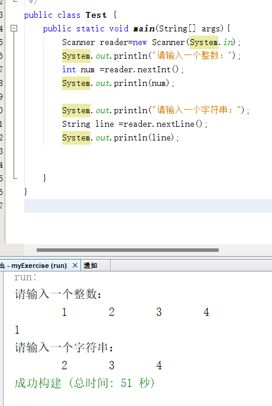
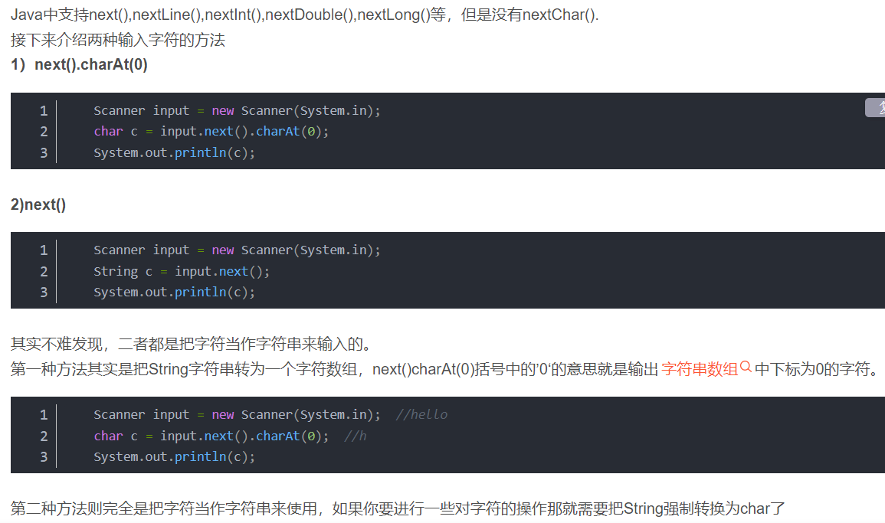
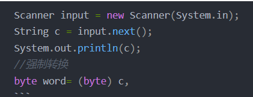
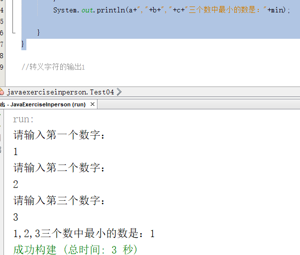
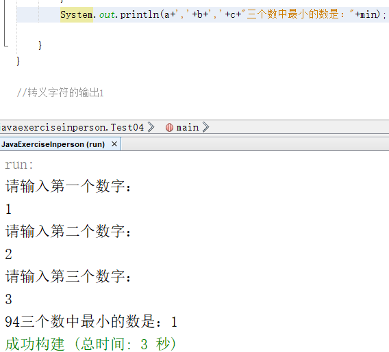

# 1.运算符和表达式

<u>*java严格区分的大小写*</u>

### 运算符：

​	就是对常量或者变量进行操作的符号。

​	比如： +  -  *  / 

### 表达式：

​	用运算符把常量或者变量连接起来的，符合Java语法的式子就是表达式。

​	比如：a + b 这个整体就是表达式。

​	而其中+是算术运算符的一种，所以这个表达式也称之为算术表达式。

# **<u>JAVA输入语句的格式：</u>**

第一套体系：

//nextInt();接收整数

//nextDouble();接收小数

//next();接收字符串

//遇到空格、TAB、回车就停止，且这些空白字符继续留在缓冲区里面

如果输入前面有除了回车以外的空白字符，则跳过，直到遇到第一个非空白字符为止



**<u>*假如输入的 缓冲区里面有一个鼠标，根据读取从左往右读取，鼠标前面的不管是什么都不会再去读，只读鼠标后面的数据*</u>**

二、输入语句
键盘输入代码的四个步骤:
1、导包：import java.util.Scanner;
2、创建Scanner类型的对象：Scanner reader= new Scanner( System.in) ;
3、调用Scanner类的相关方法(next() / nextXxx()) ，来获取指定类型的变量
**4、释放资源：调用Scanner对象的close()方法， scanner.close();**

*<u>2.2、**标准写法**</u>*
*<u>**需要判断是否还有输入**</u>*

//1、导包

import java.util.Scanner;

public class HelloWorld {
    public static void main(String[] args) {
        //2、定义一个Scanner对象
        Scanner reader = new Scanner(System.in);

        System.out.println("请输入：" );//输出提示信息
        //3、调用Scanner类的相关方法next方式接收字符串
        if(scanner.hasNext()){// 判断是否还有输入
            String str1 = scanner.next();
            System.out.println("输入的数据为：" + str1);
        }
        //4、释放资源：调用Scanner对象的close()方法， `scanner.close();`
        scanner.close();
    }
}

2.3、String 字符串类型数据输入
String 类型字符串输入有两种方法：next() 和 nextLine()；但是next() 和 nextLine()是有区别的，项目看详细例子。

#### 2.3.1、**使用next()方法**

//1、导包
public class HelloWorld {
    public static void main(String[] args) {
        //2、定义一个Scanner对象
        Scanner scanner = new Scanner(System.in);

        System.out.println("请输入：" );//输出提示信息
        //3、调用Scanner类的相关方法next方式接收字符串
        if(scanner.hasNext()){// 判断是否还有输入
            String str1 = scanner.next();
            System.out.println("输入的数据为：" + str1);
        }
        //4、释放资源：调用Scanner对象的close()方法， `scanner.close();`
        scanner.close();
    }
}

###### 观察上面输出结果，发现没有输出world，


###### 通过一个回车来完成一次输入流的缓冲区，发出信号可以开始读取。即*<u>*第一个空格/tab后面的字符串不读取，只读取第一个空格前面的字符串，</u>（记住是 第一个空白字符 tab,空格，回车 的前面，然后相应的空白字符还留在缓冲区）

**一定要是字符串遇到空白字符，如果字符串前面都是空格，不读取那些**

如下：先用next(),再用nextLine()

请输入一个字符串：
     dhfsdk  sdhfj
dhfsdk
请输入一个字符串：
  sdhfj


#### **2.3.2、使用nextLine()方法**

//1、导包
import java.util.Scanner;

public class HelloWorld {
    public static void main(String[] args) {
        //2、定义一个Scanner对象
        Scanner scanner = new Scanner(System.in);

        System.out.println("请输入：" );//输出提示信息
        //3、调用Scanner类的相关方法nextLine方式接收字符串
        if(scanner.hasNextLine()){// 判断是否还有输入
            String str1 = scanner.nextLine();
            System.out.println("输入的数据为：" + str1);
        }
        //4、释放资源：调用Scanner对象的close()方法， `scanner.close();`
        scanner.close();
    }
}

nextLine()方法返回的是**输入回车之前的所有字符，包括（除了回车之外的所有空白字符）（空格，tab）**

**nextLine进行作用的时候会把回车也一起读走，即缓冲区不会有回车符**

如下：

*<u>请输入一个字符串：</u>*
*<u>hjkhjk bjhk</u>*
*<u>hjkhjk bjhk</u>*
*<u>请输入一个字符串：</u>*
*<u>mkmkl klm</u>*
*<u>mkmkl klm*</u>****

# **什么时候需要用到hasNextInt()//hasNextXxx()呢？！！！！！！！！！！！！！！！**

在Java中，<u>*判断是否还有下一个输入*</u>通常是在使用`Scanner`类进行输入时的一个常见做法。`Scanner`类是一个文本扫描器，它<u>***能够解析基本数据类型和字符串的输入***</u>。当使用`Scanner`从控制台读取输入时，通常需要检查是否还有更多的输入，以避免程序异常终止。

以下是一些需要判断是否还有下一个输入的原因：

1. **防止异常**：如果尝试读取一个不存在的输入，`Scanner`会抛出`NoSuchElementException`或`InputMismatchException`异常。通过检查是否有下一个输入，可以避免这些异常。
2. <u>**用户体验**：在交互式程序中，允许用户决定何时结束输入可以提供更好的用户体验。</u>
3. **资源管理**：在读取文件或网络输入时，确保不会超出资源的界限。
4. <u>**逻辑控制**：在循环读取输入时，需要知道何时停止循环，以避免无限循环.</u>


下面是一个简单的例子，展示了如何使用`Scanner`类并检查是否还有下一个输入：

```
import java.util.Scanner;

public class Main {
    public static void main(String[] args) {
        Scanner scanner = new Scanner(System.in);
        
        System.out.println("请输入一系列整数，输入非整数结束：");
        while (scanner.hasNextInt()) {
            int number = scanner.nextInt();
            System.out.println("你输入的整数是：" + number);
        }
        
        scanner.close();
        System.out.println("输入结束。");
    }
}
```

在这个例子中，`hasNextInt()`方法用于检查是否还有下一个整数输入。如果用户输入了一个非整数，`hasNextInt()`将返回`false`，循环随之结束，程序不会抛出异常。

//**比如输入的数字明显已经溢出相应的变量了，也不行，scanner.hasNextInt()会变成false;**

//**在float/double变量里面输入整数也是可以的，他自己会变成小数的 **

//<u>*布尔类型的输入只能输入：true/false*</u>

<u>不能输入0/1</u>


# **2.7、char 字符型数据输入**

Scanner类中提供了获取byte \ short \ int \ long \float \double \boolean \ String 类型变量的方法。

##### 但是，**没有提供获取char类型变量的方法。需要使用next().charAt(0)**

*<u>`charAt(int index)`方法用于返回字符串中指定位置的字符。字符串的索引从0开始，所以`charAt(0)`将返回字符串的第一个字符。</u>*

##### *<u>**将这两个概念结合起来，`scanner.next().charAt(0)`的意思是：使用`Scanner`对象`scanner`读取下一个字符串输入，然后返回这个字符串的第一个字符。**</u>*

import java.util.Scanner;

//1、导包
public class HelloWorld {
    public static void main(String[] args) {
        //2、定义一个Scanner对象
        Scanner scanner = new Scanner(System.in);

        System.out.println("请输入：" );//输出提示信息
        //3、调用Scanner类的相关方法next方式接收数据
        if (scanner.hasNext()) {
            // 获取第一个字符
            char i = scanner.next().charAt(0);
            // 接收字符
            System.out.println("接收数据：" + i);
        }
        //4、释放资源：调用Scanner对象的close()方法， `scanner.close();`
        scanner.close();
    }
}

//hdsajkdhak
输入字符串的第一个字符为：h





# **<u>JAVA输出语句的格式：</u>**

1）System.out.println();
换行输出，输出后会自动换行。

2）System.out.print();
不换行输出。

3）System.out.printf();类似C语言的printf()输出语句
按格式输出。

常见的格式控制符如下：

//%表示进行格式化输出，%之后的内容为格式的定义
格式控制符			说明
--------------------------------------------------
	%d			输出int型数据
	%c			输出char型数据
	%f			输出浮点型数据，小数部分最多保留6位
	%s			输出字符串数据
	%md			输出的int型数据占m列
	%m.nf		输出的浮点型数据占m列，小数点保留n位
	//示例1
	int m = 16;
	System.out.printf("%d",m);//16  %d表示输出十进制整数
//输出
16

//示例2
int a = 8;
int m = 16;
float n = 3.1415926f;
System.out.printf("%6d，%6d，%6.2f", a, m, n);

//输出
     8，    16，  3.14


# **转义字符：**

在Java中，转义字符**用于**在**字符串中**包含一些**特殊字符**，这些特殊字符在字符串中通常有特殊的含义。例如，双引号`"`用于定义字符串的开始和结束，如果需要在字符串中包含一个双引号，就需要使**用转义字符`\`来转义**它。

以下是一些常见的转义序列及其含义：

1. `\\`：表示一个反斜杠。
2. `\t`：表示一个制表符（Tab）。
3. `\n`：表示一个换行符。
4. `\r`：表示一个回车符。
5. `\b`：表示一个退格符。
6. `\f`：表示一个换页符。
7. `\"`：表示一个双引号。
8. `\'`：表示一个单引号。
9. `\0`：表示一个空字符（null）。
10. `\ddd`：表示一个八进制数（`ddd`是八进制数）。
11. `\xhh`：表示一个十六进制数（`hh`是十六进制数）。

例如，如果你想在字符串中包含一个双引号，你可以这样写：

```
String str = "He said, \"Hello!\"";
```

这里，`\"`表示字符串中的一个双引号。

如果你想在字符串中包含一个反斜杠，你可以这样写：

```
String path = "C:\\Program Files\\Java";
```

这里，`\\`表示字符串中的一个反斜杠。

使用转义字符时，要注意以下几点：

1. 转义序列必须紧跟在反斜杠后面，**不能有空格**。
2. 转义序列的解释取决于它在字符串中的上下文。
3. 如果需要在字符串中包含反斜杠，通常需要使用两个反斜杠`\\`来表示。

正确使用转义字符可以帮助你准确地表示字符串中的字符，避免语法错误和逻辑错误。

# 2.算术运算符

分类：

```java
+ - * / %
```

运算特点：

```java
+ - * :跟小学数学中一模一样没有任何区别.
```

```java
/：
1.整数相除结果只能得到整除，如果结果想要是小数，必须要有小数参数。
2.小数直接参与运算，得到的结果有可能是不精确的。
案例：
System.out.println( 10 / 3);//3（不进行四舍五入，没有位子的话直接舍去）
System.out.println(10.0 / 3);//3.3333333333333335
```

```java
%：取模、取余。
   他做的也是除法运算，只不过获取的是余数而已。
案例：
System.out.println(10 % 2);//0
System.out.println(10 % 3);//1
应用场景：
//可以利用取模来判断一个数是奇数还是偶数
System.out.println(15 % 2);//1  奇数
```

### ❥(^_-)❤练习：数值拆分

需求：键盘录入一个三位数，将其拆分为个位、十位、百位后，打印在控制台

代码示例：

```java
//1.键盘录入一个三位数
//导包 --- 创建对象 --- 接收数据
Scanner sc = new Scanner(System.in);
System.out.println("请输入一个三位数");
int number = sc.nextInt();//123

//2.获取这个三位数的个位、十位、百位并打印出来
//公式：
//针对于任意的一个数而言
//个位： 数字 % 10
int ones = number % 10;
//十位： 数字 / 10 % 10
int tens = number / 10 % 10;
//百位： 数字 / 100 % 10
int hundreds = number / 100  % 10;

//输出结果
System.out.println(ones);
System.out.println(tens);
System.out.println(hundreds);
```

**<u>*%10 取最右边的那一位*</u>**

公式：

​	获取任意一个数上每一位数。

个位：数字 % 10

十位：数字 / 10 % 10

百位：数字 / 100 % 10

千位：数字 / 1000 % 10

。。。以此类推。。。

# 3.隐式转换（小->大）

### 概念：

​	也叫自动类型提升。

​	就是把一个取值范围小的数据或者变量，赋值给另一个取值范围大的变量。此时不需要我们额外写代码单独实现，**是程序自动帮我们完成的。**

### 简单记忆：

​	就是小的给大的，可以直接给。

### 两种提升规则：

* 取值范围小的，和取值范围大的进行运算，小的会**先提升**为大的，**再进行运算**。
* byte、short、char三种类型的数据在运算的时候，都会直接**先提升**为int，然后**再进行运算**。

### 取值范围从小到大的关系：

​	byte short int **<u>*long float*</u>** double

# 4.隐式转换的练习

请看下面案例是否有误，如果有问题，请说出原因，如果没有问题，请说出运算过程和运算结果

### 案例一：

```java
double d = 10;
System.out.println(d);//10.0
```

解释：

​	10是整数，整数默认是int类型的。

​	而在取值范围的顺序中：byte short int long float double

​	在赋值的时候把一个int类型的赋值给了一个double类型的。把一个小的赋值给一个大的是可以直接给的。


### 案例二：

```java
byte b = 100;
int i = b;//可以成功赋值
```

解释：

​	因为byte的取值范围是小的，int的取值范围是大的，在底层进行了隐式转换，不需要我们额外写代码单独实现，是可以直接赋值。

**类型转换发生在赋值操作时，Java会自动将`byte`类型的值`b`转换（扩展）为`int`类型，然后赋给`i`。但是，这并不改变`b`本身的类型。**


### 案例三：

```java
int i = 10;
long n = 20L;
??? result = i + n;
问变量result是什么类型的？
```

解释：

​	变量i是int类型的，变量n是long类型的。

​	而在取值范围的顺序中：byte short int long float double

​	变量i里面的值会自动提升为long类型的，最终的结果其实就是两个long相加，那么最终的result是long类型的。

### 案例四：

```java
int i = 10;
long n = 100L;
double d = 20.0;
??? result = i + n + d;
问变量result是什么类型的？
```

解释：

​	变量i是int类型，变量n是long类型，变量d是double类型。

​	而在取值范围的顺序中：**❤byte short int long float double**

​	所以变量i和变量n里面的值在参与运算的时候，都会进行类型提升，变成double。

​	*<u>最终其实就是三个double进行相加，那么最终的结果就是double类型的。</u>*


### 案例五：

```java
byte b1 = 10;
byte b2 = 20;
??? result = b1 + b2;//int
问变量result是什么类型的？
```

解释：

​	因为b1和b2都是byte类型的。所以在参与计算的时候，变量b1和变量b2里面的值都会自动提升为int类型的。最终其实就是两个int类型的相加，最终结果也是int类型的。


### 案例六：

```java
byte b = 10;
short s = 20;
long n = 100L;
??? result = b + s + n;
问变量result是什么类型的？long
```

解释：

​	变量b是byte类型的，变量s是short类型的，变量n是long类型的。

​	byte，short，char类型的变量在参与运算的时候，变量里面的值会直接先提升为int。

第一步：变量b和变量s里面的值会先提升为int参与运算。

​		int + int + long

第二步：而long类型的取值范围是大于int的取值范围的。

​		所以变量b和变量s里面的值会再次提升为long。

​		long + long + long。

所以最终结果是long类型的。

# 5.强制转换（大->小）

### 概念：

​	如果要把一个取值范围大的数据或者变量赋值给另一个取值范围小的变量。**是不允许直接操作。**

​	<u>*如果一定要这么干，就需要加入强制转换。*</u>

### 书写格式：

​	目标数据类型 变量名 = （目标数据类型）被强转的数据；

简单理解：

​	要转成什么类型的，那么就在小括号中写什么类型就可以了。

案例：

```java
public class OperatorDemo2 {
    public static void main(String[] args) {
        double a = 12.3;
        int b = (int) a;
        System.out.println(b);//12
    }
}
```

注意点：

​	**强制转换有可能会导致数据发生错误。（数据的精度丢失）**

# 6.字符串的+操作

### 核心技巧：

* 当**+**操作中出现**字符串**时，此时就是**字符串的连接符**，会将前后的数据进行拼接，并产生一个新的字符串。
* 当**连续进行+操作时，从左到右逐个执行的。**

# 7.字符串相加的练习：

案例1：

```java
1 + "abc" + 1
```

结果："1abc1"

解释：

​	第一步： 1 + "abc"。在这个过程中，**有字符串参与的，所以做的是拼接操作**，产生一个新的字符串"1abc"

​	第二步：  "1abc" + 1。这个过程中，有字符串参与的，所以做的也是拼接操作，产生一个新的字符串"1abc1"


案例2：

```java
1 + 2 + "abc" + 2 + 1
```

结果：“3abc21”

解释：

​	第一步：1 + 2 。在这个过程中，**没有字符串参与的，所以做的是加法运算**，结果为3。

​	第二步：3 + "abc"。在这个过程中，有字符串参与的，所以做的是拼接操作，产生一个新的字符串"3abc"。

​	第三步："3abc" + 2。在这个过程中，有字符串参与的，所以做的是拼接操作，产生一个新的字符串"3abc2"。

​	第四步："3abc2" + 1。在这个过程中，有字符串参与的，所以做的是拼接操作，产生一个新的字符串“3abc21”





案例3：

```java
String name = "黑默丁格";
System.out.println("我的名字是" + name);
```

结果： 我的名字是黑默丁格

解释：**<u>*当字符串跟变量相加的时候，实际上是跟变量里面的值进行拼接。*</u>**

# 8.字符的+操作

### 规则：

​	当+操作中出现了字符，会拿着字符到计算机内置的ASCII码表中去查对应的数字，然后再进行计算。

### 案例：

```java
char c = 'a';
int result = c + 0;//自动类型转换 byte char short运算时会自动转换为Int型数据
System.out.println(result);//97
```

ASCII码表中：

​	'a'   -----    97

​	'A'   -----    65


# 9.算术运算符的总结

分类：

```java
+ - * / %  这些操作跟小学数学几乎是一模一样的。
```

注意点：

* / 和 % 的区别：他们两个都是做除法运算，/取结果的商。% 取结果的余数。
* 整数操作只能得到整数，如果想要得到小数，必须有浮点数参与运算。

算术运算符的高级用法：

是以+为例进行的讲解，其余减法，乘法，除法的运算规则也是一样的。

特例：字符串只有+操作，没有其他操作。

# 10.自增自减运算符

### 分类：

```java
++  自增运算符
--  自减运算符
```

++：就是把变量里面的值+1

--：就是把变量里面的值-1

### 使用方式：

* 放在变量的前面，我们叫做先++。 比如：++a
* 放在变量的后面，我们叫做后++。 比如：a++

### 注意点：

​	不管是先++，还是后++。单独写在一行的时候，运算结果是一模一样的。

### 案例：

```java
//++
int a = 10;
a++;//就是让变量a里面的值 + 1
System.out.println(a);//11
++a;//就是让变量a里面的值 + 1
System.out.println(a);//12
```

### 自增自减运算符的应用场景：

某些情况下，变量需要进行加1或者减1的时候使用。

比如：过生日多一岁，就用到了自增运算符。

比如：购物商场中，选择商品数量，也用到了自增或者自减运算符。

比如：统计很多数据中，有多少个数据满足要求，也用到了自增运算符。

# 11.赋值运算符

最为常用的：	=

运算过程：就是把等号右边的结果赋值给左边的变量

案例：

```java
public class OperatorDemo6 {
    public static void main(String[] args) {
        //1.最为简单的赋值运算符用法
        int a = 10;//就是把10赋值给变量a
        System.out.println(a);

        //2.如果等号右边需要进行计算。
        int b = 20;
        int c = a + b;//先计算等号右边的，把计算的结果赋值给左边的变量
        System.out.println(c);

        //3.特殊的用法
        a = a + 10;//先计算等号右边的，把计算的结果赋值给左边的变量
        System.out.println(a);//20
    }
}
```

# 12.扩展赋值运算符

### 分类：

​	+=、-=、*=、/=、%=

### 运算规则：

​	就是把左边跟右边进行运算，把最终的结果赋值给左边，对右边没有任何影响。

### 案例：

```java
public class OperatorDemo7 {
    public static void main(String[] args) {
        //扩展赋值运算符
        int a = 10;
        int b = 20;
        a += b;//把左边和右边相加，再把最终的结果赋值给左边，对右边没有任何影响
        // 相当于 a = a + b;
        System.out.println(a);//30
        System.out.println(b);//20
    }
}
```

### 注意点：

​	**扩展的赋值运算符中隐层还包含了一个强制转换。**

**以+=为例。**

a += b ;实际上相当于 a = (byte)(a + b);

```java
public class OperatorDemo8 {
    public static void main(String[] args) {
        byte a = 10;
        byte b = 20;
        //a += b;
        a = (byte)(a + b);
        System.out.println(a);//30
    }
}
```

# 13.关系运算符

又叫比较运算符，其实就是拿着左边跟右边进行了判断而已。

### 分类：

| 符号 | 解释                                                         |
| ---- | ------------------------------------------------------------ |
| ==   | 就是判断左边跟右边是否相等，如果成立就是true，如果不成立就是false |
| !=   | 就是判断左边跟右边是否不相等，如果成立就是true，如果不成立就是false |
| >    | 就是判断左边是否大于右边，如果成立就是true，如果不成立就是false |
| >=   | 就是判断左边是否大于等于右边，如果成立就是true，如果不成立就是false |
| <    | 就是判断左边是否小于右边，如果成立就是true，如果不成立就是false |
| <=   | 就是判断左边是否小于等于右边，如果成立就是true，如果不成立就是false |

# 14.逻辑运算符

### & 和 | 的使用：

&：逻辑与（而且）

​	两边都为真，结果才是真，只要有一个为假，那么结果就是假。

|：逻辑或（或者）

​	两边都为假，结果才是假，只要有一个为真，那么结果就是真。

代码示例：

```java
// &  //两边都是真，结果才是真。
System.out.println(true & true);//true
System.out.println(false & false);//false
System.out.println(true & false);//false
System.out.println(false & true);//false

System.out.println("===================================");

// | 或  //两边都是假，结果才是假，如果有一个为真，那么结果就是真。
System.out.println(true | true);//true
System.out.println(false | false);//false
System.out.println(true | false);//true
System.out.println(false | true);//true
```

### 使用场景：

​	根据固定的场景，来选择使用&还是使用|

* 用户登录。

  用户名输入正确  & 密码输入正确

  因为只有用户名和密码同时都正确了，那么才能成功登录，只要有一个失败了都不行。

  使用技巧：

  ​	当我们需要同时满足左边和右边两种情况时，可以使用且

* 丈母娘选女婿

  丈母娘：女婿啊，你要么买个房子，要么买辆车。就可以把我的小棉袄穿走了。

  买个房子 | 买辆车

  两个条件中，只要满足其中一个，就可以穿走小棉袄了。

  使用技巧：

  ​	当两种条件只要满足其中一个的时候，可以使用或

### ^（异或）的使用：

​	在以后用的不多，了解一下即可。

计算规则：如果两边相同，结果为false，如果两边不同，结果为true

代码示例：

```java
//^   //左右不相同，结果才是true，左右相同结果就是false
System.out.println(true ^ true);//false
System.out.println(false ^ false);//false
System.out.println(true ^ false);//true
System.out.println(false ^ true);//true
```

### !（取反）的使用：

​	是取反，也叫做非。

计算规则：false取反就是true，true取反就是false

温馨提示：**取反最多只用一个。**

代码示例：

```java
System.out.println(!false);//true
System.out.println(!true);//false

System.out.println(!!false);//注意点：取反最多只用一个。
```

# 15.短路逻辑运算符

分类：  &&   ||

### &&：

​	运算结果跟&是一模一样的，只不过具有短路效果。

### ||：

​	运算结果跟|是一模一样的。只不过具有短路效果。

### *逻<u>辑核心：</u>*

​	*<u>当左边不能确定整个表达式的结果，右边才会执行。</u>*

​	*<u>当左边能确定整个表达式的结果，那么右边就不会执行了。从而提高了代码的运行效率。</u>*

### 举例：

* 用户登录案例

  用户名正确  & 密码正确

  如果使用一个&，不管用户名是否正确都会去验证密码。

思考：

​	如果用户名输入正确了，那么我们再判断密码是否正确，是符合业务逻辑的。

​	但是如果用户名输入错误了，那么现在还有必要去比较密码吗？没有不要了。

​	如果使用一个&，那么左边和右边不管什么情况下，都会执行。


​	用户名正确  &&  密码正确

​	如果用户名输入正确了，那么才会验证密码是否输入正确。

​	如果用户名输入错误了，那么就不会再去验证密码是否正确，最终的结果直接为false。从而提高了程序运行的效率。

* 丈母娘选女婿

  有房 |  有车

  首先先看看有没有房，发现有，然后再去看看有没有车。

思考：

​	既然都有房子，干嘛还要去看车呢？多此一举。

​	有房 ||  有车

​	首先先看看有没有房，如果有，那么右边就不执行了。最终的结果直接为true。

​	如果没有房子，才会去看右边有没有车。

### 总结：

&&与||的优先级相同，都是**从左到右**进行计算，但是要与他的短路特性相结合

​	&& 和 & 、||和|的运行结果都是一模一样的。

​	但是短路逻辑运算符可以提高程序的运行效率。

### 建议：

​	最为常用： &&   ||   ！

# 16.三元运算符

又叫做：三元表达式或者问号冒号表达式。

### 格式：

​	关系表达式 ？ 表达式1 ：表达式2 ；

### 计算规则：

* 计算关系表达式的值。
* 如果关系表达式的值为**真，那么执行表达式1**。
* 如果关系表达式的值为**假，那么执行表达式2**。

### 注意点：

​	**三元运算符的最终结果一定要被使用**，要么**赋值**给一个变量，要么直接**打印**出来。

### 案例：

```java
public class OperatorDemo12 {
    public static void main(String[] args) {
        //需求：求两个数的较大值
        int a = 10;
        int b = 20;

        //格式：关系表达式 ？ 表达式1 ： 表达式2 ；
        //注意点：
        //三元运算符的最终结果一定要被使用。
        //要么赋值给一个变量，要么直接输出。
       int max =  a > b ? a : b ;
        System.out.println(max);


        System.out.println(a > b ? a : b);
    }
}
```

# 17.练习1-两只老虎

需求：

​	动物园里有两只老虎，两只老虎的体重分别为通过键盘录入获得，

​	请用程序实现判断两只老虎的体重是否相同。

代码示例：

```java
//1.获取两只老虎的体重
Scanner sc = new Scanner(System.in);
System.out.println("请输入第一只老虎的体重");
int weight1 = sc.nextInt();
System.out.println("请输入第二只老虎的体重");
int weight2 = sc.nextInt();

//2.利用三元运算符求出最终结果
String result = weight1 == weight2 ? "相同" : "不相同";
System.out.println(result);
```

# 18.练习2-求三个数的最大值

需求：

​	一座寺庙里住着三个和尚，已知他们的身高分别为150cm、210cm、165cm。

​	请用程序实现获取这三个和尚的最高身高。

代码示例：

```java
//1.定义三个变量记录和尚的身高
int height1 = 150;
int height2 = 210;
int height3 = 165;

//2.利用三元运算符求出两个数中的较大值。
int temp = height1 > height2 ? height1 : height2;

//3.求出最终的结果
int max = temp > height3 ? temp : height3;

/*int max=a>b?a:b;
        max=max>c?max:c;*/

System.out.println(max);
```

# 19.运算符的优先级

​	小括号优先于所有。


  