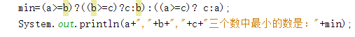
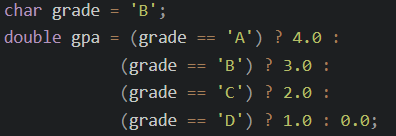
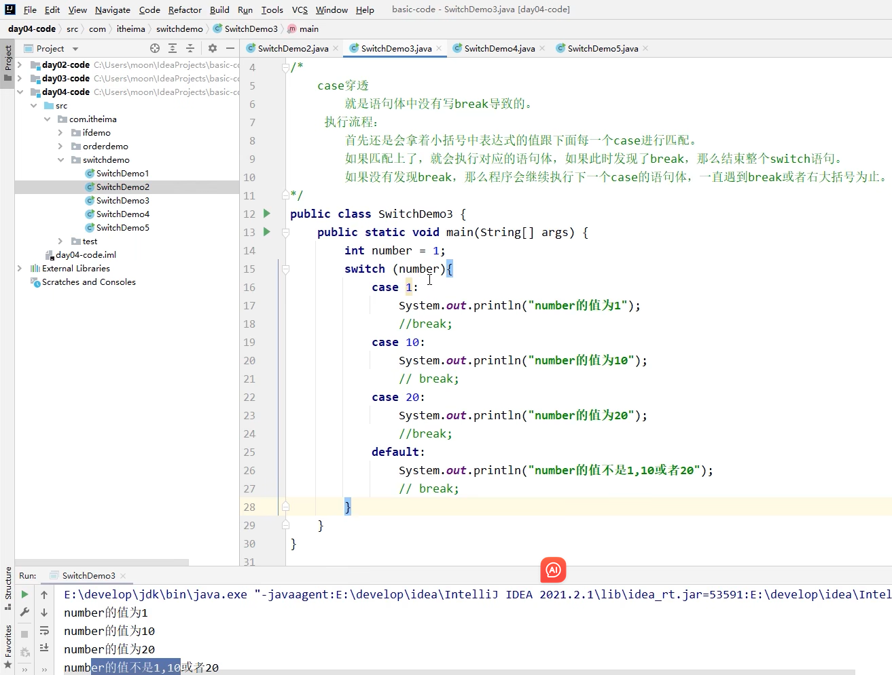
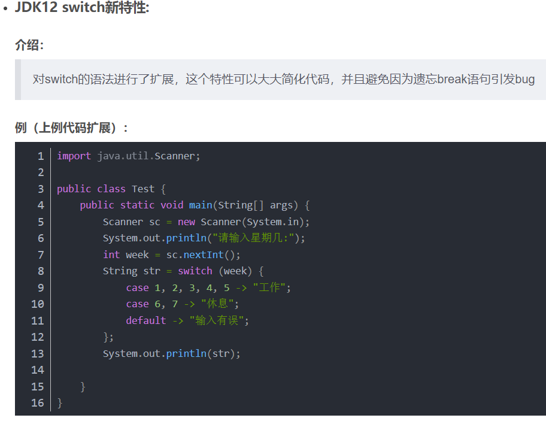
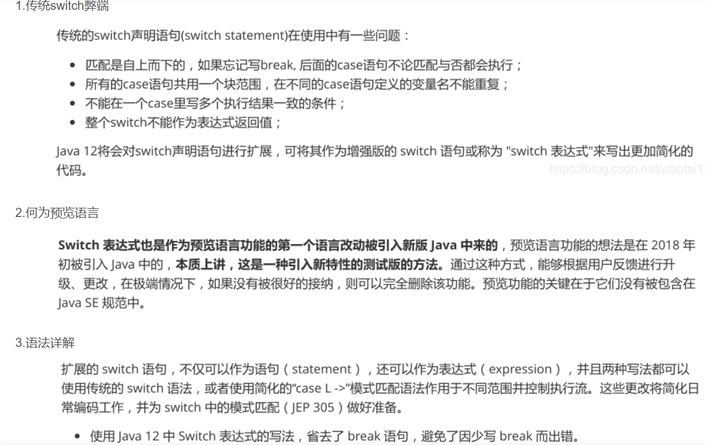
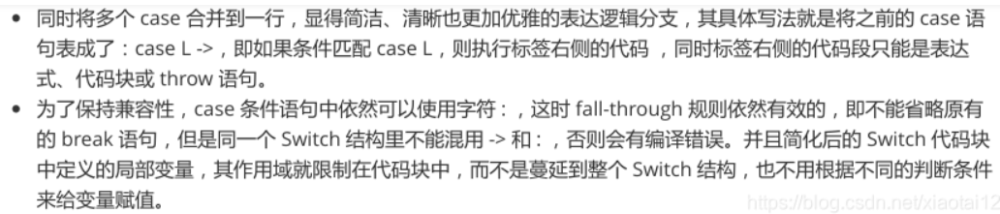
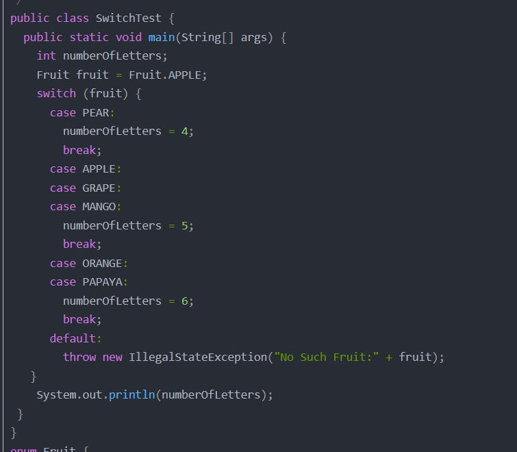
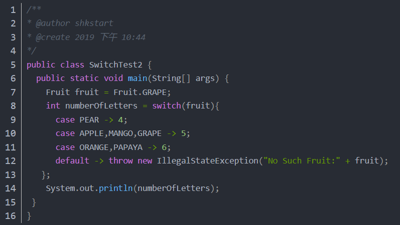
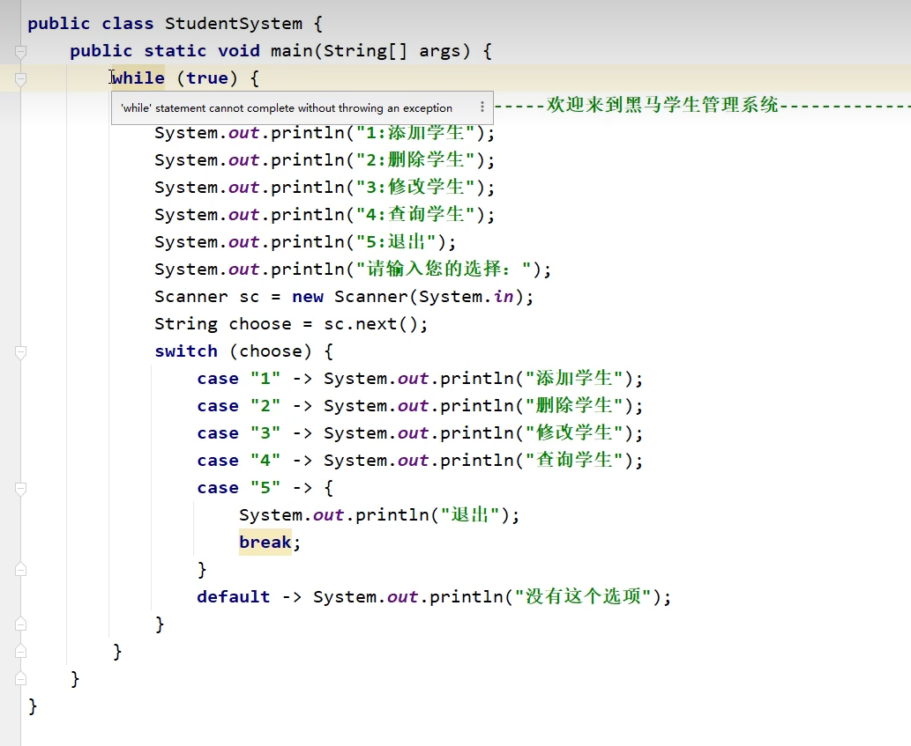

## 第一章 流程控制语句

在一个程序执行的过程中，各条语句的执行顺序对程序的结果是有直接影响的。所以，我们必须清楚每条语句的执行流程。而且，很多时候要通过控制语句的执行顺序来实现我们想要的功能。

### 1.1 流程控制语句分类

​	顺序结构

​	判断和选择结构(if, switch)

​	循环结构(for, while, do…while)

### 1.2 顺序结构

最简单最基本的流程控制，没有特定的语法结构，按先后顺序，依次执行


## 第二章 判断语句：if语句

### 2.1 if语句格式1

```java
if (关系表达式) {
    语句体;	
}
```

<u>***三目运算符**通常用于**简化if-else语句**。使用三目运算符可以**使代码更简洁、更易读**。*</u>


执行流程：

①首先计算关系表达式的值

②为  true  就执行语句体

③为  false  就**不**执行语句体

④继续执行后面的语句内容


示例：demo:样品，示范，示例

```java
public class IfDemo {
	public static void main(String[] args) {
		System.out.println("开始");	
		//定义两个变量
		int a = 10;
		int b = 20;	
		//需求：判断a和b的值是否相等，如果相等，就在控制台输出：a等于b
		if(a == b) {
			System.out.println("a等于b");
		}		
		//需求：判断a和c的值是否相等，如果相等，就在控制台输出：a等于c
		int c = 10;
		if(a == c) {
			System.out.println("a等于c");
		}		
		System.out.println("结束");
	}
}
```

#### 练习1：老丈人选女婿

需求：

​	键盘录入女婿的酒量，如果大于2斤，老丈人给出回应，否则没有任何回应

代码示例：

```java
//分析：
//1.键盘录入女婿的酒量
Scanner sc = new Scanner(System.in);
System.out.println("请输入女婿的酒量");
int wine = sc.nextInt();//5
//2.对酒量进行一个判断即可
if(wine > 2) {
    System.out.println("不错哟，小伙子！");
}
```

#### 练习2：考试奖励

需求：

​	键盘录入一个整数，表示小明的考试名次，如果名次为1，小红可以当小明的女朋友了。

代码示例：

```java
//分析：
//1.键盘录入一个整数，表示小明的考试名次
Scanner sc = new Scanner(System.in);
System.out.println("请输入小明的名次");
int rank = sc.nextInt();
//2.对小明的考试成绩进行判断即可
if(rank == 1){
    System.out.println("小红成为了小明的女朋友");
}
```

#### 第一种格式的细节：

2. 如果大括号中的语句体只有一条，那么大括号可以省略不写

   如果大括号省略了，那么**if只能控制距离他最近的那一条语句。**


### 2.2 if语句格式2

```java
格式：
if (关系表达式) {
    语句体1;	
} else {
    语句体2;	
}
```

***<u>三目运算符可以使代码更简洁，但它不应该被滥用。如果一个表达式变得过于复杂，使用if-else语句可能更易读。</u>***

***<u>另外，三目运算符只能用于返回某个值。它不能被用于执行语句或控制流。</u>***

<u>**if-else语句的嵌套**可以用 **三目运算符的嵌套** 来**简化**</u>




执行流程：

# **<u>*关系式满足：进语句体里*</u>**

# *不满足：不进去*<u></u>**

①首先计算关系表达式的值

②true就执行语句体1

③false就执行语句体2

④继续执行后面的语句内容


示例：

```java
public class IfDemo02 {
	public static void main(String[] args) {
		System.out.println("开始");		
		//定义两个变量
		int a = 10;
		int b = 20;
		//需求：判断a是否大于b，如果是，在控制台输出：a的值大于b，否则，在控制台输出：a的值不大于b
		if(a > b) {
			System.out.println("a的值大于b");
		} else {
			System.out.println("a的值不大于b");
		}		
		System.out.println("结束");
	}
}
```

#### 练习1：吃饭

需求：

​	    键盘录入一个整数，表示身上的钱。

​            如果大于等于100块，就是网红餐厅。

​            否则，就吃经济实惠的沙县小吃。

代码示例：

```java
//分析：
//1.键盘录入一个整数。表示身上的钱。
Scanner sc = new Scanner(System.in);
System.out.println("请输入一个整数表示身上的钱");
int money = sc.nextInt();
//2.对钱进行判断
if(money >= 100){
    System.out.println("网红餐厅");
}else{
    System.out.println("沙县小吃");
}
```

#### 练习2：影院选座

需求：

​	在实际开发中，电影院选座也会使用到if判断。

​	假设某影院售卖了100张票，票的序号为1~100。

​	其中奇数票号坐左侧，偶数票号坐右侧。

​	键盘录入一个整数表示电影票的票号。

​	根据不同情况，给出不同的提示：

​		如果票号为奇数，那么打印坐左边。

​		如果票号为偶数，那么打印坐右边。

代码示例：

```java
//分析：
//1.键盘录入票号
Scanner sc = new Scanner(System.in);
System.out.println("请输入票号");
int ticket = sc.nextInt();
if(ticket >= 1 && ticket <= 100){
    //合法
    //2.对票号进行判断
    if (ticket % 2 == 0) {
        //偶数
        System.out.println("坐右边");
    } else {
        //奇数
        System.out.println("坐左边");
    }
}else{
    //票号不合法
    System.out.println("票号不合法");
}
```

### 2.3 if语句格式3

```java
if (关系表达式1) {
    语句体1;	
} else if (关系表达式2) {
    语句体2;	
} 
…
else {
    语句体n+1;
}
```

执行流程：

①首先计算关系表达式1的值

②true就执行语句体1；如果值为false就计算关系表达式2的值

③如果值为true就执行语句体2；如果值为false就计算关系表达式3的值

④…

⑤如果没有任何关系表达式为true，就执行语句体n+1。


#### 练习1：考试奖励

需求：

​	小明快要期末考试了，小明爸爸对他说，会根据他不同的考试成绩，送他不同的礼物，

假如你可以控制小明的得分，请用程序实现小明到底该获得什么样的礼物，并在控制台输出。

分析：

​	①小明的考试成绩未知，可以使用键盘录入的方式获取值

​	②由于奖励种类较多，属于多种判断，采用if...else...if格式实现

​	③为每种判断设置对应的条件

​	④为每种判断设置对应的奖励

代码示例：

```java
//95~100 自行车一辆
//90~94   游乐场玩一天
//80 ~ 89 变形金刚一个
//80 以下  胖揍一顿

//1.键盘录入一个值表示小明的分数
Scanner sc = new Scanner(System.in);
System.out.println("请输入小明的成绩");
int score = sc.nextInt();
//2.对分数的有效性进行判断
if(score >= 0 && score <= 100){
    //有效的分数
    //3.对小明的分数进行判断，不同情况执行不同的代码
    if(score >= 95 && score <= 100){
        System.out.println("送自行车一辆");
    }else if(score >= 90 && score <= 94){
        System.out.println("游乐场玩一天");
    }else if(score >= 80 && score <= 89){
        System.out.println("变形金刚一个");
    }else{
        System.out.println("胖揍一顿");
    }
}else{
    //无效的分数
    System.out.println("分数不合法");
}
```

## 第三章 switch语句

### 3.1 格式//case 后面的数据类型必须与表达式一致（String也是可以的）

```java
switch (表达式) {
	case 1:
		语句体1;
		break;
	case 2:
		语句体2;
		break;
	...
	default:
		语句体n+1;
		break;
}


```

### 3.2 **执行流程：**

- 首先计算出表达式的值 
- 其次，和case依次比较，一旦有对应的值，就会执行相应的语句，在执行的过程中，遇到break就会结 束。 
- 最后，**如果所有的case都和表达式的值不匹配，就会执行default语句体部分，然后程序结束掉**。 

#### 练习：运动计划

- 需求：键盘录入星期数，显示今天的减肥活动。

  周一：跑步  

  周二：游泳  

  周三：慢走  

  周四：动感单车

  周五：拳击  

  周六：爬山  

  周日：好好吃一顿

- 代码示例：

```java
package a01switch选择语句;

import java.util.Scanner;

public class SwitchDemo2 {
    public static void main(String[] args) {
        //1.键盘录入一个整数表示星期
        Scanner sc = new Scanner(System.in);
        System.out.println("请输入一个整数表示星期");
        int week = sc.nextInt();

        //2.书写一个switch语句去跟week进行匹配
        switch (week){
            case 1:
                System.out.println("跑步");
                break;
            case 2:
                System.out.println("游泳");
                break;
            case 3:
                System.out.println("慢走");
                break;
            case 4:
                System.out.println("动感单车");
                break;
            case 5:
                System.out.println("拳击");
                break;
            case 6:
                System.out.println("爬山");
                break;
            case 7:
                System.out.println("好好吃一顿");
                break;
            default:
                System.out.println("输入错误，没有这个星期");
                break;
        }
    }
}
```

### 3.3 switch的扩展知1：

- case穿透

  如果多个case的语句体重复了，可以考虑case穿透简化代码

  **<u>*不写break会引发case穿透现象*</u>**

- **default可以放在任意位置，也可以省略**

<u>*default省略：如果表达式的值与所有case后面的值都不匹配，那么SWITCH会自动终止*</u>

- 表达式里只能有 **byte,short,int,char,String  (没有long float double)**  （JDK5 以后可以是枚举)
- break用来结束SWITCH语句
- **case后面**的值只能是**字面量，不能是变量，不能重复**
- switch在JDK12的新特性（无穿透现象，省略了break，简化了写法）

```java
int number = 10;
switch (number) {
    case 1 -> {
        System.out.println("一");}//多条语句放在一个大括号内，如果只有一条语句可以不写大括号
    case 2->System.out.println("二")；
    case 3 -> System.out.println("三");
    default -> System.out.println("其他");
}
```

- switch和if第三种格式各自的使用场景

当我们需要对**一个范围**进行判断的时候，用**if**的第三种格式

当我们把**有限个**数据列举出来，**选择其中一个执行的时候**，用     switch      <u>*（  if    也能用，但在这种情况下，Switch 更加简洁明了）*</u>

比如：

​	小明的考试成绩，如果用switch，那么需要写100个case，太麻烦了，所以用if简单。

​	如果是星期，月份，客服电话中0~9的功能选择就可以用switch


# **<u>*switch的拓展2：*</u>**


case 穿透:
介绍：
case穿透是指在switch-case中，执行完当前case语句，因为省略了break语句，导致无法跳出switch，所以继续向下执行下一条case语句的情况。

现象：
当case穿透开始时，后续的case就会失去匹配效果，内部的语句都会被执行，直到遇到break语句跳出switch，或者将整体switch语句执行完毕，才会结束。

用途：
多个case合并
————————————————



JDK12简化后，如果一个Case对应的执行语句有多行，要用语句块把他们框起来，简化后的SWITCH,每条case是独立的



以前不可以作为表达式返回值



现在可以了




像这样写如果case真的为5的话，那么还是只能跳出switch，但依旧在while内


#### 练习：休息日和工作日

需求：键盘录入星期数，输出工作日、休息日。

(1-5) 工作日，(6-7)休息日。

代码示例：

```java
//分析：
//1.键盘录入星期数
Scanner sc = new Scanner(System.in);
System.out.println("请输入星期");
int week = sc.nextInt();//3
//2.利用switch进行匹配
----------------------------------------------------
利用case穿透简化代码
switch (week){
    case 1:
    case 2:
    case 3:
    case 4:
    case 5:
        System.out.println("工作日");
        break;
    case 6:
    case 7:
        System.out.println("休息日");
        break;
    default:
        System.out.println("没有这个星期");
        break;
}
----------------------------------------------------
利用JDK12简化代码书写
switch (week) {
    case 1, 2, 3, 4, 5 -> System.out.println("工作日");//不是JDK12的话，上面的代码写成case 1,2:  是错误的，每个case后面只能写一个字面量
    case 6, 7 -> System.out.println("休息日");
    default -> System.out.println("没有这个星期");
}
```

## 第四章 循环结构

### 4.1 for循环结构（掌握）

​	循环语句可以在满足循环条件的情况下，反复执行某一段代码，这段被**重复执行的代码**被称为**循环体语句**，当反复 执行这个循环体时，需要在合适的时候把循环判断条件修改为false，从而结束循环，否则循环将一直执行下去，形 成死循环。 

#### 4.1.1 for循环格式：

```java
for (初始化语句;条件判断语句;条件控制语句) {
	循环体语句;
}
```

**格式解释：**

- 初始化语句： 循环开启时的起始状态，循环开始的时候什么样

- 条件判断语句：用于表示循环反复执行的条件，判断循环是否能一直执行下去

- 循环体语句：  用于表示循环反复执行的内容，简单说就是循环反复执行的事情

- 条件控制语句：用于表示**循环执行中每次变化的内容**，简单说就是**控制**循环是否能执行下去

- 在这个例子中，`i += 2` 表示每次迭代后`i`的值增加2，而不是传统的`i++`。

  迭代部分可以是任何合法的表达式，包括但不限于：

  - `i++`（将`i`的值增加1）
  - `i--`（将`i`的值减少1）
  - `i += n`（将`i`的值增加`n`）
  - `i -= n`（将`i`的值减少`n`）
  - `i *= n`（将`i`的值乘以`n`）
  - `i /= n`（将`i`的值除以`n`）

  只要这个表达式能够改变循环控制变量的值，并且不违反循环条件，它就可以作为迭代部分。

**执行流程：**

①执行初始化语句

②执行条件判断语句，看其结果是true还是false

​             如果是false，循环结束

​             如果是true，继续执行

③执行循环体语句

④执行条件控制语句

⑤回到②继续

**for循环书写技巧：**

- 确定循环的开始条件
- 确定循环的结束条件
- 确定循环要重复执行的代码

代码示例：

```java
//1.确定循环的开始条件
//2.确定循环的结束条件
//3.确定要重复执行的代码

//需求：打印5次HelloWorld
//开始条件：1
//结束条件：5
//重复代码：打印语句

for (int i = 1; i <= 5; i++) {
    System.out.println("HelloWorld");
}
```

##### for循环练习-输出数据

- 需求：在控制台输出1-5和5-1的数据 
- 示例代码：

```java
public class Test04 {
    public static void main(String[] args){
    for(int i=1;i<=5;i++){
       System.out.print(i+"\t");
    }
    System.out.println('\n');
     for(int m=5;m>=1;m--){
  System.out.print(m+"\t");
    }
    System.out.println('\n');
   }
 }
```

##### for循环练习-求和

- 需求：求1-5之间的数据和，并把求和结果在控制台输出  
- 示例代码：

```java
public class ForTest02 {
    public static void main(String[] args) {
		//求和的最终结果必须保存起来，需要定义一个变量，用于保存求和的结果，初始值为0
		int sum = 0;
		//从1开始到5结束的数据，使用循环结构完成
		for(int i=1; i<=5; i++) {
			//将反复进行的事情写入循环结构内部
             // 此处反复进行的事情是将数据 i 加到用于保存最终求和的变量 sum 中
			sum = sum + i;
			/*
				sum += i;	sum = sum + i;
				第一次：sum = sum + i = 0 + 1 = 1;
				第二次：sum = sum + i = 1 + 2 = 3;
				第三次：sum = sum + i = 3 + 3 = 6;
				第四次：sum = sum + i = 6 + 4 = 10;
				第五次：sum = sum + i = 10 + 5 = 15;
			*/
		}
		//当循环执行完毕时，将最终数据打印出来
		System.out.println("1-5之间的数据和是：" + sum);
    }
}
```

- 本题要点：
  - 今后遇到的需求中，如果带有**求和**二字，请立即联想到**求和变量**
  - 求和变量的定义位置，**必须在循环外部**，如果在循环内部则计算出的数据将是错误的

##### for循环练习-求偶数和

- 需求：求1-100之间的偶数和，并把求和结果在控制台输出 }
- 示例代码：

```java
public class ForTest03 {
    public static void main(String[] args) {
		//求和的最终结果必须保存起来，需要定义一个变量，用于保存求和的结果，初始值为0
		int sum = 0;
		//对1-100的数据求和与1-5的数据求和几乎完全一样，仅仅是结束条件不同
		for(int i=1; i<=100; i++) {
			//对1-100的偶数求和，需要对求和操作添加限制条件，判断是否是偶数
			if(i%2 == 0) {
                //sum += i；
				sum = sum + i;
			}
		}
		//当循环执行完毕时，将最终数据打印出来
		System.out.println("1-100之间的偶数和是：" + sum);
    }
}
```

##### for循环练习-统计次数

需求：

​	  键盘录入两个数字，表示一个范围。

​           统计这个范围中。

​           既能被3整除，又能被5整除数字有多少个？

代码示例：

```java
public class Test04 {
    public static void main(String[] args){
        Scanner reader=new  Scanner(System.in);
        System.out.println("请输入一个较小的数字");
        int count=0;
        int min,max;
        min=reader.nextInt();
        System.out.println("请输入一个较大的数字");
        max=reader.nextInt();
        
    for(int i=min;i<=max;i++){
        if(i%3==0 && i%5==0){//if(i%15==0{
        count++;
        }
     }
    System.out.print(count);
    }
}
```

### 4.2 while循环

#### 4.2.1 格式：

```java
初始化语句;
while(条件判断语句){
	循环体;
	条件控制语句;
}
```

##### 练习1：打印5次HelloWorld

```java
int i = 1;
while(i <= 5){
    System.out.println("HelloWorld");
    i++;
}
System.out.println(i);
```

##### 练习2：珠穆朗峰

```java
//1.定义一个变量表示珠穆朗玛峰的高度
int height = 8844430;//8844.43m 8844430mm
//2.定义一个变量表示纸张的厚度
double paper = 0.1;

//定义一个计数器（变量），用来统计折叠的次数
int count = 0;

//3.循环折叠纸张
//只有纸张的厚度 < 穆朗玛峰的高度 循环才继续，否则循环就停止
//坑：只有判断为真，循环才会继续
while(paper < height){
    //折叠纸张
    paper = paper * 2;
    count++;
}

//4.打印一下纸张的厚度
System.out.println(count);//27
```

### 4.3 do...while循环

本知识点了解即可

格式：

```java
初始化语句;
do{
    循环体;
    条件控制语句;
}while(条件判断语句);
```

特点：

​	先执行，再判断。

### 4.4 三种格式的区别：

​	for和while循环，是先判断，再执行。

​	do...while是先执行，再判断。

​	当知道**循环次数**或者**循环范围**的时候，用**for**循环。

​	当不知道循环次数，也不知道循环范围，但是知道循环的结束条件时，用**while**循环。