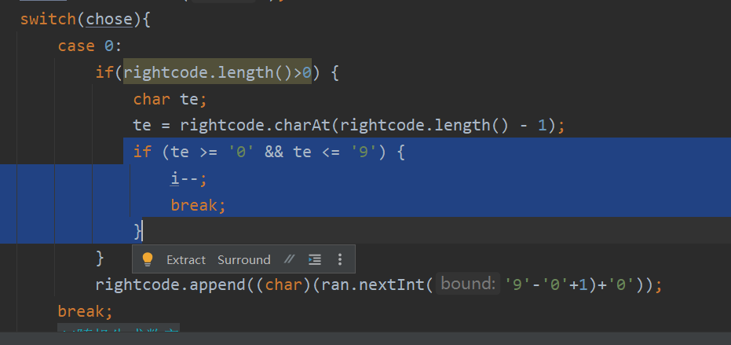

### 关于switch语句的相关拓展：

1.switch语句case标签可以是：

char、byte、short、int的常量表达式

枚举常量

字符串字面量

多个字符串，用逗号分割

eg:

case "yes","y"->

​			...

default ->

​			...

2.如果希望直通式fall-through，可以在编译的时候加上

javac -Xlint:fallthrough Test.java

//这样的话只要有一个分支缺少break，编译器都会给警告

//如果就是想用直通式，可以在外围加@SuppressWarnings("fallthrough")，这样就不会生成警告了

3.

**有直通行为**：每个case以一个冒号结束//此时如果需要终止直通要加break//不用打括号

**没有直通行为**：每个case以一个->结束//如果有多行语句要用大括号

关键是生成一个值，用->时不能用break,return,continue



如果switch里面也需要break作为内部条件判断,最好用break的形式


**不能在一个switch语句中混用->和冒号**

4.只有在需要直通行行为\某个case语句中不止一个操作时，才分别用break冒号 \yield的形式


## 通过标签实现多层嵌套循环的break跳出：

1.执行带标签的break会跳转到带标签语句块的末尾

label名:
while(){

...

​	if(condition){

break label名;

...

​			}


}

2.补充一点：

与任何使用break语句的代码一样，接下来要检测是正常退出循环还是break提前退出


for{...

​		if(condition) break;

...

}

if(condition){}//break提前退出

else{}//正常退出


## 1.无限循环

### 概念：

​	又叫死循环。循环一直停不下来。

### for格式：

```java
for(;;){
    System.out.println("循环执行一直在打印内容");
}
```

解释：

**初始化语句**可以空着不写，表示循环之前不定义任何的控制变量。

**条件判断语句**可以空着不写，如果不写，默认表示true，循环一直进行。

**条件控制语句**可以空着不写，表示每次循环体执行完毕后，控制变量不做任何变化。

### while格式：

```java
while(true){
    System.out.println("循环执行一直在打印内容");
}
```

解释：

​	小括号里面就不能省略了，true一定要写出来，否则代码会报错。

### do...while格式：

```java
do{
    System.out.println("循环执行一直在打印内容");
}while(true);
```

解释：

​	小括号里面就不能省略了，true一定要写出来，否则代码会报错。

### 无限循环的注意事项：

* 最为常用的格式：while
* 无限循环下面不能再写其他代码了，因为永远执行不到。

## 2.条件控制语句

* break
* continue

### break:

​	**不能单独存在的**。可以用在**switch**和**循环**中，表示结束，跳出的意思。

代码示例：

```java
//1.吃1~5号包子
for (int i = 1; i <= 5; i++) {
    System.out.println("在吃第" + i + "个包子");
    //2.吃完第三个的时候就不吃了
    if(i == 3){
        break;//结束整个循环。
    }
}
```

### continue:

​	不能单独存在的。只能存在于**循环**当中。

​	表示：**跳过本次循环**，继续**执行下次循环**。

代码示例：

```java
//1.吃1~5号包子
for (int i = 1; i <= 5; i++) {
    //2.第3个包子有虫子就跳过，继续吃下面的包子
    if(i == 3){
        //跳过本次循环（本次循环中，下面的代码就不执行了），继续执行下次循环。
        continue;
    }
    System.out.println("在吃第" + i + "个包子");
}
```

## 3. Random

Random跟Scanner一样，也是Java提前写好的类，我们不需要关心是如何实现的，只要直接使用就可以了。

### 使用步骤：

1. 导包

```java
import java.util.Random;
导包的动作必须出现在类定义的上边。
```

2. 创建对象

```java
Random r = new Random ();
上面这个格式里面，只有r是变量名，可以变，其他的都不允许变。
```

3. 生成随机数

```java
int number = r.nextInt(随机数的范围);
上面这个格式里面，只有number是变量名，可以变，其他的都不允许变。
随机数范围的特点：从0开始，不包含指定值。比如：参数为10，生成的范围[0,10)
```


代码示例：

```java
//1.导包
import java.util.Random;

public class RandomDemo1 {
    public static void main(String[] args) {
        //2.创建对象
        Random r = new Random();
        //3.生成随机数
        int number = r.nextInt(100);//包左不包右，包头不包尾
        //0 ~ 99
        System.out.println(number);

    }
}
```

## 4. ☆☆☆☆☆☆☆☆☆☆逢七过

需求：

​	朋友聚会的时候可能会玩一个游戏：逢7过 

​	游戏规则：从任意一个数字开始报数，当你要报的数字是包含7或者是7的倍数时都要说过：过

​	使用程序在控制台打印出1-100之间的满足逢七必过规则的数据 

举例：

​	1 2 3 4 5 6 过 8 9 10 11 12 13 过 15 16 过 18 ...

代码示例：

```java
/*朋友聚会的时候可能会玩一个游戏：逢7过
        游戏规则：从任意一个数字开始报数，当你要报的数字是包含7或者是7的倍数时都要说过：过
        需求：使用程序在控制台打印出1-100之间的满足逢七必过规则的数据*/
//分析：
//个位7  十位7   7倍数
//1 2 3 4 5 6 过 8 9 10 11 12 13 过 15 16 过 18 19 20 过....
//69 过 过 过 过 过 过... 80
//1.得到1~100之间的每一个数字
//开始：1
//结束：100
for (int i = 1; i <= 100; i++) {
    //2.判断每一个数字，如果符合规则，就打印过，如果不符合规则就打印真实的数字
    if(i % 10 == 7 || i / 10 % 10 == 7  ||  i % 7 == 0){
        System.out.println("过");
        continue;
    }
    System.out.println(i);
}
```

## 5. 平方根

**在计算机里的平方根一般只用考虑算术平方根**

快速打开计算器

需求：

​	键盘录入一个大于等于2的整数 x ，计算并返回 x 的 平方根 。结果只保留整数部分 ，小数部分将被舍去 。

代码示例：

```java
/*需求：键盘录入一个大于等于2的整数 x ，计算并返回 x 的 平方根 。
        结果只保留整数部分 ，小数部分将被舍去 。*/


//分析：
//平方根   16的平方根4
//         4的平方根2


// 10
// 1 * 1 = 1 < 10
// 2 * 2 = 4 < 10
// 3 * 3 = 9 < 10
// 4 * 4 = 16 > 10
//推断：10的平方根是在3~4之间。


// 20
// 1 * 1 = 1 < 20
// 2 * 2 = 4 < 20
// 3 * 3 = 9 < 20
// 4 * 4 = 16 < 20
// 5 * 5 = 25 > 20
//推断：20的平方根是在4~5之间。


//在代码当中
//从1开始循环，拿着数字的平方跟原来的数字进行比较
//如果小于的，那么继续往后判断
//如果相等，那么当前数字就是平方根
//如果大于的，那么前一个数字就是平方跟的整数部分


//1.键盘录入一个整数
Scanner sc = new Scanner(System.in);
System.out.println("请输入一个整数");
int number = sc.nextInt();
//2.从1开始循环判断
//开始：1 结束: number
for (int i = 1; i <= number; i++) {
    //用i * i 再跟number进行比较
    if(i * i == number){
        System.out.println(i + "就是" + number + "的平方根");
        //一旦找到了，循环就可以停止了，后面的数字就不需要再找了，提高代码的运行效率。
        break;
    }else if(i * i > number){
        System.out.println((i - 1) + "就是" + number + "平方根的整数部分");
        break;
    }
}
```

## 6.判断是否为质数

**1既不是质数也不是合数。2是质数**

需求：

​	键盘录入一个正整数 x ，判断该整数是否为一个质数。 

代码示例：

```java
//需求：键盘录入一个正整数 x ，判断该整数是否为一个质数。

//质数：
//如果一个整数只能被1和本身整除，那么这个数就是质数。否则这个数叫做合数
//7 = 1 * 7 质数
//8 = 1 * 8  2 * 4 合数


//分析：
//1.键盘录入一个正整数
//number
Scanner sc = new Scanner(System.in);
System.out.println("请输入一个正整数");
int number = sc.nextInt();//9

//定义一个变量，表示标记
//标记着number是否为一个质数
//true： 是一个质数
//false : 不是一个质数

//表示最初就认为number是一个质数
boolean flag = true;


//2.判断
//写一个循环，从2开始判断，一直判断到number-1为止
//看这个范围之内，有没有数字可以被number整除
for (int i = 2; i < number; i++) {
    //i 依次表示这个范围之内的每一个数字
    //看number是否能被i整除就可以了
    if(number % i == 0){// 9 % 2 = 1
        flag = false;
        //System.out.println(number + "不是一个质数");
        break;
    }/*else{
                System.out.println(number + "是一个质数");
            }*/
}

//只有当这个循环结束了，表示这个范围之内所有的数字都判断完毕了
//此时才能断定number是一个质数
if(flag){
    System.out.println(number + "是一个质数");
}else{
    System.out.println(number + "不是一个质数");
}


//☆☆☆☆☆☆☆☆☆☆☆☆算法优化：
package myexercise;
import java.util.Scanner;
import static java.lang.Math.*;

public class MyExercise{
    public static void main(String[] args){
        System.out.println("请输入一个整数：");
        Scanner reader=new Scanner(System.in);
        int a=reader.nextInt();
        boolean state=true;
        if(a==1){
        state=false;
        }
        for(int i=2;i<=Math.sqrt(a);i++){
 /*
 一个合数，能够整除它的数一定对应分布在这个合数的算术平方根两侧
 eg:2*9=9*2
 
 
 */
            
        if(a%i==0){
        state=false;
        break;}   
        }
        
        
        if(state){
        System.out.println(a+"是质数");
        }
        else{
        System.out.println(a+"不是质数");
        }
        
    }
}

```

1. **资源管理**：标记变量可以用于管理资源的使用，例如，一个标记变量可以表示是否已经获取了数据

   库连接。

2. **优化性能**：在某些情况下，使用标记变量可以减少条件判断的次数，从而提高程序的执行效率。

3. **简化代码**：使用标记变量可以使代码更加清晰和易于理解，尤其是在处理多个条件时。

4. **多线程同步**：在多线程编程中，标记变量可以用于线程之间的同步，例如，一个标记变量可以表示一个线程是否已经完成了它的任务。

   <u>*若有两种状态最后会导致不同的结果，在之前的程序中这两种状态可能会改变，可以用标记变量简化代码*</u>

## 7. 猜数字小游戏

需求：

​	程序自动生成一个1-100之间的随机数，在代码中使用键盘录入去猜出这个数字是多少？

要求：

​	使用循环猜，一直猜中为止。

思路分析：

1. 生成一个1-100之间的随机数
2. 使用键盘录入去猜出这个数字是多少
3. 把反复猜的代码写在循环中

代码示例：

```java
//1.生成一个1-100之间的随机数
Random r = new Random();
int number = r.nextInt(100) + 1;// 0 ~ 99 + 1 --- 1 ~ 100
System.out.println(number);

//2.使用键盘录入去猜出这个数字是多少？
Scanner sc = new Scanner(System.in);
while(true){
    System.out.println("请输入一个整数");
    int guessNumber = sc.nextInt();
    //3.比较
    if(guessNumber > number){
        System.out.println("您猜的数字大了");
    }else if(guessNumber < number){
        System.out.println("您猜的数字小了");
    }else{
        System.out.println("恭喜你，猜中了");
        break;
    }
}


import java.util.Scanner;
import java.util.Random;
//拓展：☆☆☆☆☆☆☆☆☆☆☆游戏中的抽奖机制（保底机制）
//用点券取抽水晶
//保底 10次

public class MyExercise{
    public static void main(String[] args){
    Random r=new Random();
    int count=0;//保底变量的计数
    Scanner reader=new Scanner(System.in);
    System.out.println("猜一猜这个数是多少：");
    int randum=r.nextInt(100)+1;
    while(true){
    count++;
    int guess=reader.nextInt();
    if(count==10){
    System.out.println("猜中了");
    break;
    }//保底变量的控制
    if(guess>randum){
    System.out.println("大了");
    }
    else if(guess < randum){
    System.out.println("小了");
    }
    else{
    System.out.println("猜中了");
    break;
    }
    }
    
    
    }
}
```
