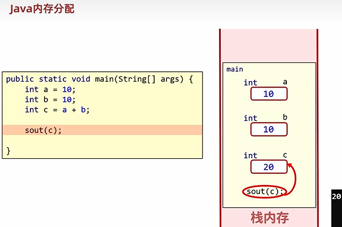
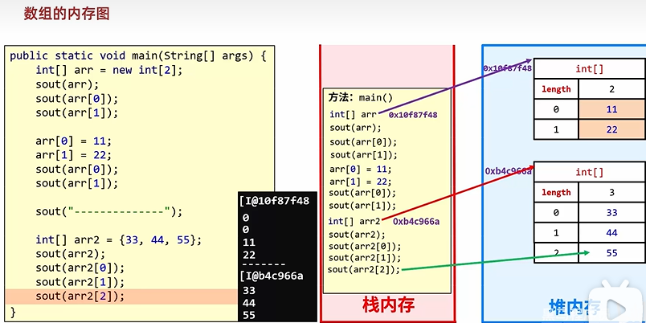
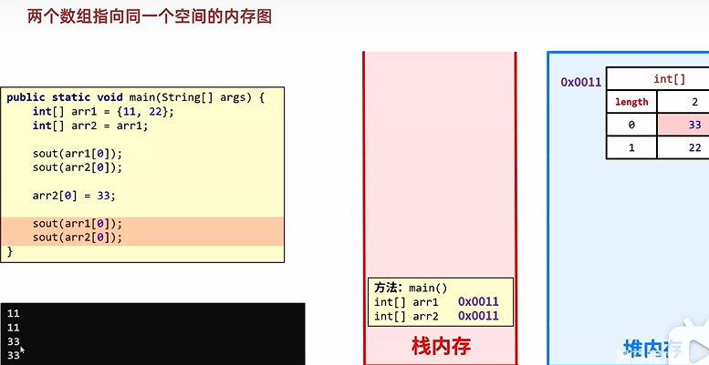

# 1.数组

### 概念：

​	指的是一种容器，可以同来存储**同种数据类型**的**多个值**。

​	但是数组容器在存储数据的时候，需要结合**隐式转换**考虑。

byte、short、char三种类型的数据在运算的时候，都会直接**先提升**为int，然后**再进行运算**。

byte、short、int、long、float、double

#### **<u>*boolean与基本数据类型里的其他数据不能进行转换，强制也不行*</u>**

比如：

​	定义了一个int类型的数组。那么boolean、double类型的数据是不能存到这个数组中的，（boolean也不能存入到double类型的数组里面）

​	但是byte类型，short类型，int类型的数据是可以存到这个数组里面的。

建议：

​	容器的类，和存储的数据类型保持一致。

举例：

​	整数1 2 3 4 56 就可以使用int类型的数组来存储。

​	小数1.1 1.2 1.3 1.4 就可以使用double类型的数组来存储。

​	字符串"aaa"  "bbb"  "ccc" 就可以使用String类型的数组来存储。//**<u>*String在JAVA中不是基本的数据类型，是一种特殊的类*</u>**


**<u>*补充：*</u>**

**<u>*在JAVA中，关于数组的一个长度属性.length*</u>**

**<u>//调用方式：      数组名.length</u>**

# **2.数组的定义**

### 格式一：

​	数据类型 [] 数组名

比如：int [] array

### 格式二：

​	数据类型  数组名 []

比如： int array []

### 详解：

数据类型：限定了数组以后能存什么类型的数据。

方括号：表示现在定义的是一个数组。

数组名：就是一个名字而已，方便以后使用。

### 注意点：

​	方法括号跟数组名，谁写在前面，谁写在后面都是一样的。

​	平时习惯性使用第一种方式。

# 3.数组的静态初始化

### 完整格式：

​	**<u>*数据类型[] 数组名 = new 数据类型[]{元素1，元素2，元素3，元素4...};*</u>**

比如：

​	int[] arr = new int[]{11,22,33};

​	double[] arr = new double[]{1.1,1.2,1.3};

### 格式详解：

​	数据类型：限定了数组以后能存什么类型的数据。

​	方括号：表示现在定义的是一个数组。

​	数组名：其实就是名字而已，方便以后使用，在起名字的时候遵循小驼峰命名法。

​			arr   namesArr

​	new：就是给数组在内存中开辟了一个空间。

​	数据类型：限定了数组以后能存什么类型的数据。

​			  前面和后面的数据类型一定要保持一致。

​			int[] arr = new double[]{11,22,33};//错误写法

​	方括号：表示现在定义的是一个数组。

​	大括号：表示数组里面的元素。元素也就是存入到数组中的数据。

​			多个元素之间，一定要用逗号隔开。

### 注意点：

* 等号前后的数据类型必须保持一致。
* **数组一旦创建之后，长度不能发生变化。**

### 简化格式:

​	**<u>*数据类型[] 数组名 = {元素1，元素2，元素3，元素4...};*</u>**

比如：

​	int[] array = {1,2,3,4,5};

​	double[] array = {1.1,1.2,1.3};

### 练习1：

定义数组存储5个学生的年龄。

```java
1.给数组限定什么类型？ int
2.利用静态初始化完成创建并添加元素
int[] agesArr = new int[]{18,19,20,21,22};
int[] agesArr = {18,19,20,21,22};
```

### 练习2：

定义数组存储3个学生的姓名。

```java
1.给数组限定什么类型？ String
2.利用静态初始化完成创建并添加元素
String[] namesArr = new String[]{"zhangsan","lisi","wangwu"};
String[] namesArr = {"zhangsan","lisi","wangwu"};
```

### 练习3：

定义数组存储4个学生的身高。

```java
1.给数组限定什么类型？ double
2.利用静态初始化完成创建并添加元素
double[] heightsArr = new double[]{1.85,1.82,1.78,1.65};
double[] heightsArr = {1.85,1.82,1.78,1.65};
```

# 4.地址值

```java
int[] arr = {1,2,3,4,5};
System.out.println(arr);//[I@6d03e736

double[] arr2 = {1.1,2.2,3.3};
System.out.println(arr2);//[D@568db2f2
```

打印数组的时候，实际出现的是数组的地址值。

数组的地址值：就表示数组在内存中的位置。

以[I@6d03e736为例：

[ ：表示现在打印的是一个数组。

I：表示现在打印的数组是int类型的。

@：仅仅是一个间隔符号而已。

**6d03e736**：就是数组在内存中**真正的地址值**。（十六进制的）

但是，我们习惯性会把[I@6d03e736这个**整体**称之为**数组的地址值**。

地址值对于我们来讲，作用不大，简单了解。

# 5.数组元素访问

### 格式：

​	数组名[索引];

### 作用：

* 获取数组中对应索引上的值

* 修改数组中对应索引上的值

  一旦修改之后，原来的值就会被覆盖了。

### 代码示例：

```java
public class ArrDemo2 {
    /*

        数组中元素访问的格式：
                数组名[索引];

         作用：
            1.获取指定索引上对应的元素
            2.修改指定索引上对应的元素


    */
    public static void main(String[] args) {
       int[] arr = {1,2,3,4,5};
       //需求1：获取arr数组中，3索引上的值
        int number = arr[3];
        System.out.println(number);
        System.out.println(arr[3]);

       //需求2：将arr数组中，3索引上的值修改为10
            arr[3] = 10;
        System.out.println("修改之后为:" + arr[3]);

    }
}
```

# 6.索引

​	也叫角标、下标

​	就是数组容器中每一个小格子对应的编号。

### 索引的特点：

* 索引一定是从0开始的。
* 连续不间断。
* 逐个+1增长。

# 7.数组的遍历

遍历：就是把数组里面所有的内容一个一个全部取出来。

数组的长度：数组名.length;

通用代码：

```java
for(int i = 0; i < arr.length; i++){
    //在循环的过程中，i依次表示数组中的每一个索引
    sout(arr[i]);//就可以把数组里面的每一个元素都获取出来，并打印在控制台上了。
    //sout即为System.out.pringln(arr[i]);
}
```

# 8.数组的动态初始化

### 格式：

​	数据类型[] 数组名 = new 数据类型[数组的长度];         //数组的长度可以由变量得到

### 举例：

```java
//1.定义一个数组，存3个人的年龄，年龄未知
int[] agesArr = new int[3];


//2.定义一个数组，存班级10名学生的考试成绩，考试成绩暂时未知，考完才知道。
int[] scoresArr = new int[10];
```

### 数组的默认初始化值：

整数类型：0

小数类型：0.0

布尔类型：false

**浮点型（float）** 数组的默认值是 `0.0f`

字符类型：'\u0000',即 Unicode 编码中的空字符 **<u>*（空字符：是一个控制字符，表示字符串的结束）*</u>***<u>（不是空格       空格字符在 Unicode 中的编码是 `U+0020`）**引用类型<u></u>（可以理解为除了八种基本数据类型外，其它所有的都是引用数据类型）*</u>（如对象数组）：null


eg:

float[] floatArray = new float[5]; *// 所有元素默认为0.0f* 

double[] doubleArray = new double[5]; *// 所有元素默认为0.0* 

char[] charArray = new char[5]; *// 所有元素默认为\u0000* 

boolean[] booleanArray = new boolean[5]; *// 所有元素默认为false* 

String[] stringArray = new String[5]; *// 所有元素默认为null*

# 9.数组两种初始化方式的区别

静态初始化：int[] arr = {1,2,3,4,5};

动态初始化：int[] arr = new int[3];

静态初始化：手动指定数组的元素，系统会根据元素的个数，计算出数组的长度。

动态初始化：手动**指定数组长度**，由**虚拟机给出默认初始化值**。

### 使用场景：

**只明确元素个数**，但是**不明确具体的数据**，推荐使用**动态初始化**。

已经**明确了**要操作的**所有数据**，推荐使用**静态初始化**。

### 举例：

* 使用数组来存储键盘录入的5个整数。

  int[] arr = new int[5];

* 将全班的学生成绩存入数组中，已知学生成绩为：66,77,88,99,100

  int[] arr = new int[5];

  arr[0] = 66;

  arr[1] = 77;

  ... 虽然可以实现，但是太麻烦了。

  建议使用静态初始化：int[] arr = {66,77,88,99,100};

# 10.数组常见问题

当访问了数组中不存在的索引(下标)，就会引发索引越界异常。

避免：

​	针对于任意一个数组，索引的范围：
   	最小索引：0
   	最大索引：数组的长度 - 1
​           		    数组名.length - 1

```java
public class ArrDemo6 {
    public static void main(String[] args) {
       int[] arr = {1,2,3,4,5,5,5,5,5};
        //用索引来访问数组中的元素
        System.out.println(arr[1]);
        System.out.println(arr[10]);//ArrayIndexOutOfBoundsException

    }
}
```

# 11.数组的练习

## 练习1：求和

需求：定义一个数组，存储1,2,3,4,5

遍历数组得到每一个元素，求数组里面所有的数据和

代码示例：

```java
/*定义一个数组，存储1,2,3,4,5
        遍历数组得到每一个元素，求数组里面所有的数据和*/


//分析：
//1.定义一个数组，并添加数据1,2,3,4,5
int[] arr = {1,2,3,4,5};

//求和变量
int sum = 0;
//2.遍历数组得到每一个数据，累加求和
for (int i = 0; i < arr.length; i++) {
    //i 依次表示数组里面的每一个索引
    //arr[i] 依次表示数组里面的每一个元素
    sum = sum + arr[i];
}

//当循环结束之后，sum的值就是累加之后的结果
System.out.println(sum);
```

## 练习2：统计个数

需求：定义一个数组，存储1,2,3,4,5,6,7,8,9,10

遍历数组得到每一个元素，统计数组里面一共有多少个能被3整除的数字

代码示例：

```java
//分析：
//1.定义一个数组 存储1,2,3,4,5,6,7,8,9,10
int[] arr = {1, 2, 3, 4, 5, 6, 7, 8, 9, 10};
//定义一个变量，用来统计次数
int count = 0;
//2.遍历数组得到每一个元素
for (int i = 0; i < arr.length; i++) {
    //i 表示数组里面的每一个索引
    //arr[i] 表示数组里面的每一个元素
    //3.判断当前的元素是否为3的倍数，如果是那么统计变量就需要自增一次。
    if(arr[i] % 3 == 0){
        // System.out.println(arr[i]);
        count++;
    }
}
//当循环结束之后，就表示数组里面所有的数字都判断完毕了，直接打印count即可
System.out.println("数组中能被3整除的数字有" + count + "个");
```

## 练习3：变化数据

需求：

定义一个数组，存储1,2,3,4,5,6,7,8,9,10

遍历数组得到每一个元素。

要求：

1，如果是奇数，则将当前数字扩大两倍

2，如果是偶数，则将当前数字变成二分之一

代码示例：

```java
//分析：
//1.定义一个数组，存1,2,3,4,5,6,7,8,9,10
int[] arr = {1,2,3,4,5,6,7,8,9,10};
//2.遍历数组得到每一个元素
for (int i = 0; i < arr.length; i++) {
    //i 依次表示数组里面的每一个索引
    //arr[i] 依次表示数组里面的每一个元素
    //3.对每一个元素进行判断
    if(arr[i] % 2 == 0){
        //偶数 变成二分之一
        arr[i] = arr[i] / 2;
    }else{
        //奇数 扩大两倍
        arr[i] = arr[i] * 2;
    }
}

//遍历数组
//☆☆☆☆☆☆☆☆☆☆☆☆☆☆☆☆☆☆☆☆一个循环尽量只做一件事情。
/*本来下面这个System.out.println（）是可以写在上面的循环中的，但是为了防止思路混乱，所以最好分开写是个很好的习惯*/
for (int i = 0; i < arr.length; i++) {
    System.out.println(arr[i]);
}
```

## 练习4：求最值

需求：求数组中的最大值

代码示例：

```java
//定义数组求最大值：33,5,22,44,55

//扩展问题：
//1.根据求最大值的思路，自己改写一下求最小值


/*☆☆☆☆☆☆☆☆☆☆☆☆☆2.为什么max要记录为arr[0],默认值不能为0吗？
不能写0
因为如果数组里的值全部大于0，或者全部小于0就会出现问题
☆☆☆☆☆☆☆☆☆☆☆max的初始化值一定要是数组中的值。*/


//3.循环中开始条件一定是0吗？
//循环的开始条件如果为0，那么第一次循环的时候是自己跟自己比了一下，对结果没有任何影响，但是效率偏低
//为了提高效率，减少一次循环的次数，循环开始条件可以写1.


//1.定义数组用来存储5个值
int[] arr = {33,5,22,44,55};
//2.定义一个变量max用来存储最大值
//临时认为0索引的数据是最大的
int max = arr[0];
//3.循环获取数组中的每一个元素
//拿着每一个元素跟max进行比较
for (int i = 1; i < arr.length; i++) {
    //i 索引  arr[i] 元素
    if(arr[i] > max){
        max = arr[i];
    }
}
//4.当循环结束之后，max记录的就是数组中的最大值
System.out.println(max);//55
```

## 练习5：统计个数

需求：生成10个1~100之间的随机数存入数组。

1）求出所有数据的和

2）求所有数据的平均数

3）统计有多少个数据比平均值小

代码示例：

```java
//分析：
//1.定义数组
int[] arr = new int[10];
//2.把随机数存入到数组当中
Random r = new Random();

for (int i = 0; i < arr.length; i++) {
    //每循环一次，就会生成一个新的随机数
    int number = r.nextInt(100) + 1;
    //把生成的随机数添加的数组当中
    //数组名[索引] = 数据;
    arr[i] = number;
}


// 1）求出所有数据的和
//定义求和变量
int sum = 0;
for (int i = 0; i < arr.length; i++) {
    //循环得到每一个元素
    //并把元素累加到sum当中
    sum = sum + arr[i];
}
System.out.println("数组中所有数据的和为：" + sum);


//2）求所有数据的平均数
int avg = sum / arr.length;
System.out.println("数组中平均数为：" + avg);


//3）统计有多少个数据比平均值小
int count = 0;
for (int i = 0; i < arr.length; i++) {
    if(arr[i] < avg){
        count++;
    }
}

//当循环结束之后，就表示我已经找到了所有的比平均数小的数据
System.out.println("在数组中，一共有" + count + "个数据，比平均数小");


//遍历数组，验证答案
for (int i = 0; i < arr.length; i++) {
    System.out.print(arr[i] + " ");
}
```

## 练习6：☆☆☆☆☆☆☆☆☆☆交换数据

需求：定义一个数组，存入1,2,3,4,5。按照要求交换索引对应的元素。

交换前：1,2,3,4,5

交换后：5,2,3,4,1

代码示例：

```java
//1.定义数组存储数据
int[] arr = {1,2,3,4,5};
//2.利用循环去交换数据
for(int i = 0,j = arr.length - 1; i < j; i++,j--){
    //☆☆☆☆☆☆☆☆☆☆☆☆☆交换变量i和变量j指向的元素
    int temp = arr[i];
    arr[i] = arr[j];
    arr[j] = temp;
}
//当循环结束之后，那么数组中的数据就实现了头尾交换
for (int i = 0; i < arr.length; i++) {
    System.out.print(arr[i] + " ");
}
```

## 练习7：☆☆☆☆☆☆☆☆☆☆☆☆☆☆☆☆☆打乱数据 

需求：定义一个数组，存入1~5。要求打乱数组中所有数据的顺序。

代码示例：

```java
//1.定义数组存储1~5
int[] arr = {1, 2, 3, 4, 5};
//2.循环遍历数组，从0索引开始打乱数据的顺序
Random r = new Random();
for (int i = 0; i < arr.length; i++) {
    //生成一个随机索引
    int randomIndex = r.nextInt(arr.length);
    //拿着随机索引指向的元素 跟 i 指向的元素进行交换
    int temp = arr[i];
    arr[i] = ar☆r[randomIndex];
    arr[randomIndex] = temp;
}
//当循环结束之后，那么数组中所有的数据已经打乱顺序了
for (int i = 0; i < arr.length; i++) {
    System.out.print(arr[i] + " ");
}


/*一般来说，按照数组索引依次递增的顺序，没一个索引都与其后面的随机索引对应的元素交换位置一定能保证每个位置的元素都不是原来的元素*/
```

#  12 数组的内存图

**1.栈**：方法运行时使用的内存
				main把方法加载到栈里面开始运行

<u>*		当main方法执行完毕会出栈*</u>



栈内存：a 存放Int数据的内存空间的变量名






栈内存：

arr 存放int型数组的 **地址** 的变量名，通过 **索引** 才能真正的 访问到**堆内存里数组的数据元素**

**2.堆**：存储对象或者数组

​				new来创建的，都存储在堆之中

3.方法区：一个类class要运行时，会把字节码加载到方法区临时存储

4.本地方法栈：JVM虚拟机在使用操作功能的时候使用，和我们开发无关

5.寄存器：给CPU使用，与开发暂时无关


# 补充：方法的返回值是数组的时候的例子

//请设计一个方法，把原数组的第from个元素，到第to-1个元素全部复制到新的数组里面


​          
​      public class MyExercise{
​        public static void main(String[] args){
​          int[] arr={1,2,3,4,5,6,7,8,9};
​          int[] Arr=newArr(arr,2,6);
​          for(int a=0;a<Arr.length;a++){
​             System.out.print(Arr[a]);
​             if(a<Arr.length-1) System.out.print('\t');
​      }
​    }
​    public static int[] newArr(int[] b,int from,int to){
​           int [] newA=new int[to-from];
​           int index=0;
​           for(int i=from;i<to;i++){
​               newA[index++]=b[i];
​           }
​           return newA;
​           }


​           
​    }


​      