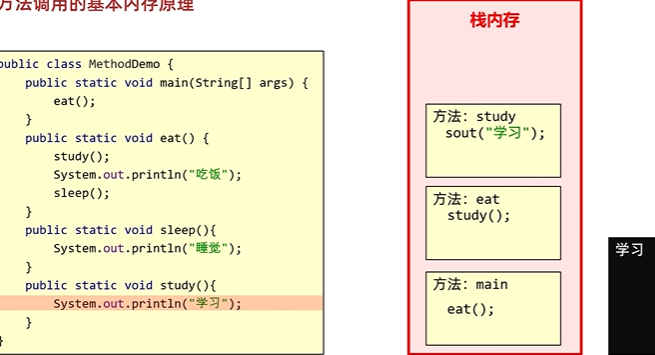

## 1. 方法概述

### 1.1 方法的概念

### 	**方法（method）是程序中最小的执行单元**

方法提高代码的**<u>*复用性、可维护性*</u>**

* 注意：
  * 方法必须先创建才可以使用，该过程成为**方法定义**
  * 方法创建后并不是直接可以运行的，需要手动使用后，才执行，该过程成为**方法调用**
* 写成方法的代码：
* 1/ 重复的代码
* 2/具有独立功能的代码

## 2. 方法的定义和调用

### 2.1 无参数方法定义和调用

* 定义格式：

  ```java
  public static void 方法名 (   ) {
  	// 方法体;
  }
  ```


方法的调用：

**<u>*看到方法的时候进入到相应的方法里去执行，执行完毕后回到调用处*</u>**

也就是说<u>*可能会涉及到方法的多重嵌套的调用，但是不能嵌套定义*</u>

# **方法的定义要写在main方法的外面，类的里面**

* 范例：

  ```java
  public static void method (    ) {
  	// 方法体;
  }
  ```

* 调用格式：

  ```java
  方法名();
  ```

* 范例：

  ```java
  method();
  ```

* 注意：

* ### **<u>*程序运行的时候电脑是最先 进入到main方法里面*</u>**

  ​	方法必须先定义，后调用，否则程序将报错

### 2.3 无参数方法的练习

* 需求：设计一个方法用于打印两个数中的较大数 
* 思路：
  * ①定义一个方法，用于打印两个数字中的较大数，例如getMax() 
  * ②方法中定义两个变量，用于保存两个数字 
  * ③使用分支语句分两种情况对两个数字的大小关系进行处理 
  * ④在main()方法中调用定义好的方法 
* 代码：

```java
public class MethodTest {
    public static void main(String[] args) {
        //在main()方法中调用定义好的方法
        getMax();
    }

    //定义一个方法，用于打印两个数字中的较大数，例如getMax()
    public static void getMax() {
        //方法中定义两个变量，用于保存两个数字
        int a = 10;
        int b = 20;

        //使用分支语句分两种情况对两个数字的大小关系进行处理
        if(a > b) {
            System.out.println(a);
        } else {
            System.out.println(b);
        }
    }
}
```

## 3. 带参数方法定义和调用

### 3.1 带参数方法定义和调用

* 定义格式：

  参数：由数据类型和变量名组成 -  数据类型 变量名

  参数范例：int a

  ```java
  public static void 方法名 (参数1) {
  	方法体;
  }
  
  public static void 方法名 (参数1, 参数2, 参数3...) {
  	方法体;
  }
  ```

* 范例：

  ```java
  public static void isEvenNumber(int number){
      ...
  }
  public static void getMax(int num1, int num2){
      ...
  }
  ```

  * 注意：

  		方法定义时，参数中的数据类型与变量名都不能缺少，缺少任意一个程序将报错
			
  		方法定义时，多个参数之间使用逗号( ，)分隔

* 调用格式：

  ```java
  方法名(参数)；
  
  方法名(参数1,参数2);
  ```

* 范例：

  ```java
  isEvenNumber(10);
  
  getMax(10,20);
  ```

  * 方法调用时，**参数**的**数量与类型**必须与方法**定义中的设置相匹配**，否则程序将报错 
  
  * ### **<u>*调用的时候也遵循数据类型的隐式转换*</u>**

### 3.2 形参和实参

1. 形参：方法定义中的参数

​          等同于变量定义格式，例如：int number

2. 实参：**方法调用中的参数**

​          等同于使用变量或常量，例如： 10  number

### 3.3 带参数方法练习

* 需求：设计一个方法用于打印两个数中的较大数，数据来自于方法参数 }
* 思路：
  * ①定义一个方法，用于打印两个数字中的较大数，例如getMax() 
  * ②为方法定义两个参数，用于接收两个数字 
  * ③使用分支语句分两种情况对两个数字的大小关系进行处理 
  * ④在main()方法中调用定义好的方法（使用常量）
  * ⑤在main()方法中调用定义好的方法（使用变量） 
* 代码：

```java
public class MethodTest {
    public static void main(String[] args) {
        //在main()方法中调用定义好的方法（使用常量）
        getMax(10,20);
        //调用方法的时候，人家要几个，你就给几个，人家要什么类型的，你就给什么类型的
        //getMax(30);
        //getMax(10.0,20.0);

        //在main()方法中调用定义好的方法（使用变量）
        int a = 10;
        int b = 20;
        getMax(a, b);
    }

    //定义一个方法，用于打印两个数字中的较大数，例如getMax()
    //为方法定义两个参数，用于接收两个数字
    public static void getMax(int a, int b) {
        //使用分支语句分两种情况对两个数字的大小关系进行处理
        if(a > b) {
            System.out.println(a);
        } else {
            System.out.println(b);
        }
    }
}
```

## 4. 带返回值方法的定义和调用

### 4.1 带返回值方法定义和调用

* 定义格式

  ```java
  public static 数据类型 方法名 ( 参数 ) { 
  	return 返回值 ;
  }
  ```

* 范例

  ```java
  public static boolean isEvenNumber( int number ) {           
  	return true ;
  }
  public static int getMax( int a, int b ) {
  	return  100 ;
  }
  ```

  * 注意：
    * 方法定义时**return后面的返回值**与方法**定义上的数据类型**要**匹配**，否则程序将报错

* 调用格式

  ```java
  方法名 ( 参数 ) ;
  数据类型 变量名 = 方法名 ( 参数 ) ;
  ```

* 范例

  ```java
  isEvenNumber ( 5 ) ;
  boolean  flag =  isEvenNumber ( 5 ); 
  ```

  * 注意：
    * 方法的返回值通常会使用变量接收，否则该返回值将无意义


**<u>*写方法时要想清楚 三个问题：*</u>**

**<u>**

**1/“我要干嘛**“

**2/”我需要什么（参数）“**

**3/“需不需要用返回值”</u>**

### 4.2 带返回值方法练习1

* 需求：设计一个方法可以获取两个数的较大值，数据来自于参数

* 思路：

  * ①定义一个方法，用于获取两个数字中的较大数 
  * ②使用分支语句分两种情况对两个数字的大小关系进行处理 
  * ③根据题设分别设置两种情况下对应的返回结果 
  * ④在main()方法中调用定义好的方法并使用变量保存 
  * ⑤在main()方法中调用定义好的方法并直接打印结果 

* 代码：

  ```java
  public class MethodTest {
      public static void main(String[] args) {
          //在main()方法中调用定义好的方法并使用变量保存
          int result = getMax(10,20);
          System.out.println(result);
  
          //在main()方法中调用定义好的方法并直接打印结果
          System.out.println(getMax(10,20));
      }
  
      //定义一个方法，用于获取两个数字中的较大数
      public static int getMax(int a, int b) {
          //使用分支语句分两种情况对两个数字的大小关系进行处理
          //根据题设分别设置两种情况下对应的返回结果
          if(a > b) {
              return a;
          } else {
              return b;
          }
      }
  }
  ```

### 4.3 带返回值方法练习2

需求：

​	定义一个方法，求一家商场每个季度的营业额。根据方法结果再计算出全年营业额。

代码示例：

```java
package com.itheima.demo;

public class MethodDemo9 {
    public static void main(String[] args) {
        /*需求：定义一个方法，求一家商场每个季度的营业额。
        根据方法结果再计算出全年营业额。*/
        int sum1 = getSum(10, 20, 30);
        int sum2 = getSum(10, 20, 30);
        int sum3 = getSum(10, 20, 30);
        int sum4 = getSum(10, 20, 30);

        int sum = sum1 + sum2 + sum3 + sum4;
        System.out.println(sum);

    }

    //心得：
    //1.我要干嘛？  决定了方法体   每个季度的营业额
    //2.我干这件事情，需要什么才能完成？ 决定了形参 需要三个月的营业额 a b c
    //3.我干完这件事情，看调用处是否需要使用方法的结果。   决定了返回值
    //如果需要使用，那么必须返回
    //如果不需要使用，可以返回也可以不返回
    public static int getSum(int month1,int month2,int month3){
        int sum = month1 + month2 + month3;
        //因为方法的调用处，需要继续使用这个结果
        //所以我们必须要把sum返回
        return sum;
    }
}

```

### 4.4 带返回值方法练习3

需求：

​	键盘录入两个圆的半径（整数），比较两个圆的面积。

代码示例：

```java
import java.util.Scanner;

public class MethodDemo10 {
    public static void main(String[] args) {
        //需求：键盘录入两个圆的半径（整数），比较两个圆的面积。
        //键盘录入圆的半径
        Scanner sc = new Scanner(System.in);
        System.out.println("请输入圆的半径");
        int radii1 = sc.nextInt();

        System.out.println("请输入第二个圆的半径");
        int radii2 = sc.nextInt();
        double area1 = getArea(radii1);
        double area2 = getArea(radii2);
        if(area1 > area2){
            System.out.println("第一个圆更大");
        }else{
            System.out.println("第二个圆更大");
        }
    }

    //心得：
    //1.我要干嘛？   求圆的面积
    //2.我干这件事情，需要什么才能完成？        半径
    //3.方法的调用处，是否需要继续使用方法的结果    要比较
    public static double getArea(int radii) {
        double area = 3.14 * radii * radii;
        return area;
    }
}
```

## 5. 方法的注意事项

### 5.1 方法的注意事项

* 方法不能嵌套定义

  * 示例代码：

    ```java
    public class MethodDemo {
        public static void main(String[] args) {
    
        }
    
        public static void methodOne() {
    		public static void methodTwo() {
           		// 这里会引发编译错误!!!
        	}
        }
    }
    ```

* 方法之间是平级关系，通常定义的方法都写在main方法的下面，**方法编写的顺序与执行的顺序无关，**方法的执行顺序与调用顺序有关

  

* **void**表示无返回值，可以省略return，**也可以**单独的书**写return，后面不加数据**。

* return语句后面不能跟数据或代码，不然会报错

  * 示例代码：

    ```java
    public class MethodDemo {
        public static void main(String[] args) {
    
        }
        public static void methodTwo() {
            //return 100; 编译错误，因为没有具体返回值类型
            return;	
            //System.out.println(100); return语句后面不能跟数据或代码
        }
    }
    ```

### 5.2 方法的通用格式

* 格式：

  ```java
  public static 返回值类型 方法名(参数) {
     方法体; 
     return 数据 ;
  }
  ```

* 解释：

  * public static 	修饰符，目前先记住这个格式

  	 返回值类型	方法操作完毕之后返回的数据的数据类型

    ​			如果方法操作完毕，没有数据返回，这里写void，而且方法体中一般不写return

  	 方法名		调用方法时候使用的标识

  	 参数		由数据类型和变量名组成，多个参数之间用逗号隔开

  	 方法体		完成功能的代码块

  	 return		如果方法操作完毕，有数据返回，用于把数据返回给调用者

* 定义方法时，要做到两个明确

  * 明确返回值类型：主要是明确方法操作完毕之后是否有数据返回，如果没有，写void；如果有，写对应的数据类型
  * 明确参数：主要是明确参数的类型和数量

* 调用方法时的注意：

  * void类型的方法，直接调用即可
  * 非void类型的方法，推荐用变量接收调用

## 6. 方法重载

### 6.1 方法重载

* 方法重载概念

  方法重载指**同一个类**中定义的多个方法之间的关系，满足下列条件的多个方法相互构成重载

  * 多个方法在同一个类中

  * 多个方法**1/☆☆☆☆☆☆☆☆☆☆☆☆☆☆具有相同的方法名**，这些方法的（**功能相同**）

  * 多个方法的**2/☆☆☆☆☆☆☆☆☆☆☆☆☆参数不相同**，类型不同、顺序不同或者数量不同（<u>*至于形参的名字取什么影响不大，如果两个重载方法的 形参只有名字不同，其他相同，会报错*</u>）（本质上，JAVA虚拟机会通过参数的不同来区分同名的方法，也就是之前所说的  实参 与 形参 一定要一一对应）

  * # *<u>与返回值的类型无关</u>*

* 注意：

  * 重载仅对应方法的定义，与方法的调用无关，调用方式参照标准格式
  * 重载仅针对同一个类中方法的名称与参数进行识别，与返回值无关，换句话说不能通过返回值来判定两个方法是否相互构成重载

* 正确范例：

  ```java
  public class MethodDemo {
  	public static void fn(int a) {
      	//方法体
      }
      public static int fn(double a) {
      	//方法体
      }
  }
  
  public class MethodDemo {
  	public static float fn(int a) {
      	//方法体
      }
      public static int fn(int a , int b) {
      	//方法体
      }
  }
  ```

* 错误范例：

  ```java
  public class MethodDemo {
  	public static void fn(int a) {
      	//方法体
      }
      public static int fn(int a) { 	/*错误原因：重载与返回值无关*/
      	//方法体
      }
  }
  
  
  
  
  
  
  //☆☆☆☆☆☆☆☆☆☆☆☆☆☆☆必须要在同一个类里面满足条件的方法才能构成方法的重载
  public class MethodDemo01 {
      public static void fn(int a) {
          //方法体
      }
  } 
  public class MethodDemo02 {
      public static int fn(double a) { /*错误原因：这是两个类的两个fn方法*/
          //方法体
      }
  }
  ```

### 6.2 方法重载练习

* 需求：使用方法重载的思想，设计比较两个整数是否相同的方法，兼容全整数类型（byte,short,int,long） 

* 思路：

  * ①定义比较两个数字的是否相同的方法compare()方法，参数选择两个int型参数

  * ②定义对应的重载方法，变更对应的参数类型，参数变更为两个long型参数

  * ③定义所有的重载方法，两个byte类型与两个short类型参数 

  * ④完成方法的调用，测试运行结果 

  * 

    整数要使其为byte,short,long类型记得强制类型转换

* 代码：

  ```java
  public class MethodTest {
      public static void main(String[] args) {
          //调用方法
          System.out.println(compare(10, 20));
          System.out.println(compare((byte) 10, (byte) 20));
          System.out.println(compare((short) 10, (short) 20));
          System.out.println(compare(10L, 20L));
      }
  
      //int
      public static boolean compare(int a, int b) {
          System.out.println("int");
          return a == b;
      }
  
      //byte
      public static boolean compare(byte a, byte b) {
          System.out.println("byte");
          return a == b;
      }
  
      //short
      public static boolean compare(short a, short b) {
          System.out.println("short");
          return a == b;
      }
  
      //long
      public static boolean compare(long a, long b) {
          System.out.println("long");
          return a == b;
      }
  
  }
  ```

### 7.3 数组遍历

* 需求：设计一个方法用于数组遍历，要求遍历的结果是在一行上的。例如：[11, 22, 33, 44, 55] 

* 思路：

  * ①因为要求结果在一行上输出，所以这里需要在学习一个新的输出语句System.out.print(“内容”);

    System.out.println(“内容”); 输出内容并换行

    System.out.print(“内容”); 输出内容不换行

    System.out.println(); 起到换行的作用

  * ②定义一个数组，用静态初始化完成数组元素初始化

  * ③定义一个方法，用数组遍历通用格式对数组进行遍历

  * ④用新的输出语句修改遍历操作

  * ⑤调用遍历方法

* 代码：

  ```java
  public class Test1 {
      public static void main(String[] args) {
        /*  //先打印数据，再进行换行
          System.out.println("aaa");
          //只打印不换行
          System.out.print("bbb");
          System.out.print("ddd");
          //不打印任何内容，只换行
          System.out.println();
          System.out.print("cc");*/
          //设计一个方法用于数组遍历，要求遍历的结果是在一行上的。例如：[11, 22, 33, 44, 55]
          int[] arr = {1,2,3,4,5};
          printArr(arr);
      }
      //1.我要遍历数组
      //2.需要什么？  数组
      //3.调用处是否需要使用方法的结果。
      public static void printArr(int[] arr){
          System.out.print('{');
          for(int i=0;i<b.length;i++){
               System.out.print(b[i]);
               if(i<b.length-1) System.out.print(',');
              //☆☆☆☆☆☆☆☆☆☆☆☆☆☆☆☆人家都是尽量把同样思路的语句放在一起写，不同的再加条件限制
          }
          System.out.print('}');
      }
  }
  ```

### 7.4 数组最大值

* 需求：设计一个方法用于获取数组中元素的最大值 

* 思路：

  * ①定义一个数组，用静态初始化完成数组元素初始化
  * ②定义一个方法，用来获取数组中的最大值，最值的认知和讲解我们在数组中已经讲解过了
  * ③调用获取最大值方法，用变量接收返回结果
  * ④把结果输出在控制台

* 代码：

  ```java
  public class MethodTest02 {
      public static void main(String[] args) {
          //定义一个数组，用静态初始化完成数组元素初始化
          int[] arr = {12, 45, 98, 73, 60};
  
          //调用获取最大值方法，用变量接收返回结果
          int number = getMax(arr);
  
          //把结果输出在控制台
          System.out.println("number:" + number);
      }
  
      //定义一个方法，用来获取数组中的最大值
      /*
          两个明确：
              返回值类型：int
              参数：int[] arr
       */
      public static int getMax(int[] arr) {
          int max = arr[0];
  
          for(int x=1; x<arr.length; x++) {//☆☆☆☆☆☆☆☆☆☆☆☆☆☆☆☆前面都已经把下标为0的元素设置为max，循环的时候可以从下一个1开始，可以减少一次循环，提高一点效率
              if(arr[x] > max) {
                  max = arr[x];
              }
          }
          return max;
      }
  }
  ```

### 7.6 获取索引


**<u>JAVA中的boolean只有两个值，false,true (他们本身就是一个值，不代表0,1)</u>**

需求：

​	定义一个方法获取数字，在数组中的索引位置，将结果返回给调用处，如果有重复的，只要获取第一个即可。

代码示例：

```java
package com.itheima.demo;

public class Test4 {
    public static void main(String[] args) {
        //定义一个方法获取数字，在数组中的索引位置，将结果返回给调用处
        //如果有重复的，只要获取第一个即可

        int[] arr = {1,2,3,4,5};
        int index = contains(arr, 3);
        System.out.println(index);
    }

    //1. 我要干嘛？判断数组中的某一个数是否存在
    //2. 需要什么？数组 数字
    //3. 调用处是否需要继续使用？返回
    //获取number在arr中的位置
    public static int contains(int[] arr, int number) {
        //遍历arr得到每一个元素
        for (int i = 0; i < arr.length; i++) {
            //拿着每一个元素跟number比较
            if(arr[i] == number){
                //如果相等，表示找到了
                return i;
            }
        }
        //当循环结束之后，如果还不能返回索引，表示数组中不存在该数据
        //可以返回-1
        return -1;
    }
}


//相关补充：遍历数组，看数组里面是否有所需要查找的元素

    public static boolean contains(int[] b,int m){
        for(int i=1;i<b.length;i++){
            if(b[i]==m) return true;
        }
        return false;
       
    }
   //☆☆☆☆☆☆☆☆☆☆☆☆☆☆☆☆return 直接结束程序的运行（这里用标记变量也可行，不过不如直接return 来的方便）
//break仅仅只是结束循环

```


# 7.7 方法调用的基本原理

1.


**<u>*方法里的变量随着方法的出栈而出栈*</u>**

2.栈：都是先进后出




当一个方法（栈里最上面那个方法   /最后进来的那个方法/）执行完之后就出栈

此时要**返回调用处**


**3.基本数据类型**//传递真实的数据 相当于数据复制


**4.引用数据类型/目前学过的只有数组/（new出来的存储空间）**//传递的是地址值 


1/堆里面的空间都有地址值，通过     **地址（找地址）+索引（获取数据）**    去访问堆内存储的数据

2/引用（拿别人的去用）

**5.**

**例一：**


一个方法内的变量只会在这个方法里面有用

**传递基本数据类型的时候，传递的是真是的数据，形参的改变，不影响实际参数的值**

//