# **<u>*包是存放.java文件的文件夹*</u>**


## 1. 类和对象

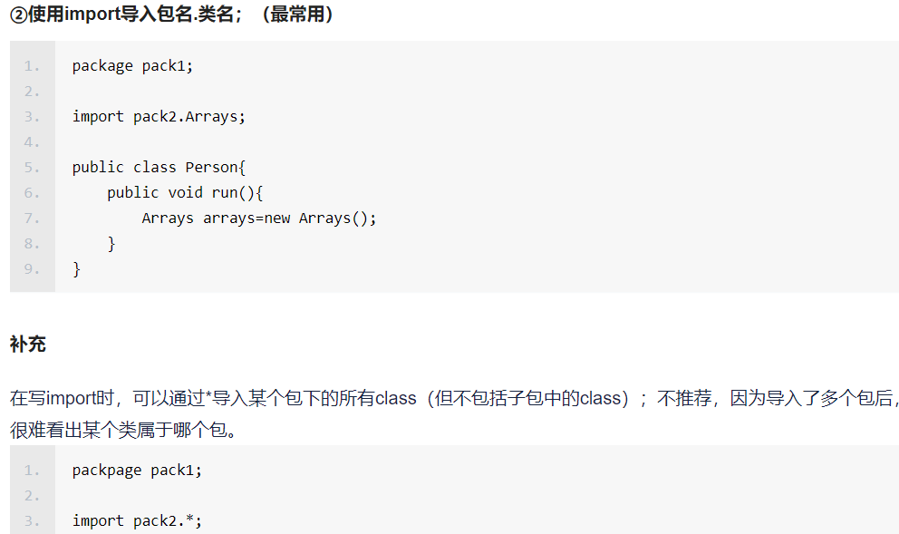

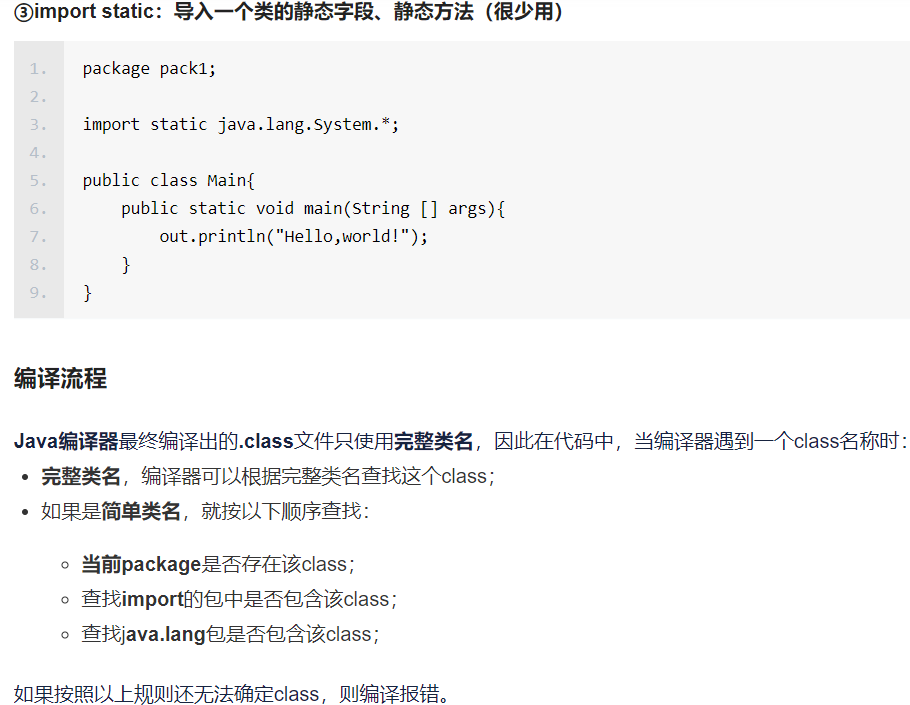

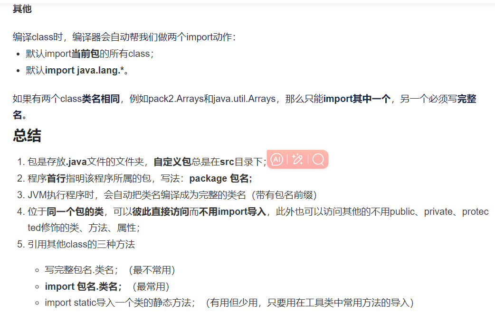


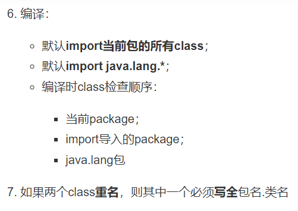

# 拓展

**（1）**

1/Javabean类：描述一类事物的类，在该类中不main方法

2/测试类：编写main方法的类，可以在测试类中创建javabean的对象并进行赋值调用

**（2）**

一个JAVA文件中可以定义多个class类，但是**只有一个class能被public修饰**，而且**被修饰的类名必须成为代码的文件名**


**被public修饰的类名必须和文件名一样**的原因主要有以下几点：‌

1. **单一公开接口**：‌**<u>*每个编译单元（‌即源代码文件）‌只能有一个public类*</u>**，‌这可以理解为每个编译单元只能有**<u>*一个公开的接口*</u>**，‌而这个接口由其public类来表示。‌没有被public修饰的类都是为了给被public修饰的类做支撑。‌这是从软件架构设计和安全性设计上得出的结论，‌也是Java设计者的考虑。‌
2. **避免混淆**：‌如果允许文件中存在多个public类，‌并且它们的类名不同于文件名，‌那么在查找和引用类时就会变得困难和容易出错。‌通过要求public类的类名与文件名相同，‌可以避免源代码文件中出现多个public类的混乱情况，‌提高代码的可读性和可维护性。‌
3. **便于虚拟机查找**：‌Java在运行时并不是将所有的class文件全都放到内存中，‌而是在遇到import的时候才去相应的文件目录找相应的class文件。‌将类名与文件名一一对应，‌可以方便虚拟机在相应的路径（‌包名）‌中找到相应的类的信息（**<u>*一个文件里只能有一个与文件名同名的public(可以被调用的类)类*</u>**）。‌如果不这么做的话，‌就很难去找，‌而且开销也会很大。‌

**（3）**

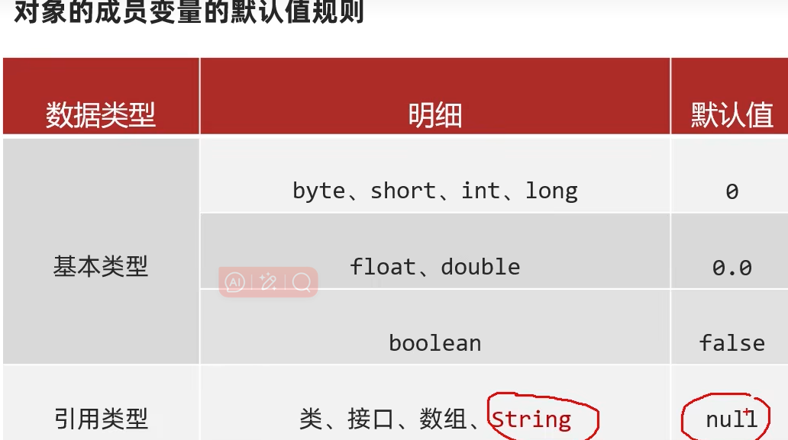

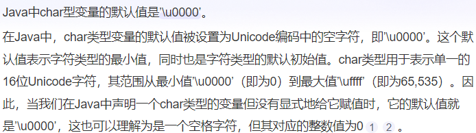


### 1.1 类和对象的理解

客观存在的事物皆为对象 ，所以我们也常常说万物皆对象。

* 类
  * 类的理解
    * 类是对现实生活中一类具有共同属性和行为的事物的抽象
    * 类是对象的数据类型，类是具有**相同属性和行为**的一组对象的集合
    * 简单理解：类就是对现实事物的一种描述
  * 类的组成
    * **属性**：指事物的**特征**，例如：手机事物（品牌，价格，尺寸）
    * **行为**：指事物**能执行的操作**，例如：手机事物（打电话，发短信）
* 类和对象的关系
  * 类：类是对现实生活中一类具有共同属性和行为的事物的抽象
  * 对象：是能够看得到摸的着的真实存在的实体
  * 简单理解：**类是对事物的一种描述，对象则为具体存在的事物**

### 1.2 类的定义

类的组成是由属性和行为两部分组成

* 属性：在类中通过成员变量来体现（类中方法外的变量）
* 行为：在类中通过成员方法来体现（和前面的方法相比去掉static关键字即可）

类的定义步骤：

①定义类

②编写类的成员变量

③编写类的成员方法

```java
public class 类名 {
	// 成员变量
	变量1的数据类型 变量1；
	变量2的数据类型 变量2;
	…
	// 成员方法
	方法1;
	方法2;	
}
```

示例代码：

```java
/*
    手机类：
        类名：
        手机(Phone)

        成员变量：
        品牌(brand)
        价格(price)

        成员方法：
        打电话(call)
        发短信(sendMessage)
 */
public class Phone {
    //成员变量
    String brand;
    int price;

    //成员方法
    public void call() {
        System.out.println("打电话");
    }

    public void sendMessage() {
        System.out.println("发短信");
    }
}

```

### 1.3 对象的使用

* 创建对象的格式：
  * 类名 对象名 = new 类名();
* 调用成员的格式：
  * 对象名.成员变量
  * 对象名.成员方法()
* 命名的时候尽量首写字母大写，满足小驼峰命名法

* 示例代码

```java
/*
    创建对象
        格式：类名 对象名 = new 类名();
        范例：Phone p = new Phone();

    使用对象
        1：使用成员变量
            格式：对象名.变量名
            范例：p.brand
        2：使用成员方法
            格式：对象名.方法名()
            范例：p.call()
 */
public class PhoneDemo {
    public static void main(String[] args) {
        //创建对象
        Phone p = new Phone();

        //使用成员变量
        System.out.println(p.brand);
        System.out.println(p.price);

        p.brand = "小米";
        p.price = 2999;

        System.out.println(p.brand);
        System.out.println(p.price);

        //使用成员方法
        p.call();
        p.sendMessage();
    }
}
```

### 1.4 学生对象-练习

* 需求：首先定义一个学生类，然后定义一个学生测试类，在学生测试类中通过对象完成成员变量和成员方法的使用
* 分析：
  * 成员变量：姓名，年龄…
  * 成员方法：学习，做作业…
* 示例代码：

```java
public class Student {
    //成员变量
    String name;
    int age;

    //成员方法
    public void study() {
        System.out.println("好好学习，天天向上");
    }

    public void doHomework() {
        System.out.println("键盘敲烂，月薪过万");
    }
}
/*
    学生测试类
 */
public class StudentDemo {
    public static void main(String[] args) {
        //创建对象
        Student s = new Student();

        //使用对象
        System.out.println(s.name + "," + s.age);

        s.name = "林青霞";
        s.age = 30;

        System.out.println(s.name + "," + s.age);

        s.study();
        s.doHomework();
    }
}
```

## 2. 对象内存图

### 2.1 单个对象内存图

* 成员变量使用过程


* 成员方法调用过程


**<u>*补充：*</u>**

1/在方法区 加载字节码文件，最开始一定是在方法区先加载含main方法的那个类，到后面类的实例化时才需要把相应的类加载到方法区

2/main方法入栈

3/在堆中new的空间的地址返回给s，（S存的 是这个类对象的地址）

4/显示初始化比如在类里面直接给成员变量赋值

5/不管是主类还是其他类的方法调用，都是从方法区加载到栈里执行


1/当方法调用完了直接出栈（方法里面如果有定义变量的，带着一起出栈）

2/此时，那个变量存的堆中的地址也被带走了，那么堆中申请的空间也变成了垃圾

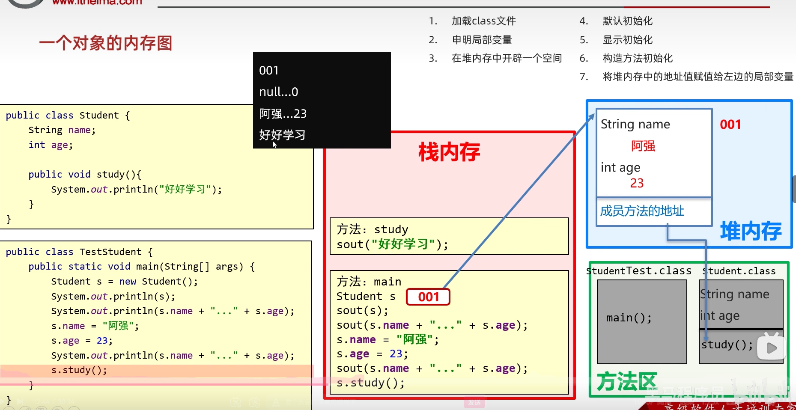

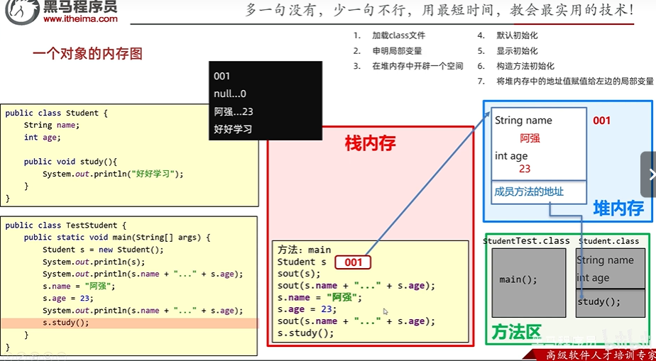

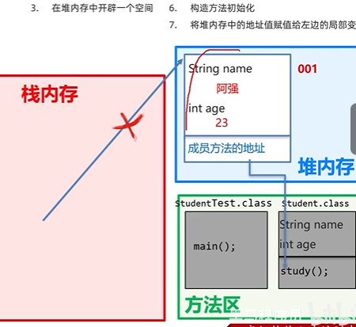


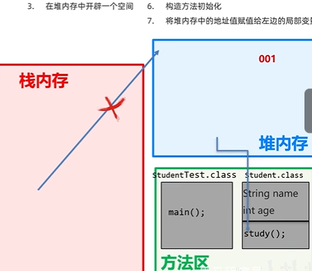


### 2.2 多个对象内存图

* 成员变量使用过程


* 成员方法调用过程


* 1/如果之前的方法区里已经加载了相应的class类文件，那么后面再用到不用再加载了，直接用就行了

* 总结：

  多个对象在堆内存中，都有不同的内存划分，成员变量存储在各自的内存区域中，成员方法多个对象共用的一份


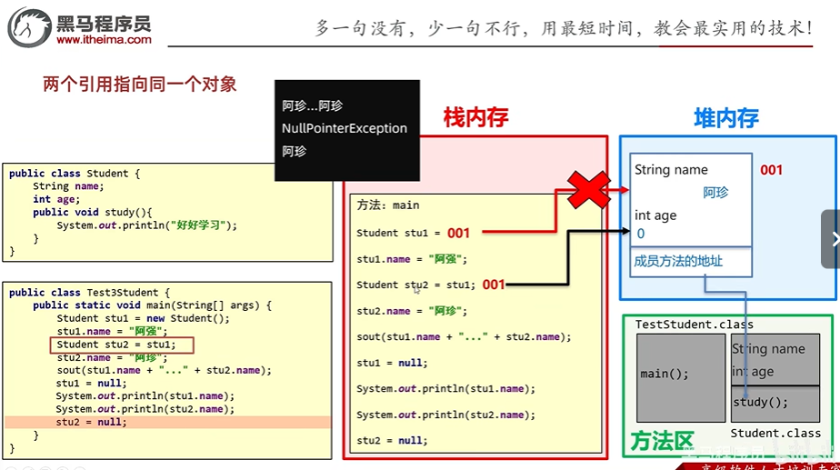

**null表示不存在的空间，当用它赋值给栈中存储堆中相应对象的地址的变量之后，这个变量不指向任何空间，但堆中的空间不受影响**


# 拓展：基本数据类型 与 引用数据类型 间的区别

基本数据类型：数据存在自己的空间里（变量名代表空间里存的数据）
引用数据类型：数据存在其他空间中（变量名代表数据真实存储空间的地址）


基本数据类型：整数、浮点数、布尔、字符

引用数据类型：除了左边的其他所有类型（比如 数组、各种类（String也属于一种类））


## **3. 成员变量和局部变量**

### 3.1 成员变量和局部变量的区别

* 类中位置不同：成员变量（类中方法外）局部变量（方法内部或方法声明上）
* 内存中位置不同：成员变量（堆内存/在堆里创建对象）局部变量（栈内存/方法是在栈里面运行）
* 生命周期不同：成员变量（随着对象的存在而存在，随着对象的消失而消失）局部变量（随着方法的调用而存在，醉着方法的调用完毕而消失）
* **<u>*初始化值不同：成员变量（有默认初始化值）局部变量（没有默认初始化值，必须先定义，赋值才能使用）*</u>**

## 4. 封装

### 4.1 封装思想

1. 封装概述
   是面向对象三大特征之一（封装，继承，多态）

   ## *<u>**对象代表什么，就得封装对应的数据，并提供数据对应的行为**</u>* 

   eg:人画圆
   
   有 人、圆 两个对象
   
   封装：<u>*实际上本质不是看哪个对象   A  对另一个对象  B  做了什么（即对象之间的作用关系）（这样的话只能看做是A调用了B里面的某个方法），而是**有关于这个对象自身属性的变化***</u>
   
   
   
   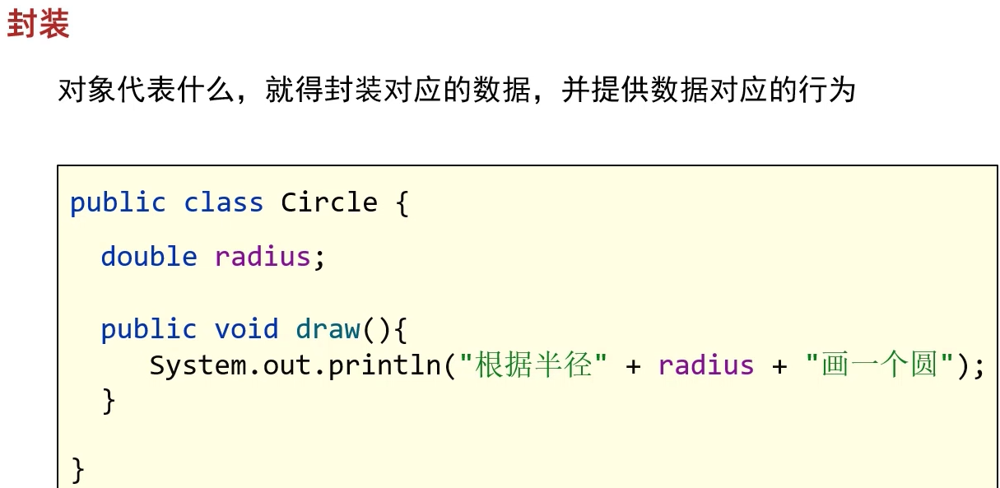
   
2. 封装代码实现
   将**类的某些信息隐藏**在类内部，**不允许外部程序直接访问**，而是通过**该类提供的方法来实现对隐藏信息的操作和访问**
   成员变量private，提供对应的getXxx()/setXxx()方法

### 4.2 private关键字

private是一个修饰符，可以用来修饰成员（成员变量，成员方法）

* 被**private**修饰的成员，**只能在本类进行访问**，针对private修饰的成员变量，**如果需要被其他类使用**，提供相应的操作，可以通过对**方法的调用**来**间接调用**该成员变量
  * 提供“get变量名()”方法，用于获取成员变量的值，方法用public修饰
  * 提供“set变量名(参数)”方法，用于设置成员变量的值，方法用public修饰
* 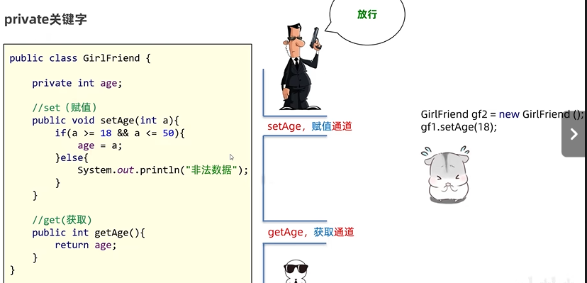
  
  
  
  比如，你当然可以在测试类的main方法里再次调用类的属性用条件语句进行数据的限制与矫正，<u>*但是不符合一个类里面，其相应数据的方法应该也在那个类里面简便*</u>。（即 **<u>*封装思想*</u>**）
  
  
  
* 示例代码：

  ```java
  /*
      学生类
   */
  class Student {
      //成员变量
      String name;
      private int age;
  
      //提供get/set方法
      public void setAge(int a) {
          if(a<0 || a>120) {
              System.out.println("你给的年龄有误");
          } else {
              age = a;
          }
      }
  
      public int getAge() {
          return age;
      }
  
      //成员方法
      public void show() {
          System.out.println(name + "," + age);
      }
  }
  /*
      学生测试类
   */
  public class StudentDemo {
      public static void main(String[] args) {
          //创建对象
          Student s = new Student();
          //给成员变量赋值
          s.name = "林青霞";
          s.setAge(30);
          //调用show方法
          s.show();
      }
  }
  ```

### 4.3 private的使用

* 需求：定义标准的学生类，要求name和age使用private修饰，并提供set和get方法以及便于显示数据的show方法，测试类中创建对象并使用，最终控制台输出  林青霞，30 

* 示例代码：

  ```java
  /*
      学生类
   */
  class Student {
      //成员变量
      private String name;
      private int age;
  
      //get/set方法
      public void setName(String n) {
          name = n;
      }
  
      public String getName() {
          return name;
      }
  
      public void setAge(int a) {
          age = a;
      }
  
      public int getAge() {
          return age;
      }
  
      public void show() {
          System.out.println(name + "," + age);
      }
  }
  /*
      学生测试类
   */
  public class StudentDemo {
      public static void main(String[] args) {
          //创建对象
          Student s = new Student();
  
          //使用set方法给成员变量赋值
          s.setName("林青霞");
          s.setAge(30);
  
          s.show();
  
          //使用get方法获取成员变量的值
          System.out.println(s.getName() + "---" + s.getAge());
          System.out.println(s.getName() + "," + s.getAge());
  
      }
  }
  ```

### 4.4 this关键字（区分局部变量和成员变量的！！重名问题！！）

## **<u>*（this有点像返回上一层的感觉！）*</u>**

**<u>*补充：当你在定义一个量的时候，其实系统会默认同时给那个变量初始化了！！！！！！！！！！！！！！！！*</u>**

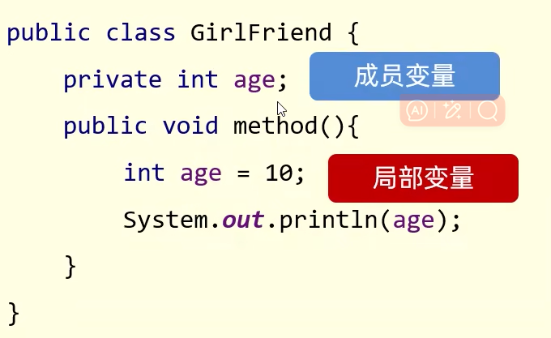

**成员变量**：在类的里面，**方法的外面**定义的变量

**局部变量**：在类里面的**方法里**定义的变量


**<u>*当没有this 的时候，就近原则*</u>**

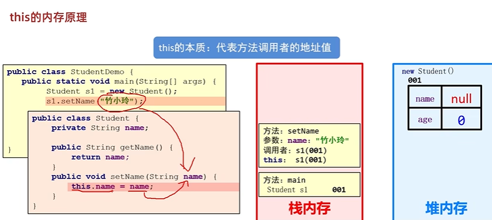

**<u>**

**</u>**

**<u>*对对象的成员变量进行操作的时候可以理解为前面一定要有调用者*</u>**

* this修饰的变量用于指代成员变量，其主要作用是（区分局部变量和成员变量的重名问题）
  * 方法的形参如果与成员变量同名，**不带this**修饰的变量指的是**形参**，而不是成员变量，**带this 指成员变量**
  * 方法的形参**没有**与成员变量**同名**，不带this修饰的变量**指的是成员变量**

```java
public class Student {
    private String name;
    private int age;

    public void setName(String name) {
        this.name = name;
    }

    public String getName() {
        return name;
    }

    public void setAge(int age) {
        this.age = age;
    }

    public int getAge() {
        return age;
    }

    public void show() {
        System.out.println(name + "," + age);
    }
}
```

## 5. 构造方法

### 5.1 构造方法概述

构造方法是一种特殊的方法

* 作用：创建对象   Student stu = **new Student();**

* 格式：

  public class 类名{

  ​        修饰符 类名( 参数 ) {

  ​					方法体；

  ​        }

  }


* 构造方法的方法名与类名相同，大小写也要一致
* 构造方法没有返回值类型，连void也没有，也不能用return带回结果数据
* 功能：**主要是完成对象数据的初始化**，是**创建对象必须调用**的一个方法(new 创建对象，虚拟机会自动调用构造方法)，如果该方法不能被成功调用则对象**无法创建**。（如果在类中我们**没有显性的定义**构造方法，java会自动为我们创建一个空的无参数的构造方法,系统为成员变量进行默认初始化
* 示例代码：

```java
class Student {
    private String name;
    private int age;

    //构造方法
    public Student() {
        System.out.println("无参构造方法");
    }

    public void show() {
        System.out.println(name + "," + age);
    }
}
/*
    测试类
 */
public class StudentDemo {
    public static void main(String[] args) {
        //创建对象
        Student s = new Student();
        s.show();
    }
}
```

### 5.2 构造方法的注意事项

* 构造方法的创建

如果没有定义构造方法，系统将给出一个默认的无参数构造方法
如果**定义了构造方法，系统将不再提供默认的无参的构造方法**（此时如果这个自己定义的构造方法有参，然后去调用无参的构造方法，系统会报错）//一般有个习惯，无参构造以及带全部参数的构造方法都要全部写上

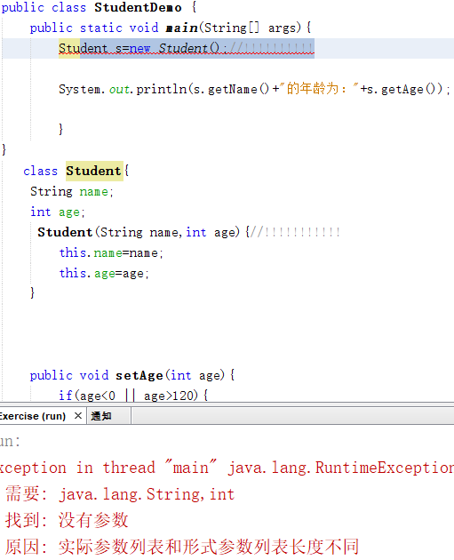

* 构造方法的重载

如果自定义了带参构造方法，还要使用无参数构造方法，就必须再写一个无参数构造方法

* 推荐的使用方式

无论是否使用，都手工书写无参数构造方法

* 重要功能！

可以使用带参构造，为成员变量进行初始化

* 示例代码

```java
/*
    学生类
 */
class Student {
    private String name;
    private int age;

    public Student() {}

    public Student(String name) {
        this.name = name;
    }

    public Student(int age) {
        this.age = age;
    }

    public Student(String name,int age) {
        this.name = name;
        this.age = age;
    }

    public void show() {
        System.out.println(name + "," + age);
    }
}
/*
    测试类
 */
public class StudentDemo {
    public static void main(String[] args) {
        //创建对象
        Student s1 = new Student();
        s1.show();

        //public Student(String name)
        Student s2 = new Student("林青霞");
        s2.show();

        //public Student(int age)
        Student s3 = new Student(30);
        s3.show();

        //public Student(String name,int age)
        Student s4 = new Student("林青霞",30);
        s4.show();
    }
}
```

### 5.3 标准类制作

① 类名需要见名知意

② **成员变量使用private修饰**

③ 提供至少两个构造方法 

* 无参构造方法（防止当你不想初始化时，创建对象失败）
* 带全部参数的构造方法

④ get和set方法 

​	提供每一个成员变量对应的setXxx()/getXxx()

⑤ 如果还有其他行为，也需要写上


//在定义声明完成员变量之后，可以通过

1/alt+insert

2/alt+fn+insert（这个在我的电脑上不好用）

快速生成构造方法和getXX、setXX，之类的方法


**<u>*Ctrl+p//用来显示方法里面对应应该改填什么信息*</u>**

### 5.4 练习1

需求：

​	定义标准学生类，要求分别使用空参和有参构造方法创建对象，空参创建的对象通过setXxx赋值，有参创建的对象直接赋值，并通过show方法展示数据。 

* 示例代码：

```java
class Student {
    //成员变量
    private String name;
    private int age;

    //构造方法
    public Student() {
    }

    public Student(String name, int age) {
        this.name = name;
        this.age = age;
    }

    //成员方法
    public void setName(String name) {
        this.name = name;
    }

    public String getName() {
        return name;
    }

    public void setAge(int age) {
        this.age = age;
    }

    public int getAge() {
        return age;
    }

    public void show() {
        System.out.println(name + "," + age);
    }
}
/*
    创建对象并为其成员变量赋值的两种方式
        1:无参构造方法创建对象后使用setXxx()赋值
        2:使用带参构造方法直接创建带有属性值的对象
*/
public class StudentDemo {
    public static void main(String[] args) {
        //无参构造方法创建对象后使用setXxx()赋值
        Student s1 = new Student();
        s1.setName("林青霞");
        s1.setAge(30);
        s1.show();

        //使用带参构造方法直接创建带有属性值的对象
        Student s2 = new Student("林青霞",30);
        s2.show();
    }
}
```

### 5.4 练习2


```java
public class User {
    //1.私有化全部的成员变量
    //2.空参构造
    //3.带全部参数的构造
    //4.针对于每一个私有化的成员变量都要提供其对应的get和set方法
    //5.如果当前事物还有其他行为，那么也要写出来，比如学生的吃饭，睡觉等行为

    private String username;//用户名
    private String password;//密码
    private String email;//邮箱
    private char gender;//性别
    private int age;//年龄

    //空参构造方法
    public User() {
    }

    //带全部参数的构造
    public User(String username, String password, String email, char gender, int age) {
        this.username = username;
        this.password = password;
        this.email = email;
        this.gender = gender;
        this.age = age;
    }

    //get和set

    public String getUsername() {
        return username;
    }

    public void setUsername(String username) {
        this.username = username;
    }

    public String getPassword() {
        return password;
    }

    public void setPassword(String password) {
        this.password = password;
    }

    public String getEmail() {
        return email;
    }

    public void setEmail(String email) {
        this.email = email;
    }

    public char getGender() {
        return gender;
    }

    public void setGender(char gender) {
        this.gender = gender;
    }

    public int getAge() {
        return age;
    }

    public void setAge(int age) {
        this.age = age;
    }

    public void eat(){
        System.out.println(username + "在吃饭");
    }
}

public class Test {
    public static void main(String[] args) {
        //写一个标准的javabean类
        //咱们在课后只要能把这个标准的javabean能自己写出来，那么就表示今天的知识点就ok了


        //利用空参构造创建对象
        User u1 = new User();
        //如果利用空参创建对象，还想赋值只能用set方法赋值
        u1.setUsername("zhangsan");
        u1.setPassword("1234qwer");
        u1.setEmail("itheima@itcast.cn");
        u1.setGender('男');
        u1.setAge(23);
        //获取属性的值并打印
        System.out.println(u1.getUsername() + ", " + u1.getPassword()
                + ", " + u1.getEmail() + ", " + u1.getGender() + ", " + u1.getAge());
        u1.eat();

        System.out.println("=============================");

        //简单的办法
        //利用带全部参数的构造来创建对象
        //快捷键:ctrl + p
        User u2 = new User("lisi","12345678","lisi@itcast.cn",'女',24);
        System.out.println(u2.getUsername() + ", " + u2.getPassword()
                + ", " + u2.getEmail() + ", " + u2.getGender() + ", " + u2.getAge());
        u2.eat();
    }
}

```

# 5.5 成员变量 与 局部变量 的区别

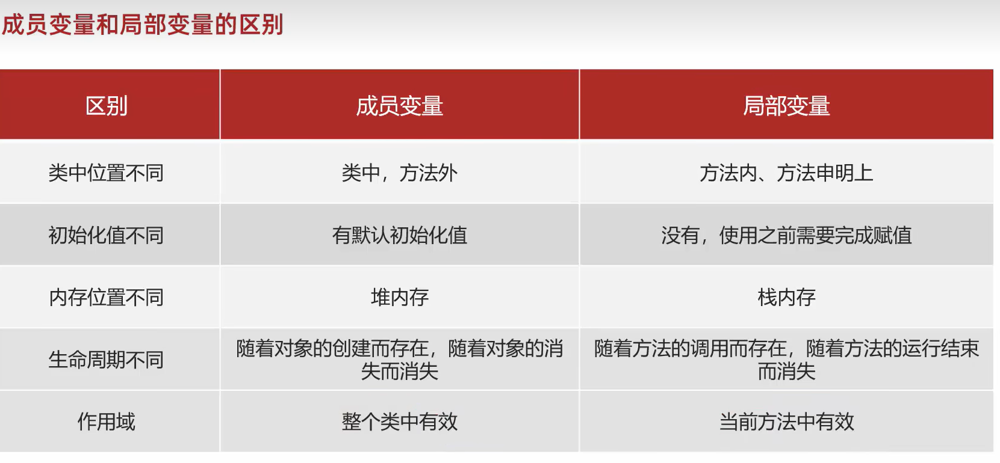 