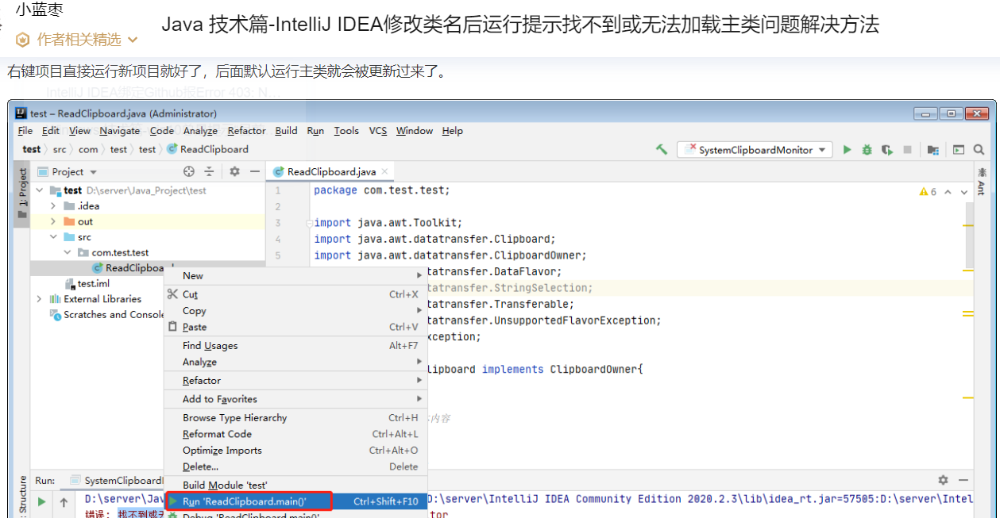

#  



**一个包中可以有多个主类。**‌在Java中，一个包（package）可以包含多个类，并且这些类中可以有一个或多个主类（main类）。主类是包含`main`方法的类，通常用于程序的入口点。一个包中的类并不限制主类的数量，但是一个Java应用程序只能有一个主类作为程序的入口点。这意味着，虽然一个包中可以有多个包含`main`方法的类，但在执行时，JVM只会识别并运行其中一个作为入口点的主类。

此外，需要注意的是，虽然一个包可以包含多个类，但这些类并不都需要是主类。主类的存在主要是为了方便程序的启动和执行，而包的设计则更多地关注于代码的组织和管理，以及防止类名的冲突。因此，开发者可以根据需要在一个包中定义任意数量的类，包括主类和非主类，以满足特定的功能和逻辑需求‌


//以上和 题目2相关


#  知识点

面向对象

## 题目1

### 题目描述：

​	定义数组存储3部汽车对象。

​	汽车的属性：品牌，价格，颜色。

​	创建三个汽车对象，数据通过键盘录入而来，并把数据存入到数组当中。

### 练习答案：

```java
public class Car {
    private String brand;//品牌
    private int price;//价格
    private String color;//颜色


    public Car() {
    }

    public Car(String brand, int price, String color) {
        this.brand = brand;
        this.price = price;
        this.color = color;
    }

    public String getBrand() {
        return brand;
    }

    public void setBrand(String brand) {
        this.brand = brand;
    }

    public int getPrice() {
        return price;
    }

    public void setPrice(int price) {
        this.price = price;
    }

    public String getColor() {
        return color;
    }

    public void setColor(String color) {
        this.color = color;
    }
}


public class CarTest {
    public static void main(String[] args) {
        //1.创建一个数组用来存3个汽车对象
        Car[] arr = new Car[3];

        //2.创建汽车对象，数据来自于键盘录入
        Scanner sc = new Scanner(System.in);
        for (int i = 0; i < arr.length; i++) {
            //创建汽车的对象
            Car c = new Car();
            //录入品牌
            System.out.println("请输入汽车的品牌");
            String brand = sc.next();
            c.setBrand(brand);
            //录入价格
            System.out.println("请输入汽车的价格");
            int price = sc.nextInt();
            c.setPrice(price);
            //录入颜色
            System.out.println("请输入汽车的颜色");
            String color = sc.next();
            c.setColor(color);

            //把汽车对象添加到数组当中
            arr[i] = c;
        }

        //3.遍历数组
        for (int i = 0; i < arr.length; i++) {
            Car car = arr[i];
            System.out.println(car.getBrand() + ", " + car.getPrice() + ", " + car.getColor());
        }
    }
}

```


### 

### 题目四 

### 题目描述：

​	定义数组存储3个学生对象。

​	学生的属性：学号，姓名，年龄。

​	要求1：添加的时候需要进行学号的唯一性判断。

​	要求2：添加完毕之后，遍历所有学生信息。/*【第一个TEST类】*/

​	要求3：通过id删除学生信息

​             如果存在，则删除，如果不存在，则提示删除失败。

​	要求4：删除完毕之后，遍历所有学生信息。/*【第二个TEST类】*/

​	要求5：id为2的学生，年龄+1岁/*【第三个TEST类】*/

### 练习答案：

```java
public class Student {
    private int id;
    private String name;
    private int age;

    public Student() {
    }

    public Student(int id, String name, int age) {
        this.id = id;
        this.name = name;
        this.age = age;
    }

    public int getId() {
        return id;
    }

    public void setId(int id) {
        this.id = id;
    }

    public String getName() {
        return name;
    }

    public void setName(String name) {
        this.name = name;
    }

    public int getAge() {
        return age;
    }

    public void setAge(int age) {
        this.age = age;
    }
}
//student标准类的创建


public class Test {
    public static void main(String[] args) {
        /*定义一个长度为3的数组，数组存储1~3名学生对象作为初始数据，学生对象的学号，姓名各不相同。
        学生的属性：学号，姓名，年龄。
        要求1：再次添加一个学生对象，并在添加的时候进行学号的唯一性判断。
        要求2：添加完毕之后，遍历所有学生信息。
		*/

        //1.创建一个数组用来存储学生对象
        Student[] arr = new Student[3];
        //2.创建学生对象并添加到数组当中
        Student stu1 = new Student(1, "zhangsan", 23);
        Student stu2 = new Student(2, "lisi", 24);

        //3.把学生对象添加到数组当中
        arr[0] = stu1;
        arr[1] = stu2;


        //要求1：再次添加一个学生对象，并在添加的时候进行学号的唯一性判断。
        Student stu4 = new Student(1, "zhaoliu", 26);

        //唯一性判断
        //已存在 --- 不用添加
        //不存在 --- 就可以把学生对象添加进数组
        boolean flag = contains(arr, stu4.getId());
        if(flag){
            //已存在 --- 不用添加
            System.out.println("当前id重复，请修改id后再进行添加");
        }else{
            //不存在 --- 就可以把学生对象添加进数组
            //把stu4添加到数组当中
            //1.数组已经存满 --- 只能创建一个新的数组，新数组的长度 = 老数组 + 1
            //2.数组没有存满 --- 直接添加
            int count = getCount(arr);
            if(count == arr.length){
                //已经存满
                //创建一个新的数组，长度 = 老数组的长度 + 1
                //然后把老数组的元素，拷贝到新数组当中
                Student[] newArr = creatNewArr(arr);
                //把stu4添加进去
                newArr[count] = stu4;

                //要求2：添加完毕之后，遍历所有学生信息。
                printArr(newArr);

            }else{
                //没有存满
                //[stu1,stu2,null]
                //getCount获取到的是2，表示数组当中已经有了2个元素
                //还有一层意思：如果下一次要添加数据，就是添加到2索引的位置
                arr[count] = stu4;
                //要求2：添加完毕之后，遍历所有学生信息。
                printArr(arr);

            }
        }
    }


    public static void printArr(Student[] arr){
        for (int i = 0; i < arr.length; i++) {
            Student stu = arr[i];
            if(stu != null){
                System.out.println(stu.getId() + ", " + stu.getName() + ", " + stu.getAge());
            }
        }
    }

    //创建一个新的数组，长度 = 老数组的长度 + 1
    //然后把老数组的元素，拷贝到新数组当中
    public static Student[] creatNewArr(Student[] arr){
        Student[] newArr = new Student[arr.length + 1];

        //循环遍历得到老数组中的每一个元素
        for (int i = 0; i < arr.length; i++) {
            //把老数组中的元素添加到新数组当中
            newArr[i] = arr[i];
        }

        //把新数组返回
        return newArr;

    }

    //定义一个方法判断数组中已经存了几个元素
    public static int getCount(Student[] arr){
        //定义一个计数器用来统计
        int count = 0;
        for (int i = 0; i < arr.length; i++) {
            if(arr[i] != null){
                count++;
            }
        }
        //当循环结束之后，我就知道了数组中一共有几个元素
        return count;
    }


    //1.我要干嘛？  唯一性判断
    //2.我干这件事情，需要什么才能完成？ 数组 id
    //3.调用处是否需要继续使用方法的结果？ 必须返回
    public static boolean contains(Student[] arr, int id) {
        for (int i = 0; i < arr.length; i++) {
            //依次获取到数组里面的每一个学生对象
            Student stu = arr[i];
            if(stu != null){
                //获取数组中学生对象的id
                int sid = stu.getId();
                //比较
                if(sid == id){
                    return true;
                }
            }
        }

        //当循环结束之后，还没有找到一样的，那么就表示数组中要查找的id是不存在的。
        return false;
    }


}


public class Test3 {
    public static void main(String[] args) {
        /*定义一个长度为3的数组，数组存储1~3名学生对象作为初始数据，学生对象的学号，姓名各不相同。
        学生的属性：学号，姓名，年龄。

        要求3：通过id删除学生信息
            如果存在，则删除，如果不存在，则提示删除失败。
        要求4：删除完毕之后，遍历所有学生信息。
		*/


        //1.创建一个数组用来存储学生对象
        Student[] arr = new Student[3];
        //2.创建学生对象并添加到数组当中
        Student stu1 = new Student(1, "zhangsan", 23);
        Student stu2 = new Student(2, "lisi", 24);
        Student stu3 = new Student(3, "wangwu", 25);

        //3.把学生对象添加到数组当中
        arr[0] = stu1;
        arr[1] = stu2;
        arr[2] = stu3;

        /*要求3：通过id删除学生信息
        如果存在，则删除，如果不存在，则提示删除失败。*/

        //要找到id在数组中对应的索引
        int index = getIndex(arr, 2);
        if (index >= 0){
            //如果存在，则删除
            arr[index] = null;
            //遍历数组
            printArr(arr);
        }else{
            //如果不存在，则提示删除失败
            System.out.println("当前id不存在，删除失败");
        }
    }


    //1.我要干嘛？  找到id在数组中的索引
    //2.我需要什么？ 数组 id
    //3.调用处是否需要继续使用方法的结果？ 要
    public static int getIndex(Student[] arr , int id){
        for (int i = 0; i < arr.length; i++) {
            //依次得到每一个学生对象
            Student stu = arr[i];
            //对stu进行一个非空判断
            if(stu != null){
                int sid = stu.getId();
                if(sid == id){
                    return i;
                }
            }
        }

        //当循环结束之后，还没有找到就表示不存在
        return -1;
    }

    public static void printArr(Student[] arr){
        for (int i = 0; i < arr.length; i++) {
            Student stu = arr[i];
            if(stu != null){
                System.out.println(stu.getId() + ", " + stu.getName() + ", " + stu.getAge());
            }
        }
    }
}


public class Test4 {
    public static void main(String[] args) {
        /*定义一个长度为3的数组，数组存储1~3名学生对象作为初始数据，学生对象的学号，姓名各不相同。
        学生的属性：学号，姓名，年龄。

        要求5：查询数组id为“2”的学生，如果存在，则将他的年龄+1岁*/


        //1.创建一个数组用来存储学生对象
        Student[] arr = new Student[3];
        //2.创建学生对象并添加到数组当中
        Student stu1 = new Student(1, "zhangsan", 23);
        Student stu2 = new Student(2, "lisi", 24);
        Student stu3 = new Student(3, "wangwu", 25);

        //3.把学生对象添加到数组当中
        arr[0] = stu1;
        arr[1] = stu2;
        arr[2] = stu3;


        //4.先要找到id为2的学生对于的索引
        int index = getIndex(arr, 2);

        //5.判断索引
        if(index >= 0){
            //存在， 则将他的年龄+1岁
            Student stu = arr[index];
            //把原来的年龄拿出来
            int newAge = stu.getAge() + 1;
            //把+1之后的年龄塞回去
            stu.setAge(newAge);
            //遍历数组
            printArr(arr);
        }else{
            //不存在，则直接提示
            System.out.println("当前id不存在，修改失败");
        }


    }

    //1.我要干嘛？  找到id在数组中的索引
    //2.我需要什么？ 数组 id
    //3.调用处是否需要继续使用方法的结果？ 要
    public static int getIndex(Student[] arr , int id){
        for (int i = 0; i < arr.length; i++) {
            //依次得到每一个学生对象
            Student stu = arr[i];
            //对stu进行一个非空判断
            if(stu != null){
                int sid = stu.getId();
                if(sid == id){
                    return i;
                }
            }
        }

        //当循环结束之后，还没有找到就表示不存在
        return -1;
    }

    public static void printArr(Student[] arr){
        for (int i = 0; i < arr.length; i++) {
            Student stu = arr[i];
            if(stu != null){
                System.out.println(stu.getId() + ", " + stu.getName() + ", " + stu.getAge());
            }
        }
    }
}
```


