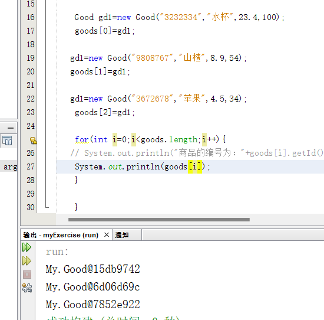
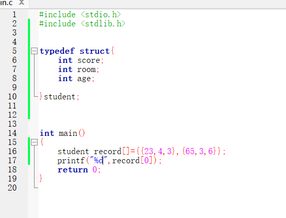
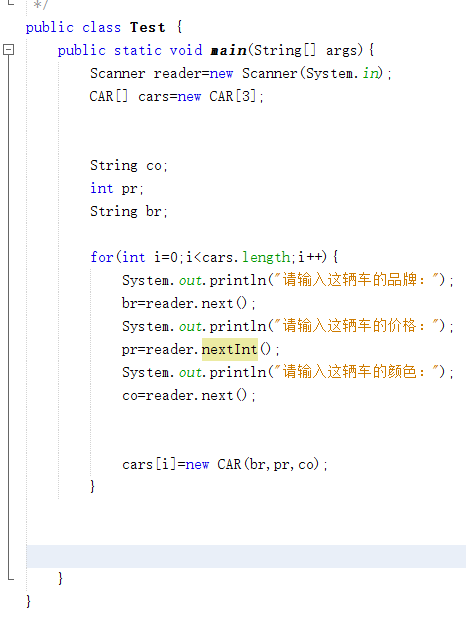
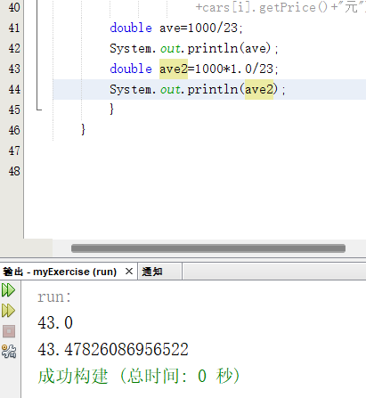
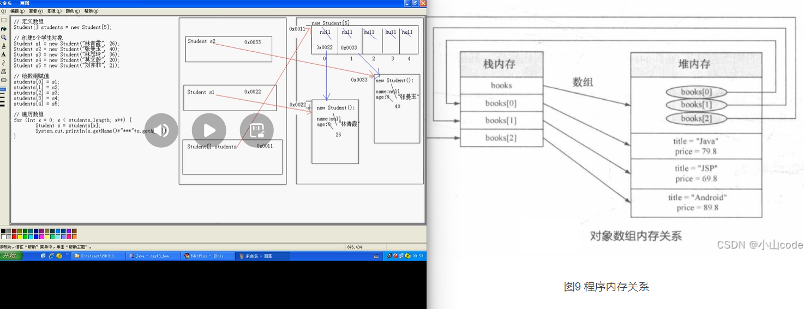
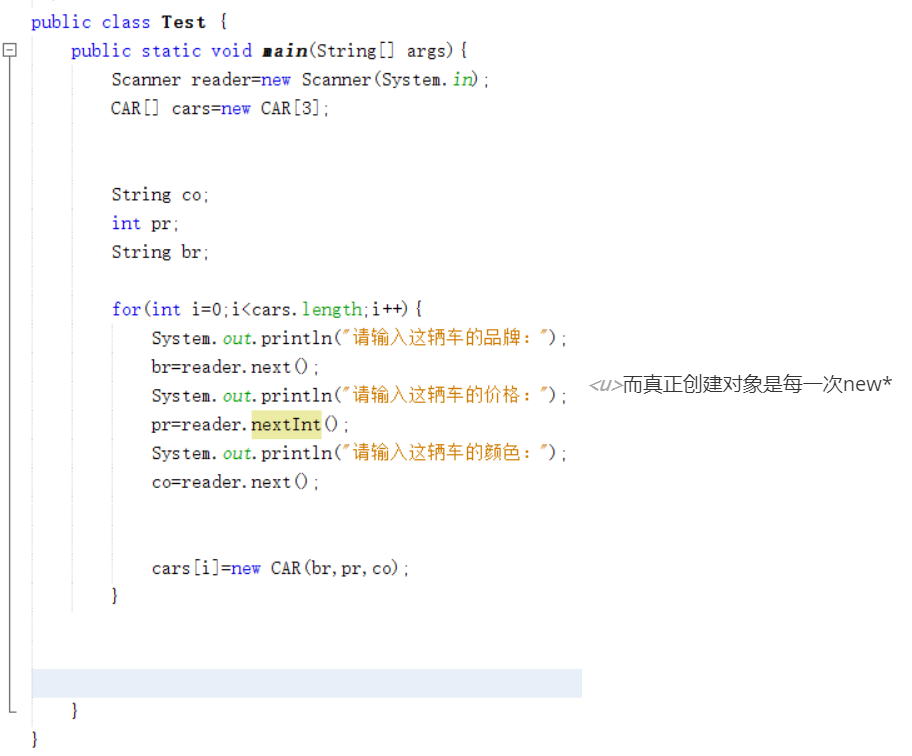
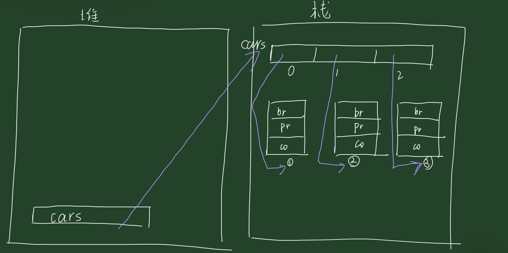

IDEA输出的快捷语句是：sout(System.out.println())

## 练习一：文字版格斗游戏 


**<u>*在方法的形参里面传递到如果是引用数据类型（数组，类，STRING,接口），相当于传递的是它们的地址*</u>**

需求:

​	格斗游戏，每个游戏角色的姓名s，血量，都不相同，在选定人物的时候（new对象的时候），这些信息就应该被确定下来。 

举例：

​	程序运行之后结果为：

​	姓名为:乔峰		血量为:100

​	姓名为:鸠摩智	血量为:100

​	乔峰举起拳头打了鸠摩智一下，造成了XX点伤害，鸠摩智还剩下XXX点血。

​	鸠摩智举起拳头打了鸠摩智一下，造成了XX点伤害，乔峰还剩下XXX点血。

​	乔峰举起拳头打了鸠摩智一下，造成了XX点伤害，鸠摩智还剩下XXX点血。

​	鸠摩智举起拳头打了鸠摩智一下，造成了XX点伤害，乔峰还剩下XXX点血。

​	乔峰K.O.了鸠摩智 

代码示例：

```java
public class GameTest {
    public static void main(String[] args) {
        //1.创建第一个角色
        Role r1 = new Role("乔峰",100);
        //2.创建第二个角色
        Role r2 = new Role("鸠摩智",100);

        //3.开始格斗 回合制游戏
   /*     while(true){
            //r1开始攻击r2
            r1.attack(r2);
            //判断r2的剩余血量
            if(r2.getBlood() == 0){
                System.out.println(r1.getName() + " K.O了" + r2.getName());
                break;
            }

            //r2开始攻击r1
            r2.attack(r1);
            if(r1.getBlood() == 0){
                System.out.println(r2.getName() + " K.O了" + r1.getName());
                break;
            }


        }*/
 /*       
     ☆☆☆☆☆☆☆☆☆☆☆☆☆☆☆☆☆☆☆☆☆☆☆☆☆☆☆☆☆☆☆☆☆☆☆☆☆☆☆☆☆☆☆☆☆☆☆☆☆☆☆☆☆☆☆☆☆☆☆☆☆☆☆☆☆☆☆☆☆☆☆☆☆☆☆☆☆☆☆☆☆☆☆☆☆☆☆☆☆☆☆☆☆☆
 while(true){
     if(){break;}
     if(){break;}
     
 }       
   一般用来写循环中有多种变量因素作为条件语句来控制循环的进行
       用for的话，一般最好用于只有一个变量因素作为条件语句比较好（而且for语句一般和次数有很大的关系）☆☆☆☆☆☆☆☆☆☆☆☆☆☆☆☆☆☆☆☆☆☆☆☆☆☆☆☆☆☆☆☆☆☆☆☆☆☆☆☆☆☆☆☆☆☆☆☆☆☆☆☆☆☆☆☆☆☆☆☆☆☆☆☆☆☆☆☆☆☆☆☆☆☆☆☆☆☆☆☆☆☆☆☆☆☆☆☆☆☆☆☆☆☆
    }
}
*/


public class Role {
    private String name;
    private int blood;

    public Role() {
    }

    public Role(String name, int blood) {
        this.name = name;
        this.blood = blood;
    }

    public String getName() {
        return name;
    }

    public void setName(String name) {
        this.name = name;
    }

    public int getBlood() {
        return blood;
    }

    public void setBlood(int blood) {
        this.blood = blood;
    }


    //定义一个方法用于攻击别人
    //思考：谁攻击谁？
    //Role r1 = new Role（）；
    //Role r2 = new Role（）；
    //r1.攻击(r2);
    //方法的调用者去攻击参数
    public void attack(Role role) {
        //计算造成的伤害 1 ~ 20
        Random r = new Random();
        int hurt = r.nextInt(20) + 1;

        //剩余血量
        int remainBoold = role.getBlood() - hurt;
        //对剩余血量做一个验证，如果为负数了，就修改为0
        remainBoold = remainBoold < 0 ? 0 : remainBoold;
        //修改一下挨揍的人的血量
        role.setBlood(remainBoold);

        //this表示方法的调用者
        System.out.println(this.getName() + "举起拳头，打了" + role.getName() + "一下，" +
                "造成了" + hurt + "点伤害，" + role.getName() + "还剩下了" + remainBoold + "点血");
    }

}
        
        
 //this该方法上一层的那个对象的调用       
```

## 练习二：文字版格斗游戏进阶

<u>*补充：if-elseif-else(一定是按顺序，前面的判断完了才轮到后面的进行判断)*</u>	

**<u>*补充：System.out.printf("呵呵哈哈哈或或%s","张三")*</u>**

**<u>*打印结果：呵呵哈哈哈或或张三*</u>**

**<u>*第一个逗号前面双引号内填打印出的内容，后面的逗号里面填 填充 的内容*</u>**


## **<u>*构造方法也可以嵌套成员方法*</u>**

**<u>*引用数据类型作方法的形参传递时，可以改变该对象相应成员变量的数据；基本数据类型相当于是复制*</u>**

在上一个的基础上，我想看到人物的性别和长相，打斗的时候我想看到武功招式。

举例：

​	程序运行之后结果为：

​	姓名为:乔峰		血量为:100	性别为:男	长相为:气宇轩昂

​	姓名为:鸠摩智	血量为:100	性别为:男	长相为:气宇轩昂

​	乔峰使出了一招【背心钉】，转到对方的身后，一掌向鸠摩智背心的灵台穴拍去。给鸠摩智造成一处瘀伤。

​	鸠摩智使出了一招【游空探爪】，飞起身形自半空中变掌为抓锁向乔峰。结果乔峰退了半步，毫发无损。 

​	。。。。

​	乔峰K.O.了鸠摩智 

分析：

​	长相是提前定义好的，提前放在一个数组当中，程序运行之后，从数组中随机获取。

<u>*！！！！！！！！！！这题printf的灵活使用还挺精彩的！！！！！！！！！！！！！*</u>

```java
//男生长相数组
String[] boyfaces = {"风流俊雅", "气宇轩昂", "相貌英俊", "五官端正", "相貌平平", "一塌糊涂", "面目狰狞"};
//女生长相数组
String[] girlfaces = {"美奂绝伦", "沉鱼落雁", "婷婷玉立", "身材娇好", "相貌平平", "相貌简陋", "惨不忍睹"};
```

​	武功招式也是提前定义好的，提前放在一个数组当中，程序运行之后，从数组随机获取

```java
//attack 攻击描述：
String[] attacks_desc = {
    "%s使出了一招【背心钉】，转到对方的身后，一掌向%s背心的灵台穴拍去。",
    "%s使出了一招【游空探爪】，飞起身形自半空中变掌为抓锁向%s。",
    "%s大喝一声，身形下伏，一招【劈雷坠地】，捶向%s双腿。",
    "%s运气于掌，一瞬间掌心变得血红，一式【掌心雷】，推向%s。",
    "%s阴手翻起阳手跟进，一招【没遮拦】，结结实实的捶向%s。",
    "%s上步抢身，招中套招，一招【劈挂连环】，连环攻向%s。"
```

​	受伤的提前也是提前定义好的，只不过不是随机了，根据剩余血量获取不同的描述

```java
//injured 受伤描述：
String[] injureds_desc = {
    "结果%s退了半步，毫发无损",
    "结果给%s造成一处瘀伤",
    "结果一击命中，%s痛得弯下腰",
    "结果%s痛苦地闷哼了一声，显然受了点内伤",
    "结果%s摇摇晃晃，一跤摔倒在地",
    "结果%s脸色一下变得惨白，连退了好几步",
    "结果『轰』的一声，%s口中鲜血狂喷而出",
    "结果%s一声惨叫，像滩软泥般塌了下去"
```

​	其中输出语句跟以前不一样了，用的是System.out.printf（）；该输出语句支持%s占位符

```java
public class Test {
    public static void main(String[] args) {
        //两部分参数：
        //第一部分参数：要输出的内容%s（占位）
        //第二部分参数：填充的数据
        
        System.out.printf("你好啊%s","张三");//用张三填充第一个%s
        System.out.println();//换行
        System.out.printf("%s你好啊%s","张三","李四");//用张三填充第一个%s，李四填充第二个%s
    }
}
```

最终代码示例：

```java
package com.itheima.test2;

import java.util.Random;

public class Role {
    private String name;
    private int blood;
    private char gender;
    private String face;//长相是随机的

    String[] boyfaces = {"风流俊雅", "气宇轩昂", "相貌英俊", "五官端正", "相貌平平", "一塌糊涂", "面目狰狞"};
    String[] girlfaces = {"美奂绝伦", "沉鱼落雁", "婷婷玉立", "身材娇好", "相貌平平", "相貌简陋", "惨不忍睹"};

    //attack 攻击描述：
    String[] attacks_desc = {
            "%s使出了一招【背心钉】，转到对方的身后，一掌向%s背心的灵台穴拍去。",
            "%s使出了一招【游空探爪】，飞起身形自半空中变掌为抓锁向%s。",
            "%s大喝一声，身形下伏，一招【劈雷坠地】，捶向%s双腿。",
            "%s运气于掌，一瞬间掌心变得血红，一式【掌心雷】，推向%s。",
            "%s阴手翻起阳手跟进，一招【没遮拦】，结结实实的捶向%s。",
            "%s上步抢身，招中套招，一招【劈挂连环】，连环攻向%s。"
    };

    //injured 受伤描述：
    String[] injureds_desc = {
            "结果%s退了半步，毫发无损",
            "结果给%s造成一处瘀伤",
            "结果一击命中，%s痛得弯下腰",
            "结果%s痛苦地闷哼了一声，显然受了点内伤",
            "结果%s摇摇晃晃，一跤摔倒在地",
            "结果%s脸色一下变得惨白，连退了好几步",
            "结果『轰』的一声，%s口中鲜血狂喷而出",
            "结果%s一声惨叫，像滩软泥般塌了下去"
    };

    public Role() {
    }

    public Role(String name, int blood, char gender) {
        this.name = name;
        this.blood = blood;
        this.gender = gender;
        //随机长相
        setFace(gender);
    }/*☆☆☆☆☆☆☆☆☆☆☆☆☆☆☆☆☆☆☆☆☆☆☆☆☆☆☆☆☆☆☆☆☆☆☆☆☆☆☆☆☆☆☆☆☆☆☆
 在写标准JAVABEAN类方法，将全部变量初始化的构造方法里（如果其中有的量的取值取决于另外一个或几个变量的取值，不在括号里面的形参写它，在方法里调用那个变量即可）   ☆☆☆☆☆☆☆☆☆☆☆☆☆☆☆☆☆☆☆☆☆☆☆☆☆☆☆☆☆☆☆☆☆☆☆☆☆☆☆☆☆☆☆☆☆☆☆*/


    public char getGender() {
        return gender;
    }

    public void setGender(char gender) {
        this.gender = gender;
    }

    public String getFace() {
        return face;
    }

    public void setFace(char gender) {
        Random r = new Random();
        //长相是随机的
        if (gender == '男') {
            //从boyfaces里面随机长相
            int index = r.nextInt(boyfaces.length);
            this.face = boyfaces[index];
        } else if (gender == '女') {
            //从girlfaces里面随机长相
            int index = r.nextInt(girlfaces.length);
            this.face = girlfaces[index];
        } else {
            this.face = "面目狰狞";
        }


    }


    public String getName() {
        return name;
    }

    public void setName(String name) {
        this.name = name;
    }

    public int getBlood() {
        return blood;
    }

    public void setBlood(int blood) {
        this.blood = blood;
    }


    //定义一个方法用于攻击别人
    //思考：谁攻击谁？
    //Role r1 = new Role（）；
    //Role r2 = new Role（）；
    //r1.攻击(r2);
    //方法的调用者去攻击参数
    public void attack(Role role) {
        Random r = new Random();
        int index = r.nextInt(attacks_desc.length);
        String KungFu = attacks_desc[index];

        //输出一个攻击的效果
        System.out.printf(KungFu, this.getName(), role.getName());
        System.out.println();

        //计算造成的伤害 1 ~ 20
        int hurt = r.nextInt(20) + 1;

        //剩余血量
        int remainBoold = role.getBlood() - hurt;
        //对剩余血量做一个验证，如果为负数了，就修改为0
        remainBoold = remainBoold < 0 ? 0 : remainBoold;
        //修改一下挨揍的人的血量
        role.setBlood(remainBoold);

        //受伤的描述
        //血量> 90 0索引的描述
        //80 ~  90  1索引的描述
        //70 ~  80  2索引的描述
        //60 ~  70  3索引的描述
        //40 ~  60  4索引的描述
        //20 ~  40  5索引的描述
        //10 ~  20  6索引的描述
        //小于10的   7索引的描述
        if (remainBoold > 90) {
            System.out.printf(injureds_desc[0], role.getName());
        }else if(remainBoold > 80 && remainBoold <= 90){
            System.out.printf(injureds_desc[1], role.getName());
        }else if(remainBoold > 70 && remainBoold <= 80){
            System.out.printf(injureds_desc[2], role.getName());
        }else if(remainBoold > 60 && remainBoold <= 70){
            System.out.printf(injureds_desc[3], role.getName());
        }else if(remainBoold > 40 && remainBoold <= 60){
            System.out.printf(injureds_desc[4], role.getName());
        }else if(remainBoold > 20 && remainBoold <= 40){
            System.out.printf(injureds_desc[5], role.getName());
        }else if(remainBoold > 10 && remainBoold <= 20){
            System.out.printf(injureds_desc[6], role.getName());
        }else{
            System.out.printf(injureds_desc[7], role.getName());
        }
        System.out.println();

        
         if(role.getBlood()==0){
            System.out.println(this.getName()+"K.O了"+role.getName());
        }

    }


    public void showRoleInfo() {
        System.out.println("姓名为：" + getName());
        System.out.println("血量为：" + getBlood());
        System.out.println("性别为：" + getGender());
        System.out.println("长相为：" + getFace());
    }

}


package com.itheima.test2;

public class GameTest {
    public static void main(String[] args) {
        //1.创建第一个角色
        Role r1 = new Role("乔峰",100,'男');
        //2.创建第二个角色
        Role r2 = new Role("鸠摩智",100,'男');

        //展示一下角色的信息
        r1.showRoleInfo();
        r2.showRoleInfo();

        //3.开始格斗 回合制游戏
        while(true){
            //r1开始攻击r2
            r1.attack(r2);
            //判断r2的剩余血量
            if(r2.getBlood() == 0){
                break;
            }

            //r2开始攻击r1
            r2.attack(r1);
            if(r1.getBlood() == 0){
                break;
            }
        }
    }
}

```

## 练习三：对象数组（商品）

需求：

​	定义数组存储3个商品对象。

​	商品的属性：商品的id，名字，价格，库存。

​	创建三个商品对象，并把商品对象存入到数组当中。


**<u>*在标准的JAVABEAN类，想要一次性给类对象进行所有变量的赋值，一般来说就调用构造方法最简单（而调用构造方法是在new的时候才进行的）*</u>**

**<u>**

**结构体的对象之间是可以通过赋值运算符直接赋值的，但是结构体数组不行！！！！（数据组维度不行）</u>**




*<u>**直接打印打印的是地址**</u>*

*<u>**C语言也是一样的(引用类型的数据！！！！除了数组！！！！，其他“数组名[i]”代表的都是一个类（）结构体空间的地址值)**</u>*



代码示例：

```java
package com.itheima.test3;

public class Goods {
    private String id;
    private String name;
    private double price;
    private int count;

    public Goods() {
    }

    public Goods(String id, String name, double price, int count) {
        this.id = id;
        this.name = name;
        this.price = price;
        this.count = count;
    }

    public String getId() {
        return id;
    }

    public void setId(String id) {
        this.id = id;
    }

    public String getName() {
        return name;
    }

    public void setName(String name) {
        this.name = name;
    }

    public double getPrice() {
        return price;
    }

    public void setPrice(double price) {
        this.price = price;
    }

    public int getCount() {
        return count;
    }

    public void setCount(int count) {
        this.count = count;
    }
}


package com.itheima.test3;

public class GoodsTest {
    public static void main(String[] args) {
        //1.创建一个数组
        Goods[] arr = new Goods[3];

        //2.创建三个商品对象
        Goods g1 = new Goods("001","华为P40",5999.0,100);
        Goods g2 = new Goods("002","保温杯",227.0,50);
        Goods g3 = new Goods("003","枸杞",12.7,70);
//可以只用一个变量去接收new的值
       /*☆☆☆☆☆☆☆☆☆☆☆☆☆☆☆☆☆☆☆☆☆☆☆☆☆☆☆☆☆☆☆☆☆☆☆☆☆☆☆☆☆☆☆☆☆☆☆☆
       Goods g1 = new Goods("001","华为P40",5999.0,100);
        arr[0] = g1;
        
        g1= new Goods("002","保温杯",227.0,50);
         arr[1] = g1;
         
        g1= new Goods("003","枸杞",12.7,70); 
        arr[2] = g1; ☆☆☆☆☆☆☆☆☆☆☆☆☆☆☆☆☆☆☆☆☆☆☆☆☆☆☆☆☆☆☆☆☆☆☆☆☆☆☆☆☆☆☆☆☆☆
 */       
        
        
        
        
        //3.把商品添加到数组中
        arr[0] = g1;
        arr[1] = g2;
        arr[2] = g3;

        //4.遍历
        for (int i = 0; i < arr.length; i++) {
            //i 索引 arr[i] 元素
            Goods goods = arr[i];
            System.out.println(goods.getId() + ", " + goods.getName() + ", " + goods.getPrice() + ", " + goods.getCount());
        }
    }
}

```

## 练习四：对象数组（汽车）

**<u>*关于输入语句的笔记——————————见	笔记03*</u>**

需求：

​	定义数组存储3部汽车对象。

​	汽车的属性：品牌，价格，颜色。

​	创建三个汽车对象，数据通过键盘录入而来，并把数据存入到数组当中。

代码示例：

```java
package com.itheima.test5;

public class Car {
    private String brand;//品牌
    private int price;//价格
    private String color;//颜色


    public Car() {
    }

    public Car(String brand, int price, String color) {
        this.brand = brand;
        this.price = price;
        this.color = color;
    }

    public String getBrand() {
        return brand;
    }

    public void setBrand(String brand) {
        this.brand = brand;
    }

    public int getPrice() {
        return price;
    }

    public void setPrice(int price) {
        this.price = price;
    }

    public String getColor() {
        return color;
    }

    public void setColor(String color) {
        this.color = color;
    }
}


package com.itheima.test5;

import java.util.Scanner;

public class CarTest {
    public static void main(String[] args) {
        //1.创建一个数组用来存3个汽车对象
        Car[] arr = new Car[3];

        //2.创建汽车对象，数据来自于键盘录入
        Scanner sc = new Scanner(System.in);
        for (int i = 0; i < arr.length; i++) {
            //创建汽车的对象
            Car c = new Car();
            //录入品牌
            System.out.println("请输入汽车的品牌");
            String brand = sc.next();
            c.setBrand(brand);
            //录入价格
            System.out.println("请输入汽车的价格");
            int price = sc.nextInt();
            c.setPrice(price);
            //录入颜色
            System.out.println("请输入汽车的颜色");
            String color = sc.next();
            c.setColor(color);

            //把汽车对象添加到数组当中
            arr[i] = c;
        }

        //3.遍历数组
        for (int i = 0; i < arr.length; i++) {
            Car car = arr[i];
            System.out.println(car.getBrand() + ", " + car.getPrice() + ", " + car.getColor());
        }
    }
}

```


**<u>*引用数据类型  变量名A=new 引用数据类型（）；*</u>**

**<u>只要引用数据类型在左边，就说明栈中生成了一个相应的空间用来存地址（左边与右边的new分开来看），如果左边是一个引用数据类型的数组，那么相当于栈中生成了一个数组空间，数组中的每一个元素都用来存对应对象的地址</u>**

**//总之，左边，不管是单一个变量还是数组，都是用来存地址的！！！！！！！！！！！！！！！！！！！！！！！！！！！！！！**

*<u>*而真正创建对象是每一次new*</u>**（只有new 是，构造方法才能被改变）,且他返回的值是一个 地址值


## 练习五：对象数组（手机）

需求 :  

​	定义数组存储3部手机对象。

​	手机的属性：品牌，价格，颜色。

​	要求，计算出三部手机的平均价格


*<u>**//注意下面这种写法**</u>*



代码示例：

```java
package com.itheima.test6;

public class Phone {
    private String brand;//品牌
    private int price;//价格
    private String color;//颜色

    public Phone() {
    }

    public Phone(String brand, int price, String color) {
        this.brand = brand;
        this.price = price;
        this.color = color;
    }

    public String getBrand() {
        return brand;
    }

    public void setBrand(String brand) {
        this.brand = brand;
    }

    public int getPrice() {
        return price;
    }

    public void setPrice(int price) {
        this.price = price;
    }

    public String getColor() {
        return color;
    }

    public void setColor(String color) {
        this.color = color;
    }
}


package com.itheima.test6;

import java.math.BigDecimal;

public class PhoneTest {
    public static void main(String[] args) {
        //1.创建一个数组
        Phone[] arr = new Phone[3];

        //2.创建手机的对象
        Phone p1 = new Phone("小米",1999,"白色");
        Phone p2 = new Phone("华为",4999,"蓝色");
        Phone p3 = new Phone("魅族",3999,"红色");

        //3.把手机对象添加到数组当中
        arr[0] = p1;
        arr[1] = p2;
        arr[2] = p3;

        //4.获取三部手机的平均价格
        int sum = 0;
        for (int i = 0; i < arr.length; i++) {
            //i 索引  arr[i] 元素（手机对象）
            Phone phone = arr[i];
            sum = sum + phone.getPrice();
        }

        //5.求平均值
        //数据能不写死，尽量不写死
        //int avg = sum / arr.length;

        double avg2 = sum * 1.0 / arr.length;

        System.out.println(avg2);//3665.6666666666665
    }
}

```

## 练习六：对象数组（女朋友）

需求：

​	定义数组存储4个女朋友的对象

​	女朋友的属性：姓名、年龄、性别、爱好

​	要求1：计算出四女朋友的平均年龄

​	要求2：统计年龄比平均值低的女朋友有几个？并把她们的所有信息打印出来。

代码示例：

```java
package com.itheima.test7;

public class GirlFriend {
    private String name;//姓名
    private int age;//年龄
    private String gender;//性别
    private String hobby;//爱好


    public GirlFriend() {
    }

    public GirlFriend(String name, int age, String gender, String hobby) {
        this.name = name;
        this.age = age;
        this.gender = gender;
        this.hobby = hobby;
    }

    public String getName() {
        return name;
    }

    public void setName(String name) {
        this.name = name;
    }

    public int getAge() {
        return age;
    }

    public void setAge(int age) {
        this.age = age;
    }

    public String getGender() {
        return gender;
    }

    public void setGender(String gender) {
        this.gender = gender;
    }

    public String getHobby() {
        return hobby;
    }

    public void setHobby(String hobby) {
        this.hobby = hobby;
    }
}


package com.itheima.test7;

public class GirlFriendTest {
    public static void main(String[] args) {
        //1.定义数组存入女朋友的对象
        GirlFriend[] arr = new GirlFriend[4];

        //2.创建女朋友对象
        GirlFriend gf1 = new GirlFriend("小诗诗",18,"萌妹子","吃零食");
        GirlFriend gf2 = new GirlFriend("小丹丹",19,"萌妹子","玩游戏");
        GirlFriend gf3 = new GirlFriend("小惠惠",20,"萌妹子","看书，学习");
        GirlFriend gf4 = new GirlFriend("小莉莉",21,"憨妹子","睡觉");

        //3.把对象添加到数组当中
        arr[0] = gf1;
        arr[1] = gf2;
        arr[2] = gf3;
        arr[3] = gf4;

        //4.求和
        int sum = 0;
        for (int i = 0; i < arr.length; i++) {
            //i 索引 arr[i] 元素（女朋友对象）
            GirlFriend gf = arr[i];
            //累加
            sum = sum + gf.getAge();
        }

        //5.平均值
        int avg = sum / arr.length;

        //6.统计年龄比平均值低的有几个，打印他们的信息
        int count = 0;
        for (int i = 0; i < arr.length; i++) {
            GirlFriend gf = arr[i];
            if(gf.getAge() < avg){
                count++;
                System.out.println(gf.getName() + ", " + gf.getAge() + ", " + gf.getGender() + ", " + gf.getHobby());
            }
        }

        System.out.println(count + "个");
    }
}
```

## 练习七：复杂的对象数组操作

定义一个长度为3的数组，数组存储1~3名学生对象作为初始数据，学生对象的学号，姓名各不相同。

学生的属性：学号，姓名，年龄。

要求1：再次添加一个学生对象，并在添加的时候进行学号的唯一性判断。

要求2：添加完毕之后，遍历所有学生信息。

要求3：通过id删除学生信息

​             如果存在，则删除，如果不存在，则提示删除失败。

要求4：删除完毕之后，遍历所有学生信息。

要求5：查询数组id为“heima002”的学生，如果存在，则将他的年龄+1岁

代码示例：

```java
package com.itheima.test8;

public class Student {
    private int id;
    private String name;
    private int age;

    public Student() {
    }

    public Student(int id, String name, int age) {
        this.id = id;
        this.name = name;
        this.age = age;
    }

    public int getId() {
        return id;
    }

    public void setId(int id) {
        this.id = id;
    }

    public String getName() {
        return name;
    }

    public void setName(String name) {
        this.name = name;
    }

    public int getAge() {
        return age;
    }

    public void setAge(int age) {
        this.age = age;
    }
}
```

```java
public class Test {
    public static void main(String[] args) {
        /*定义一个长度为3的数组，数组存储1~3名学生对象作为初始数据，学生对象的学号，姓名各不相同。
        学生的属性：学号，姓名，年龄。
        要求1：再次添加一个学生对象，并在添加的时候进行学号的唯一性判断。
        要求2：添加完毕之后，遍历所有学生信息。
		*/


        //1.创建一个数组用来存储学生对象
        Student[] arr = new Student[3];
        //2.创建学生对象并添加到数组当中
        Student stu1 = new Student(1, "zhangsan", 23);
        Student stu2 = new Student(2, "lisi", 24);

        //3.把学生对象添加到数组当中
        arr[0] = stu1;
        arr[1] = stu2;


        //要求1：再次添加一个学生对象，并在添加的时候进行学号的唯一性判断。
        Student stu4 = new Student(1, "zhaoliu", 26);

        //唯一性判断
        //已存在 --- 不用添加
        //不存在 --- 就可以把学生对象添加进数组
        boolean flag = contains(arr, stu4.getId());
        if(flag){
            //已存在 --- 不用添加
            System.out.println("当前id重复，请修改id后再进行添加");
        }else{
            //不存在 --- 就可以把学生对象添加进数组
            //把stu4添加到数组当中
            //1.数组已经存满 --- 只能创建一个新的数组，新数组的长度 = 老数组 + 1
            //2.数组没有存满 --- 直接添加
            int count = getCount(arr);
            if(count == arr.length){
                //已经存满
                //创建一个新的数组，长度 = 老数组的长度 + 1
                //然后把老数组的元素，拷贝到新数组当中
                Student[] newArr = creatNewArr(arr);
                //把stu4添加进去
                newArr[count] = stu4;

                //要求2：添加完毕之后，遍历所有学生信息。
                printArr(newArr);

            }else{
                //没有存满
                //[stu1,stu2,null]
                //getCount获取到的是2，表示数组当中已经有了2个元素
                //还有一层意思：如果下一次要添加数据，就是添加到2索引的位置
                arr[count] = stu4;
                //要求2：添加完毕之后，遍历所有学生信息。
                printArr(arr);

            }
        }
    }


    public static void printArr(Student[] arr){
        for (int i = 0; i < arr.length; i++) {
            Student stu = arr[i];
            if(stu != null){
                System.out.println(stu.getId() + ", " + stu.getName() + ", " + stu.getAge());
            }
        }
    }

    //创建一个新的数组，长度 = 老数组的长度 + 1
    //然后把老数组的元素，拷贝到新数组当中
    public static Student[] creatNewArr(Student[] arr){
        Student[] newArr = new Student[arr.length + 1];

        //循环遍历得到老数组中的每一个元素
        for (int i = 0; i < arr.length; i++) {
            //把老数组中的元素添加到新数组当中
            newArr[i] = arr[i];
        }

        //把新数组返回
        return newArr;

    }

    //定义一个方法判断数组中已经存了几个元素
    public static int getCount(Student[] arr){
        //定义一个计数器用来统计
        int count = 0;
        for (int i = 0; i < arr.length; i++) {
            if(arr[i] != null){
                count++;
            }
        }
        //当循环结束之后，我就知道了数组中一共有几个元素
        return count;
    }


    //1.我要干嘛？  唯一性判断
    //2.我干这件事情，需要什么才能完成？ 数组 id
    //3.调用处是否需要继续使用方法的结果？ 必须返回
    public static boolean contains(Student[] arr, int id) {
        for (int i = 0; i < arr.length; i++) {
            //依次获取到数组里面的每一个学生对象
            Student stu = arr[i];
            if(stu != null){
                //获取数组中学生对象的id
                int sid = stu.getId();
                //比较
                if(sid == id){
                    return true;
                }
            }
        }

        //当循环结束之后，还没有找到一样的，那么就表示数组中要查找的id是不存在的。
        return false;
    }


}

```

```java
package com.itheima.test8;

public class Test3 {
    public static void main(String[] args) {
        /*定义一个长度为3的数组，数组存储1~3名学生对象作为初始数据，学生对象的学号，姓名各不相同。
        学生的属性：学号，姓名，年龄。

        要求3：通过id删除学生信息
            如果存在，则删除，如果不存在，则提示删除失败。
        要求4：删除完毕之后，遍历所有学生信息。

       */


        //1.创建一个数组用来存储学生对象
        Student[] arr = new Student[3];
        //2.创建学生对象并添加到数组当中
        Student stu1 = new Student(1, "zhangsan", 23);
        Student stu2 = new Student(2, "lisi", 24);
        Student stu3 = new Student(3, "wangwu", 25);

        //3.把学生对象添加到数组当中
        arr[0] = stu1;
        arr[1] = stu2;
        arr[2] = stu3;

        /*要求3：通过id删除学生信息
        如果存在，则删除，如果不存在，则提示删除失败。*/

        //要找到id在数组中对应的索引
        int index = getIndex(arr, 2);
        if (index >= 0){
            //如果存在，则删除
            arr[index] = null;
            //遍历数组
            printArr(arr);
        }else{
            //如果不存在，则提示删除失败
            System.out.println("当前id不存在，删除失败");
        }


    }


    //1.我要干嘛？  找到id在数组中的索引
    //2.我需要什么？ 数组 id
    //3.调用处是否需要继续使用方法的结果？ 要
    public static int getIndex(Student[] arr , int id){
        for (int i = 0; i < arr.length; i++) {
            //依次得到每一个学生对象
            Student stu = arr[i];
            //对stu进行一个非空判断
            if(stu != null){
                int sid = stu.getId();
                if(sid == id){
                    return i;
                }
            }
        }

        //当循环结束之后，还没有找到就表示不存在
        return -1;
    }

    public static void printArr(Student[] arr){
        for (int i = 0; i < arr.length; i++) {
            Student stu = arr[i];
            if(stu != null){
                System.out.println(stu.getId() + ", " + stu.getName() + ", " + stu.getAge());
            }
        }
    }


}

```

```java
package com.itheima.test8;

public class Test4 {
    public static void main(String[] args) {
        /*定义一个长度为3的数组，数组存储1~3名学生对象作为初始数据，学生对象的学号，姓名各不相同。
        学生的属性：学号，姓名，年龄。

        要求5：查询数组id为“2”的学生，如果存在，则将他的年龄+1岁*/


        //1.创建一个数组用来存储学生对象
        Student[] arr = new Student[3];
        //2.创建学生对象并添加到数组当中
        Student stu1 = new Student(1, "zhangsan", 23);
        Student stu2 = new Student(2, "lisi", 24);
        Student stu3 = new Student(3, "wangwu", 25);

        //3.把学生对象添加到数组当中
        arr[0] = stu1;
        arr[1] = stu2;
        arr[2] = stu3;


        //4.先要找到id为2的学生对于的索引
        int index = getIndex(arr, 2);

        //5.判断索引
        if(index >= 0){
            //存在， 则将他的年龄+1岁
            Student stu = arr[index];
            //把原来的年龄拿出来
            int newAge = stu.getAge() + 1;
            //把+1之后的年龄塞回去
            stu.setAge(newAge);
            //遍历数组
            printArr(arr);
        }else{
            //不存在，则直接提示
            System.out.println("当前id不存在，修改失败");
        }


    }

    //1.我要干嘛？  找到id在数组中的索引
    //2.我需要什么？ 数组 id
    //3.调用处是否需要继续使用方法的结果？ 要
    public static int getIndex(Student[] arr , int id){
        for (int i = 0; i < arr.length; i++) {
            //依次得到每一个学生对象
            Student stu = arr[i];
            //对stu进行一个非空判断
            if(stu != null){
                int sid = stu.getId();
                if(sid == id){
                    return i;
                }
            }
        }

        //当循环结束之后，还没有找到就表示不存在
        return -1;
    }

    public static void printArr(Student[] arr){
        for (int i = 0; i < arr.length; i++) {
            Student stu = arr[i];
            if(stu != null){
                System.out.println(stu.getId() + ", " + stu.getName() + ", " + stu.getAge());
            }
        }
    }
}
```


# 对象数组的内存图解



可以理解为

**<u>*优先级：数组	>    引用数据类型*</u>**

也就是说，关于对象数组的内存

1/无论数据是基本数据类型 还是 引用数据类型，首先 栈中会有一个变量——存储堆中数组arr[]的地址

2/如果数据属于是**基本数据类型**，那么在堆数组中的每一个元素**arr[i]**直接可以存储且访问相应的**这种数据**

如果数据属于是**引用数据类型**，那么在堆数组中每一个元素**arr[i]**里面存储的是这种数据类型的**地址**，且被系统默认初始化为**null(不指向任何地方),**于是此时要**new**一个相应的空间，并把这个空间的地址值**赋值**给arr[i]


那么，如果像这样的代码写法

内存图可能为

