## *<u>**题目2**</u>*


#  *<u>**//打乱的核心要素：**</u>*

##         *<u>**//遍历数组得到每一个元素与每一个随机索引处的数据进行交换键盘输入任意字符串，打乱里面的内容**</u>* 

### 训练目标

随机数类Random相关API、字符串相关API

### 训练提示

1、字符串是不可变的

2、如果要变化需要变成字符数组

3、调整完毕之后再变回字符串

### 参考答案

```java
public class Test {
    public static void main(String[] args) {
       //键盘录入字符串
        Scanner sc = new Scanner(System.in);
        System.out.println("请输入一个字符串");
        String str = sc.next();

        //把字符串变成字符数组
        char[] arr = str.toCharArray();
        

        //将数组里面的内容打乱
        //打乱的核心要素：
        //遍历数组得到每一个元素与每一个随机索引处的数据进行交换
        Random r = new Random();
        for (int i = 0; i < arr.length; i++) {
            int index = r.nextInt(arr.length);
            char temp = arr[i];
            arr[i] = arr[index];
            arr[index] = temp;
        }

        //将字符数组再变回字符串
        String newStr = new String(arr);

        //输出打印
        System.out.println(newStr);

    }
}
```

## 题目3//				2、3本质上真的很像很像

### 训练目标：

生成验证码

内容：可以是小写字母，也可以是大写字母，还可以是数字

规则：

  	长度为5
  	
  	内容中是四位字母，1位数字。
  	
  	其中数字只有1位，但是可以出现在任意的位置。

### **参考答案1**//把大写小写字母放在同一个数组中，用查表法的类似思想


       public class Test {
        public static void main(String[] args) {
            //1.大写字母和小写字母都放到数组当中
            char[] chs = new char[52];
            for (int i = 0; i < chs.length; i++) {
                //ASCII码表
                if(i <= 25){
                    //添加小写字母
                    chs[i] = (char)(97 + i);//☆☆☆☆☆☆☆☆☆☆☆☆☆☆☆☆
                }else{//27
                    //添加大写字母
                    // A --- 65
                    chs[i] = (char)(65 + i - 26);//☆☆☆☆☆☆☆☆☆☆☆☆☆☆☆☆
                }
            } 
        String code = "";//定义一个字符串类型的变量，用来记录最终的结果
    
        //2.随机抽取4次
        //随机抽取数组中的索引
        Random r = new Random();
        for (int i = 0; i < 4; i++) {
            int randomIndex = r.nextInt(chs.length);
            //利用随机索引，获取对应的元素
            //System.out.println(chs[randomIndex]);
            code = code + chs[randomIndex];
        }
        //System.out.println(result);
        //3.随机抽取一个数字0~9
        int number = r.nextInt(10);
        //生成最终的结果
        code = code + number;
        //4.变成字符数组打乱数据
        char[] arr = code.toCharArray();
        //将数组里面的内容打乱
        for (int i = 0; i < arr.length; i++) {
            int index = r.nextInt(arr.length);
            char temp = arr[i];
            arr[i] = arr[index];
            arr[index] = temp;
        }
    
        //将字符数组再变回字符串
        String result = new String(arr);
    
        //输出打印
        System.out.println(result);
    
    }
    }

​    

### 参考答案2//设计多层随机变量达到多种随机情况的出现

```java
public class studyCODE {

    public static void main(String[] args) {
      char[] numstring=new char[5];
      char[] numstring2=formnum(numstring);
      String hh=new String(messmnum(numstring2));
      System.out.println(hh);

    }
    public static char[] formnum(char[] yy) {//1.生成含有相应要求的字符数组
        Random ran = new Random();
        int flagran=0;//随机控制的标记变量
        yy[0] = (char) (ran.nextInt('9' - '0' + 1) + '0');//字符数组随机生成验证码的数字
        for (int i = 1; i <yy.length ; i++) {
            flagran=ran.nextInt(2);//
            if(flagran==0){
                yy[i]=(char) (ran.nextInt('Z' - 'A' + 1) + 'A');//生成大写字母
            }
            else{
                yy[i]=(char) (ran.nextInt('z' - 'a' + 1) + 'a');//生成小写字母
            }
        }
        return yy;
    }

    public static char[] messmnum(char[] ui){//2.打乱字符数组
        Random ran=new Random();
        int index;
        char temp;
        for (int i = 0; i < ui.length; i++) {
            index=ran.nextInt(ui.length);
            temp=ui[i];
            ui[i]=ui[index];
            ui[index]=temp;
        }
        return ui;
    }
}
```

拓展：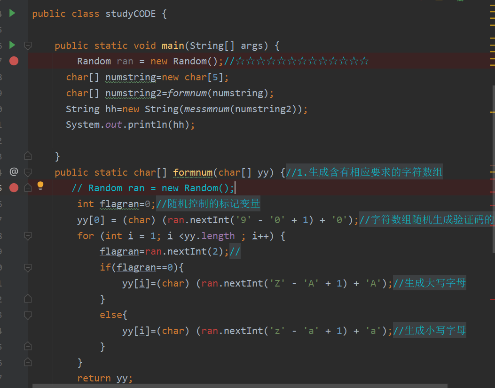

错因：


1.

java 在main方法中实例化的对象不能直接被其他方法调用

在Java中，如果你在一个方法内部（包括main方法）创建了一个对象，那么这个对象默认是局部变量，它只能在这个方法内部被使用。如果你想要在其他方法中使用这个对象，你需要将这个对象声明为成员变量，也就是类的属性。

2.

## 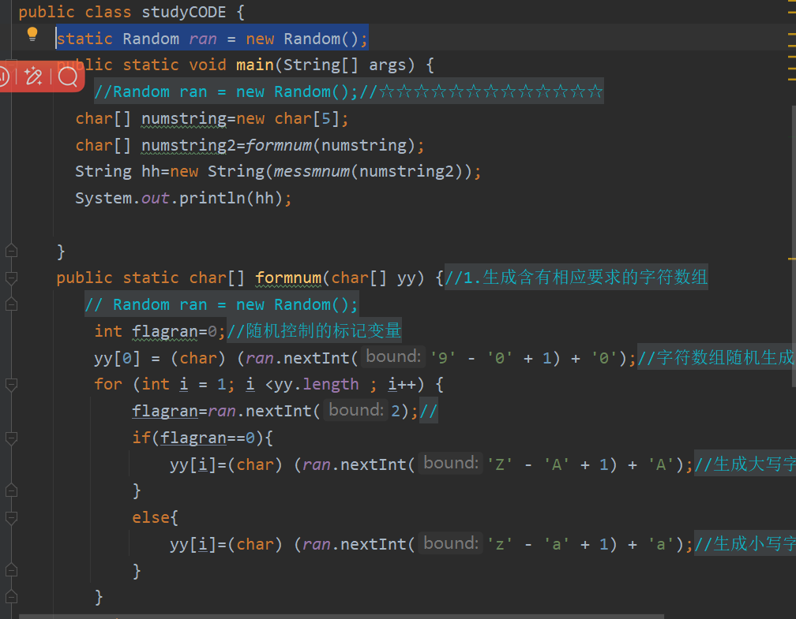


3.

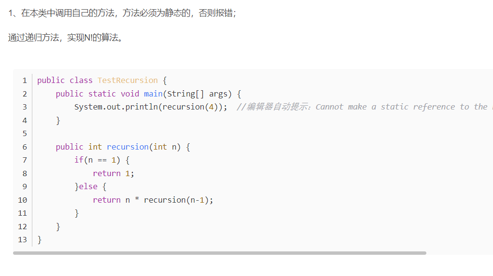

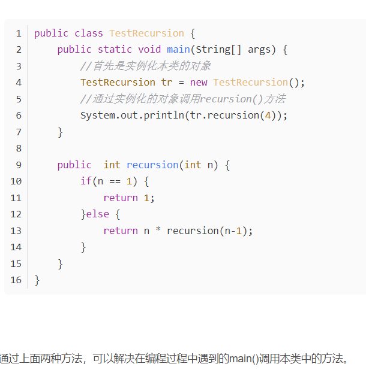


## 题目4

请编写程序，由键盘录入一个字符串，统计字符串中英文字母和数字分别有多少个。比如：Hello12345World中字母：10个，数字：5个。

### 训练目标

字符串遍历

### 训练提示

1、键盘录入一个字符串，用 Scanner 实现
2、要统计两种类型的字符个数，需定义两个统计变量，初始值都为0
3、遍历字符串，得到每一个字符
4、判断该字符属于哪种类型，然后对应类型的统计变量+1，判断字母时需要考虑大小写，条件比较复杂，怎样做才能使判断更简单呢？

### 训练步骤

1、创建键盘录入Scanner对象，使用nextLine方法接收输入的字符串。

2、为方便后续判断，使用String的toLowerCase方法，将字符串中的字符都转为小写。

3、需定义两个统计变量，初始值都为0

4、遍历字符串，得到每一个字符

5、判断该字符属于哪种类型，然后对应类型的统计变量+1，次数判断英文字母时只需判断小写即可。

### 参考答案1

```java
public class studyCODE {

    public static void main(String[] args){
        System.out.println("请输入一个字符串：");
        Scanner reader=new Scanner(System.in);
        String wait=reader.next();
        countNum(wait);


    }
    public static void countNum(String q){
        int numCount=0,charCount=0;
        for (int i = 0; i <q.length(); i++) {
            if(q.charAt(i)>='0' && q.charAt(i)<='9'){
                numCount++;
            }
            else{
                charCount++;
            }
        }
        System.out.println(q+"中字母："+charCount+"个");
        System.out.println(q+"中数字："+numCount+"个");
    }

}

```


## **参考答案2**

```
import java.util.Scanner;

public class Test {
    public static void main(String[] args) {
        //键盘录入一个字符串，用 Scanner 实现
        Scanner sc = new Scanner(System.in);
        System.out.println("请输入一个字符串：");
        String line = sc.nextLine();
        // 为方便统计，将字符串中的字母都转为小写
        line = line.toLowerCase();
        //要统计两种类型的字符个数，需定义两个统计变量，初始值都为0
        int letterCount = 0;
        int numberCount = 0;
        // 遍历字符串，得到每一个字符
        for(int i=0; i<line.length(); i++) {
            char ch = line.charAt(i);
            // 判断该字符属于哪种类型，然后对应类型的统计变量+1
            if (ch >= 'a' && ch <= 'z') {
                letterCount++;
            } else if (ch >= '0' && ch <= '9') {
                numberCount++;
            }
        }
        //输出两种类型的字符个数
        System.out.println("英文字母：" + letterCount + "个");
        System.out.println("数字：" + numberCount + "个");
    }
}


```


## 题目6

请定义一个方法用于判断一个字符串是否是对称的字符串，并在主方法中测试方法。例如："abcba"、"上海自来水来自海上"均为对称字符串。

### 训练目标

字符串的反转功能，判断是否相等功能

### 训练提示

1、判断是否对称，方法的返回值是什么类型？参数列表是什么？

2、怎样判断对称呢？如果可以将字符串反转，反转后发现跟原来的字符串完全一样，不就可以判断出来了吗，那么哪个类有字符串的反转功能呢？

### 训练步骤

1、定义方法，返回值类型为boolean，参数列表为String类型的一个参数。

2、将字符串转换为StringBuilder类型，调用StringBuilder的reverse()方法将字符串反转。

3、将反转后的字符串再转回String类型，并与原字符串比较，如果相等，返回true，否则返回false

4、在主方法中，定义一个字符串，调用方法测试结果。

### 参考答案

```java
public class studyCODE {

    public static void main(String[] args){
        System.out.println("请输入一个字符串：");
        Scanner reader=new Scanner(System.in);
        String wait=reader.next();
        ifSymmetry(wait);


    }
    public static void ifSymmetry(String q){
        StringBuilder q=new StringBuilder(q);
        String m=a.reverse().toString();
        System.out.println(a.equals(m)?"对称字符串":"非对称字符串");
    }


}

```

## 题目6


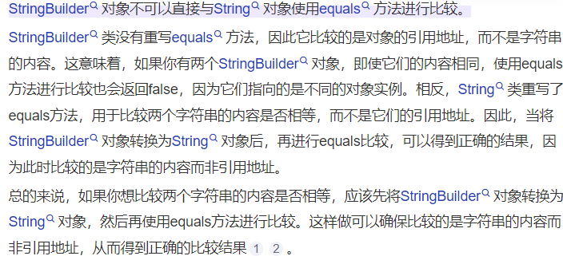

我国的居民身份证号码，由由十七位数字本体码和一位数字校验码组成。请定义方法判断用户输入的身份证号码是否合法，并在主方法中调用方法测试结果。规则为：号码为18位，不能以数字0开头，前17位只可以是数字，最后一位可以是数字或者大写字母X。

### 训练目标

字符串的遍历、判断

### 训练提示

1、要判断字符串是否符合规则，方法的返回值类型是什么？参数列表是什么？

2、使用String的API，对每种不符合条件的情况作出判断，一旦发现不符合条件就可以结束方法的执行，返回结果了。

3、在主方法中创建键盘录入，调用方法，输入各种数据测试结果。

### 训练步骤

1、定义方法，返回值类型为boolean表示是否合法，参数列表为String类型的id，表示要判断的数据。

2、对每种不符合条件的情况作出判断

​	2.1、如果字符串长度不是18，返回false。

​	2.2、如果字符串以数字"0"开头，返回false。

​	2.3、遍历字符串，获取每一位字符，判断前17位，如果不是数字，返回false，判断最后一位如果不是数字或者X，返回false

​	2.4、所以的不符合条件都筛选完成，返回true

3、在主方法中创建键盘录入Scanner对象，调用nextLine()方法，获取用户输入，调用方法，传递参数，查看结果。要多运行几次，判断各种不符合条件的数据。

### 参考答案

```java
public class studyCODE {

    public static void main(String[] args){
        System.out.println("请输入一个字符串：");
        Scanner reader=new Scanner(System.in);
        String wait=reader.next();
        checkCorrectness(wait);


    }
    public static void checkCorrectness(String q) {
        boolean flag=true;//标记变量
            if (q.length() != 18) {//字数不符合
                System.out.println("输入不合法!请重新输入");
                flag=false;
            }
            else {//字数符合
                if (q.charAt(q.length() - 1) >= '0' &&
                        q.charAt(q.length() - 1) <= '9' ||
                        q.charAt(q.length() - 1) == 'X') {//最后一位数字
                    if (q.charAt(0) == '0') {
                        flag=false;
                    }
                    else {
                        for (int i = 1; i < q.length() - 1; i++) {
                            if (q.charAt(i)< '0' || q.charAt(i) > '9') {
                                flag=false;
                                break;

                            }
                        }

                    }
                } else {
                    flag=false;
                }
                //判断
                if(flag==true){
                System.out.println("输入合法...");}
                else{
                    System.out.println("输入不合法!请重新输入");
                }
        }

    }
```


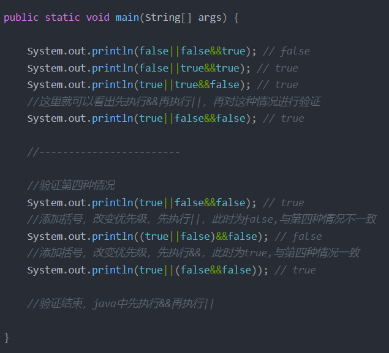

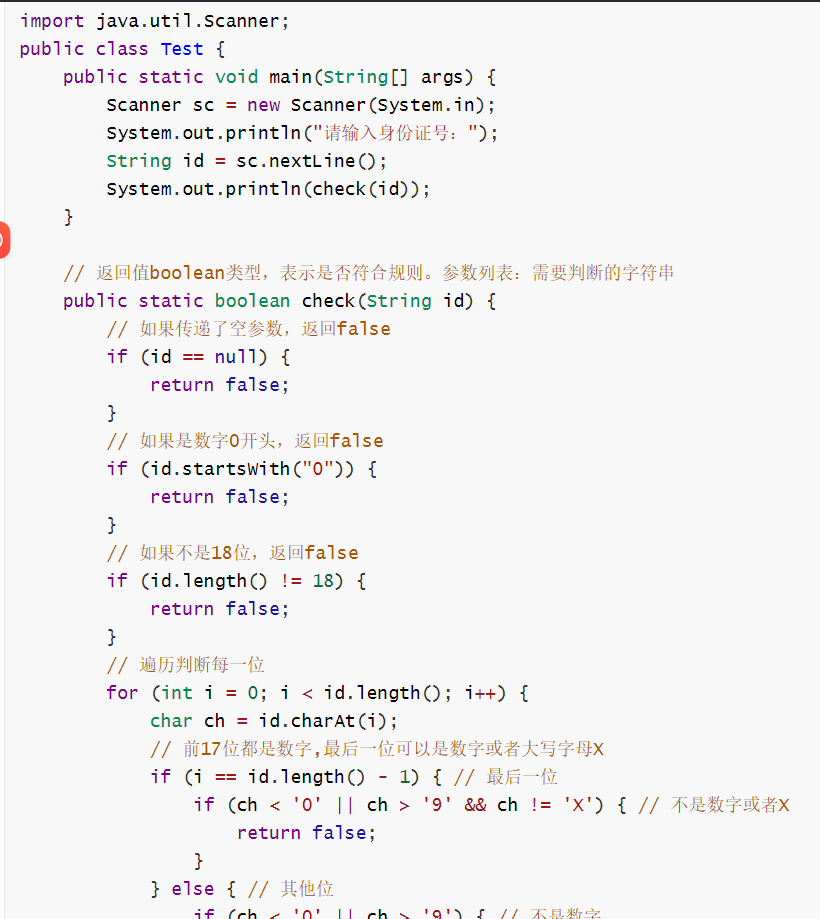

## 题目7

定义一个方法，把 int 数组中的数据按照指定的格式拼接成一个字符串返回，调用该方法，并在控制台输出结果。

要求：

​	1、如果传递的参数为空，返回null

​	2、如果传递的数组元素个数为0，返回[]

​	3、如果数组为int[] arr = {1,2,3}; ，执行方法后的输出结果为：[1, 2, 3]

### 训练目标

字符串的拼接

### 训练提示

1、定义方法的返回值是什么？参数列表是什么？

2、如果不做判断就对数组进行遍历，那么如果数组对象为空，会报出异常，怎样避免空指针异常呢？

3、拼接字符串必然涉及到频繁改变，该采用可变的字符序列StringBuilder比较好

4、遍历数组，按照题目格式拼接数组中的元素。

5、将字符串返回

6、在主方法中定义数组，并调用方法，打印结果

### 训练步骤

1、定义方法返回值类型：String，参数：int[] arr

2、判断对象如果为null，直接返回null

3、创建StringBuilder对象

4、遍历数组，按照要求进行拼接数组元素，如果是不是最后一个元素，还要拼接逗号和空格

5、将StringBuilder转为String返回

6、在主方法中定义数组，并调用方法，打印结果

### 参考答案

```java
public class studyCODE {

    public static void main(String[] args){
     int[] arr=new int[]{23,45,6,32,5};
     int[] arr1=new int[0];
     String u=iarrToString(arr);
     System.out.println(u);
        String u1=iarrToString(arr1);
        System.out.println(u1);
        String u2=iarrToString();
        System.out.println(u2);

    }

    public static String iarrToString(){//空参传递
        return null;
    }

    public static String iarrToString(int[] m){//传递数组
        String tem="[";
        for (int i = 0; i <m.length; i++) {
            tem=tem+m[i];
            if(i<m.length-1){
                tem+=',';
            }
        }
        tem+="]";
        return tem;

    }
}

```

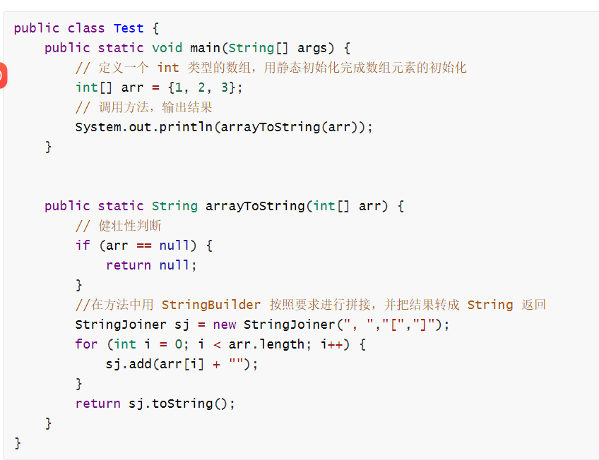

StringJoiner中的add只能加字符串！！！！！！！！所以有**<u>*arr[i]+""*</u>**

## 题目8（扩展）

在String类的API中，有如下两个方法：

```java
// 查找参数字符串str在调用方法的字符串中第一次出现的索引，如果不存在，返回-1
public int indexOf(String str)

// 截取字符串，从索引beginIndex（包含）开始到字符串的结尾
public String substring(int beginIndex)
```

请仔细阅读API中这两个方法的解释，完成如下需求。

现有如下文本："Java语言是面向对象的，Java语言是健壮的，Java语言是安全的，Java是高性能的，Java语言是跨平台的"。请编写程序，统计该文本中"Java"一词出现的次数。

### 训练目标

String类API的灵活使用

### 训练提示

1、要找的子串是否存在，如果存在获取其出现的位置。这个可以使用indexOf完成。
2、如果找到了，那么就记录出现的位置并在剩余的字符串中继续查找该子串，而剩余字符串的起始位是出现位置再加上子串的长度。

3、以此类推，通过循环完成查找，如果找不到就是-1，每次找到用计数器记录次数。

### 训练步骤

1、定义方法，返回值int表示次数，参数列表两个字符串，第一个表示在哪个字符串中查找，第二个表示要查找的目标子串

2、定义统计变量表示次数。

3、定义索引变量，表示每次找到子串出现的索引。

4、定义循环，判断条件为在字符串中找到了目标子串，使用indexOf实现。

5、如果找到的索引不是-1，在循环中，统计变量累加。

6、把查找过的部分剪切掉，从找到的索引+子串长度的位置开始截取，使用substring实现。

7、将统计变量返回

8、在主方法中，定义字符串表示题目中的文本，定义字符串表示要查找的子串，调用方法，获取结果。

### 参考答案

```java
public class studyCODE {

    public static void main(String[] args){
     String str="Java语言是面向对象的，Java语言是健壮的" +
             "，Java语言是安全的，Java是高性" +
             "能的，Java语言是跨平台的";
     String ref="Java";
     int count=countStr(str,ref);
        System.out.println(str+"中"+ref+"出现的次数为："+
                count+"次");

    }
    public static int countStr(String str,String ref){
        int count=0;
        while(true){
            if(str.indexOf(ref)==-1){
                break;
            }
            else{
                count++;
                if(str.length()==4){
                    break;
                }
                else {
                    str = str.substring(str.indexOf(ref) + 4);
                }
            }
        }
        return count;
    }


}

```

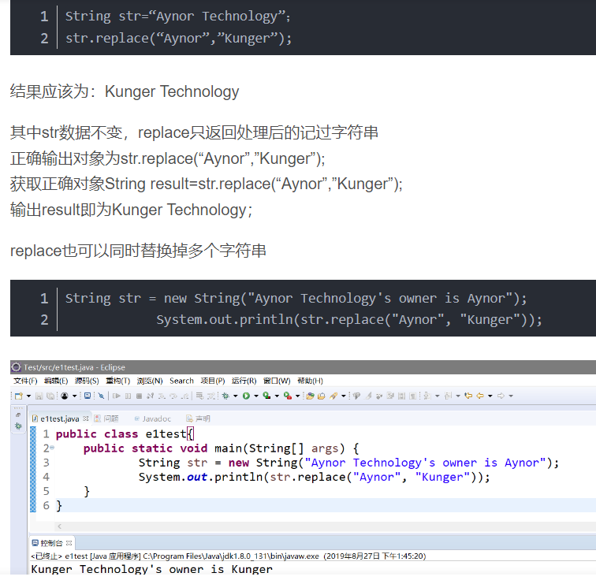

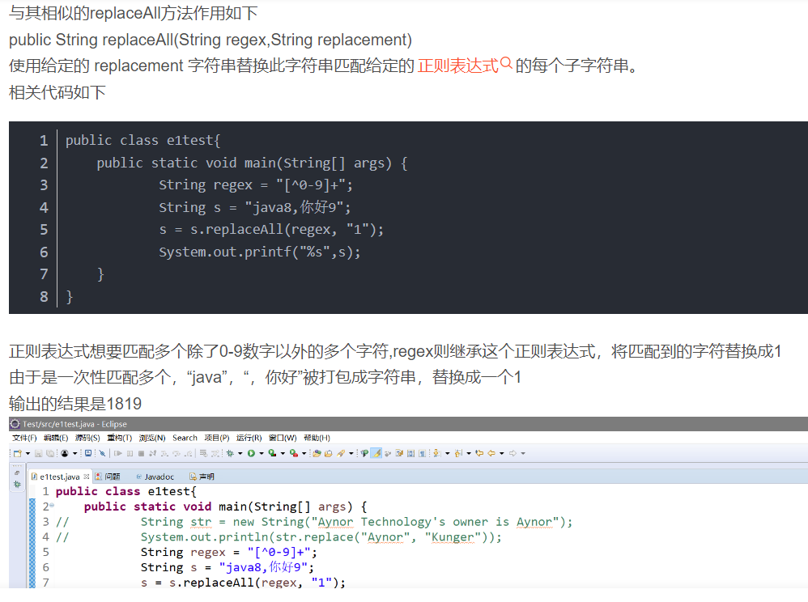

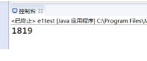