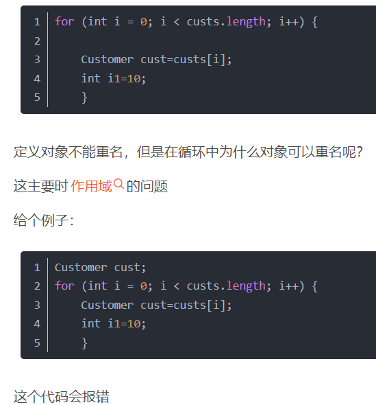
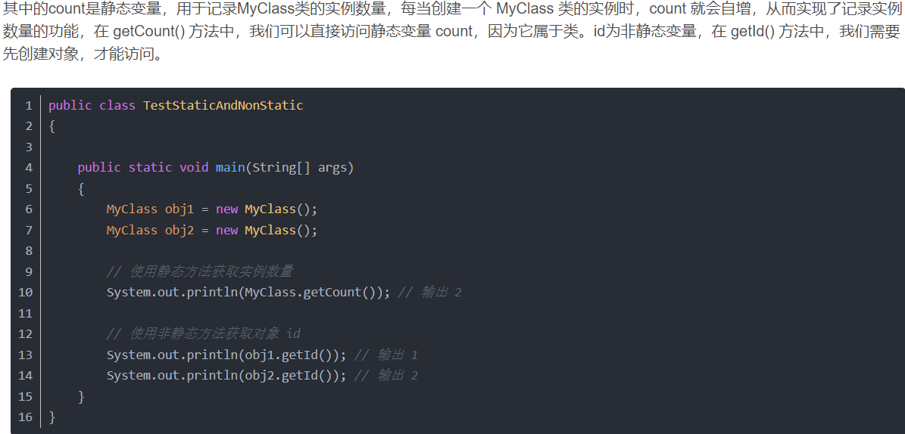
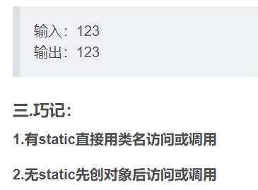
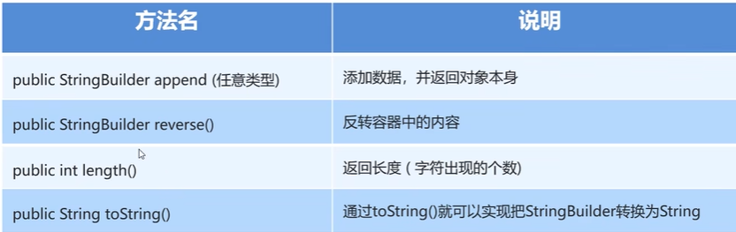
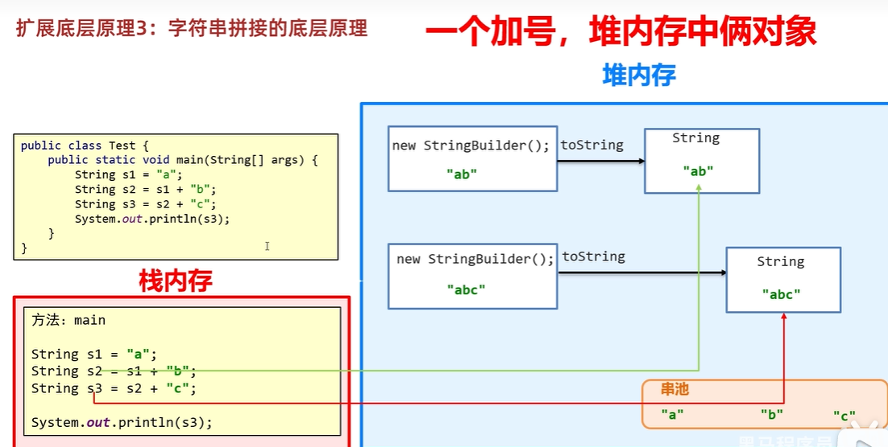

##### 关于StringBuilder和StringJoiner的清除：


**StringBuilder也没有clear**


## 1.API

### 1.1API概述

- 什么是API

  ​	API (Application Programming Interface) ：应用程序编程接口

- java中的API

  ​	指的就是 JDK 中提供的各种功能的 Java类，这些类将底层的实现封装了起来，我们不需要关心这些类是如何实现的，只需要学习这些类如何使用即可，我们可以通过帮助文档来学习这些API如何使用。

### 1.2如何使用API帮助文档

- 打开帮助文档


- 找到索引选项卡中的输入框


- 在输入框中输入Random


- 看类在哪个包下


- 看类的描述


- 看构造方法


- 看成员方法


## 2.String类		<u>*java.lang.String*</u>

### 2.1String类概述

##### 	String 类代表字符串，**<u>*Java 程序中的所有字符串文字（例如“abc”）都被实现为此类的实例*</u>**。也就是说，Java 程序中所有的双引号字符串，都是 String 类的对象。**<u>*String 类在 java.lang 包下，所以使用的时候不需要导包！！！！！！！！！*</u>**！

### 2.2String类的特点

- **<u>*字符串不可变*</u>**，它们的<u>*值在创建后不能被更改*</u>//说的是字符串本身不能改变，不是说String创造的变量不能改变

  /*JAVA中所有字符串文字都被视为String的对象*/

  

- 虽然 **String 实例化的对象的值是不可变的（<u>*基本数据类型和引用数据类型都包括*</u>）**，但是它们可以被共享

  //☆☆☆☆☆☆☆☆☆☆☆☆对象的值不能改变，但等号左边是引用，引用可以指向别的地址


- StringBuilder实例化对象的值可以发生改变
- 字符串效果上相当于字符数组( char[] )，但是底层原理是字节数组( byte[] )

### 2.3String类的构造方法

- 常用的构造方法

  | 方法名                      | 说明                                                         |
  | --------------------------- | ------------------------------------------------------------ |
  | public   String()           | 创建一个空白字符串对象，不含有任何内容                       |
  | public   String(char[] chs) | 根据字符数组的内容，来创建字符串对象                         |
  | public   String(byte[] bys) | 根据字节数组的内容，来创建字符串对象/////////应用场景：网络中传输的信息实际上都是字节信息，一般我们需要把字节信息进行转换，转换成字符串（系统会根据字节数据的值根据ASCII转化成对应的字符），此时要用这个构造 |
  | String s =   “abc”;         | **直接赋值**的方式创建字符串对象，内容就是abc//**<u>***<u>*！！！！！！！！！！！！！！！！！*</u>**<u>创造出来的"abc"不能被改变，想要改变，就把他存在字符数组，进行字符串内容的修改</u><u>****！！！！！！！！！！！！！！！！！！！！！**</u>*</u>**** |

- 示例代码

- 这样也行

- 这里如果是Int类型，系统会报错

- 

  char类型的数据打印出来是字符的形式，但是是以ASCII的形式存储
  
  byte打印出来还是数字的形式，但是能以数组的形式给String的new对象初始化，用到上面解释的地方//即 一般来说把byte 当成普通的 范围较小的整数，但是涉及到字符串的时候，有很多时候都可以与他有关
  
  ```java
  public class StringDemo01 {
      public static void main(String[] args) {
          //public String()：创建一个空白字符串对象，不含有任何内容
          String s1 = new String();
          System.out.println("s1:" + s1);
  
          //public String(char[] chs)：根据字符数组的内容，来创建字符串对象
          char[] chs = {'a', 'b', 'c'};
          String s2 = new String(chs);
          System.out.println("s2:" + s2);
  
          //public String(byte[] bys)：根据字节数组的内容，来创建字符串对象
          byte[] bys = {97, 98, 99};
          String s3 = new String(bys);
          System.out.println("s3:" + s3)
  
          //String s = “abc”;	直接赋值的方式创建字符串对象，内容就是abc
          String s4 = "abc";
          System.out.println("s4:" + s4);
      }
  }
  ```

### 2.4创建字符串对象两种方式的区别//(原理在本页的末尾)

- 通过构造方法创建

  ​	通过 new 创建的字符串对象，每一次 new 都会申请一个内存空间，虽然内容相同，但是地址值不同

- 直接赋值方式创建

  ​	以“”方式给出的字符串，只要字符序列相同(顺序和大小写)，无论在程序代码中出现几次，JVM 都只会建立一个 String 对象，并在字符串池中维护

### 2.5字符串的比较

#### 2.5.1==号的作用


- 比较基本数据类型：比较的是具体的值

- 比较引用数据类型：比较的是对象地址值

  

#### 2.5.2equals方法的作用

在计算机科学和编程中，**"case**"通常指的是**大小写敏感性**（大小写指的是英文，不是中文等其他乱七八糟的语言）


equals:必须要求完全一样，包括大小写

equalsIgnoreCase:忽略大小写

- 方法介绍

  ```java
  public boolean equals(String s)     比较两个字符串内容是否相同、区分大小写
   
  ```

- 示例代码

  ```java
  public class StringDemo02 {
      public static void main(String[] args) {
          //构造方法的方式得到对象
          char[] chs = {'a', 'b', 'c'};
          String s1 = new String(chs);
          String s2 = new String(chs);
  
          //直接赋值的方式得到对象
          String s3 = "abc";
          String s4 = "abc";
  
          //比较字符串对象地址是否相同
          System.out.println(s1 == s2);
          System.out.println(s1 == s3);
          System.out.println(s3 == s4);
          System.out.println("--------");
  
          //比较字符串内容是否相同
          System.out.println(s1.equals(s2));
          System.out.println(s1.equals(s3));
          System.out.println(s3.equals(s4));
      }
  }
  ```

### 2.6用户登录案例

#### 2.6.1案例需求

​	已知用户名和密码，请用程序实现模拟用户登录。总共给三次机会，登录之后，给出相应的提示


//这里的sc.next()在他的源代码中实际上是有了new String()的操作

以后只要想比较字符串的内容，必须要用String里面的方法equals/equalsIgnoreCase

#### 2.6.2代码实现

```java
public class Test1登录案例 {
    public static void main(String[] args) {
        //1.定义两个变量用来记录正确的用户名和密码
        String rightUsername = "itheima";
        String rightPassword = "1234qwer";

        //2.键盘录入用户名和密码
        //ctrl + alt + T 选择包裹方式

        for (int i = 0; i < 3; i++) {//0 1 2
            Scanner sc = new Scanner(System.in);
            System.out.println("请输入用户名");
            String username = sc.next();
            System.out.println("请输入密码");
            String password = sc.next();

            //3.判断比较
            if (username.equals(rightUsername) && password.equals(rightPassword)) {
                System.out.println("登录成功");
                //如果正确，循环结束
                break;
            } else {
                //最后一次机会
                if(i == 2){
                    System.out.println("账户" + username + "被锁定，请联系黑马程序员官方小姐姐：XXXXXXX");
                }else{
                    //不是最后一次机会
                    System.out.println("用户名或密码错误，登录失败,还剩下" + (2 - i) + "次机会");//2 1 0
                }
            }
        }

    }
}

```




### 

因为他们作用域不同。**<u>*for循环每次执行循环操作，都处于不同的大括号内，这就是循环定义”重名“变量的真*</u>**

### 2.7遍历字符串案例


String里的Index下标和数组一样，第一个为0

数组的长度**不用加（）**//是数组的一种属性，直接用“.”即可

字符串的长度**要加（）**//是一种String里的方法

#### 额2.7.1案例需求

​	键盘录入一个字符串，使用程序实现在控制台遍历该字符串

#### 2.7.2直接遍历字符串

```java
public class Test2字符串直接遍历 {
    public static void main(String[] args) {
        //两个方法：
        //charAt()：会根据索引获取对应的字符
        //length(): 会返回字符串的长度


        //1.键盘录入一个字符串
        Scanner sc = new Scanner(System.in);
        System.out.println("请输入字符串");
        String str = sc.next();
        System.out.println(str);

        //2.遍历
        for (int i = 0; i < str.length(); i++) {
            //i 依次表示字符串的每一个索引
            //索引的范围：0 ~  长度-1

            //根据索引获取字符串里面的每一个字符
            //ctrl + alt + V 自动生成左边的接受变量
            char c = str.charAt(i);
            System.out.println(c);
        }
    }
}

```

### 2.8统计字符次数案例

#### 2.8.1案例需求

​	键盘录入一个字符串，统计该字符串中大写字母字符，小写字母字符，数字字符出现的次数(不考虑其他字符)

#### 2.8.2代码实现

```java
public class Test4统计个数 {
    public static void main(String[] args) {
        //键盘录入一个字符串，统计大写，小写，数字出现的次数


        //1.键盘录入一个字符串
        Scanner sc = new Scanner(System.in);
        System.out.println("请输入一个字符串");
        String str = sc.next();


        //2.统计 --- 计数器count
        //此时我要统计的有3样东西，所以要定义3个计数器分别进行统计
        int bigCount = 0;
        int smallCount = 0;
        int numberCount = 0;
        //得到这个字符串里面每一个字符
        for (int i = 0; i < str.length(); i++) {
            //i 表示字符串中的索引
            //c 表示字符串中的每一个字符
            
            
            
            
            
            char c = str.charAt(i);

            //☆☆☆☆☆☆☆☆☆☆☆☆☆☆☆☆☆☆☆☆☆☆☆☆☆☆☆☆☆☆☆☆☆☆☆☆☆☆☆☆☆☆☆☆☆
  如果说频繁的用到通过方法等得到的量，最好把它赋值给一个变量，这样的话减少方法调用的次数，提高效率    
              ☆☆☆☆☆☆☆☆☆☆☆☆☆☆☆☆☆☆☆☆☆☆☆☆☆☆☆☆☆☆☆☆☆☆☆☆☆☆☆☆☆☆☆☆*/
      
            
            
            //对c进行判断
            if (c >= 'a' && c <= 'z') {
                smallCount++;
            }else if(c >= 'A' && c <= 'Z'){
                bigCount++;
            }else if(c >= '0' && c <= '9'){
                numberCount++;
            }
        }

        //3.当循环结束之后，三个变量记录的就是对应的个数
        System.out.println("大写字符有:" + bigCount + "个");
        System.out.println("小写字符有:" + smallCount + "个");
        System.out.println("数字字符有:" + numberCount + "个");
    }
}

```

### 2.9字符串拼接案例


1/**<u>*！！！！！！！字符串和数字	相加+	相当于字符串的拼接！！！！！！*</u>**


2/  String s = **""**;//**空字符串（长度为0的空白字符串）**

//字符串String类型的赋值可以**<u>*直接用等于号*</u>**

//数组类型的赋值要在new 创造对象的时候用**{}**							（包括字符串数组）

3/看文中五角星的部分！！！！

*<u>这里这个循环再一次体现了什么叫功能相同的尽量放在一块，比如如果把最后一个Int元素拿出去for循环外面特殊处理，也行，**但是代码不具有模块化，而且读起来思路会比较混乱**</u>*！！！！！！！！！！！！！


**为什么JDK1.9将char[]改为了byte[]数组：**

- Jdk1.8一个char栈两个字节(16位)，String主要存储在堆中，大部分的String包含的都是拉丁字符(26个字母)使用一个字节就可以存的下，导致一半的空间被浪费掉。
- Jdk9使用byte[]和字符集的标识来存储，如果字符集的标识是中文使用两个字节来存其他的使用一个字节来存。这样节省了将近一半的空间。


#### 2.9.1案例需求

​	定义一个方法，把 int 数组中的数据按照指定的格式拼接成一个字符串返回，调用该方法，

​	并在控制台输出结果。例如，数组为 int[] arr = {1,2,3}; ，执行方法后的输出结果为：[1, 2, 3]

#### 2.9.2代码实现//本质：String类型的数据和任何数据进行“+”操作都相当于是字符串的拼接

```java
public class Test5数组拼接成字符串 {
    public static void main(String[] args) {
        //定义一个方法，把 int 数组中的数据按照指定的格式拼接成一个字符串返回，调用该方法，
        //并在控制台输出结果。例如，数组为 int[] arr = {1,2,3};
        //执行方法后的输出结果为：[1, 2, 3]


        int[] arr = {1, 2, 3, 4, 5};

        String str = arrToString(arr);
        System.out.println(str);

    }


        public static String arrtoString(int[] m) {
         String ne="[";//创建一个空字符串
        for (int i = 0; i < m.length; i++) {
            ne+=m[i];
            if(i!=m.length-1){
                ne+=',';
            }
        }
        ne+=']';
        return ne;
    }
      

     public static void prrString(String a){
        for (int i = 0; i < a.length(); i++) {
            System.out.print(a.charAt(i));
        }
    }
}

```

### 2.10字符串反转案例

#### 2.10.1案例需求

​	定义一个方法，实现字符串反转。键盘录入一个字符串，调用该方法后，在控制台输出结果

​	例如，键盘录入 abc，输出结果 cba

#### 2.10.2代码实现

```java
public class Test6反转字符串 {
    public static void main(String[] args) {
        /*定义一个方法，实现字符串反转。键盘录入一个字符串，调用该方法后，在控制台输出结果
        例如，键盘录入 abc，输出结果 cba*/


        //1.定义一个字符串
        Scanner sc = new Scanner(System.in);
        System.out.println("请输入一个字符串");
        String str = sc.next();
        //2.定义一个方法，反转字符串
        //abc  --->  cba
        //可以把字符串倒着遍历，再拼接
        String result = reverse(str);
        System.out.println(result);//☆☆☆☆☆☆☆☆☆☆☆☆☆☆☆☆☆☆☆☆☆☆☆☆☆☆☆☆☆☆字符串可以直接打印


    }

    //注释：方法的作用就是反转字符串
    //把传递进来的字符串进行反转
    public static String reverse(String str){//abc
        //核心思想：倒着遍历并进行拼接就可以了
        //☆☆☆☆☆☆☆☆☆☆☆☆☆fori :正着遍历  forr：倒着遍历
        String s = "";
        for (int i = str.length() - 1; i >= 0; i--) {
            //i 依次表示字符串里面的每一个索引（倒着的）
            //我们就可以拿到里面的每一个字符并拼接
            s = s + str.charAt(i);
        }

        //把倒着拼接之后的结果返回即可
        return s;

    }
}

```

### 2.11 金额转换


//！！！！！！！！介绍一种常用的方法：

1/**查表法：通过建立数组，把数字与数据一一对应**  ！！！！！！！！常用于 **已经格式化** 或者	**数据一一对应好了的**

2/**while(true){**

​		**if(满足条件){,,,break;**

​					**}**

​		**else{**

**}**

**}**//一直循环，直到满足条件

3///**字符串的拼接既可以在左边拼接，也可以在右边拼接**

#### 2.11.1 案例需求//字符串String☆☆☆☆☆☆☆☆☆☆本质上这个案例是讲拼接

思路：


​	把2135变成：零佰零拾零万贰仟壹佰叁拾伍元 

​	把789变成：零佰零拾零万零仟柒佰捌拾玖元

#### 2.11.2 代码实现

//！!!!!!!!!!本题的关键之处：

**<u>*大写字母的字符串 与 单位字符串 每一个位上都是一一对应的，即由相同的下标完成*</u>**


//					/删除作用   %记录作用

```java
package com.itheima.stringdemo;

import java.util.Scanner;

public class StringDemo9 {
    public static void main(String[] args) {
        //1.键盘录入一个金额
        Scanner sc = new Scanner(System.in);
        int money;
        while (true) {
            System.out.println("请录入一个金额");
            money = sc.nextInt();
            if (money >= 0 && money <= 9999999) {
                break;
            } else {
                System.out.println("金额无效");
            }
        }

        //定义一个变量用来表示钱的大写
        String moneyStr = "";

        //2.得到money里面的每一位数字,再转成中文
        while (true) {//2135
            //从右往左获取数据，因为右侧是数据的个位
            int ge = money % 10;
            String capitalNumber = getCapitalNumber(ge);
            //把转换之后的大写拼接到moneyStr当中
            moneyStr = capitalNumber + moneyStr;
            //第一次循环 ： "伍" + "" = "伍"
            //第二次循环 ： "叁" + "伍" = "叁伍"
            //去掉刚刚获取的数据
            money = money / 10;

            //如果数字上的每一位全部获取到了，那么money记录的就是0，此时循环结束
            if (money == 0) {
                break;
            }
        }

        //3.在前面补0，补齐7位
        int count = 7 - moneyStr.length();
        for (int i = 0; i < count; i++) {
            moneyStr = "零" + moneyStr;
        }
        System.out.println(moneyStr);//零零零贰壹叁伍

        //4.插入单位
        //定义一个数组表示单位
        String[] arr = {"佰","拾","万","仟","佰","拾","元"};
        //               零    零   零   贰   壹   叁   伍

        //遍历moneyStr，依次得到 零    零   零   贰   壹   叁   伍
        //然后把arr的单位插入进去

        String result = "";
        for (int i = 0; i < moneyStr.length(); i++) {
            char c = moneyStr.charAt(i);
            //把大写数字和单位拼接到result当中
            result = result + c + arr[i];
        }

        //5.打印最终结果
        System.out.println(result);

    }


    //定义一个方法把数字变成大写的中文
    //1 -- 壹
    //☆☆☆☆☆☆☆☆☆☆☆☆☆☆☆☆☆☆☆☆☆☆☆☆☆☆☆☆☆☆☆☆☆☆☆☆☆☆☆☆☆☆☆☆☆☆☆☆☆☆☆☆☆☆☆☆☆☆☆☆☆☆☆☆☆☆☆☆☆☆☆☆☆☆☆☆☆☆☆☆☆☆☆☆☆☆☆☆☆字符串数组
    public static String getCapitalNumber(int number) {
        //定义数组，让数字跟大写的中文产生一个对应关系
        String[] arr = {"零", "壹", "贰", "叁", "肆", "伍", "陆", "柒", "捌", "玖"};
        //返回结果
        return arr[number];
    }

}

```

//方法二 采用字符数组实现

```java
public class studyCODE {
    static char[] numCh={'零','壹','贰','叁','肆','伍','陆','柒','捌','玖'};
    public static void main(String[] args){
//创建查表数组
        //壹、贰、叁、肆、伍、陆、柒、捌、玖、拾、佰、仟、万（萬）、亿、元（圆）、角、分、零、整（正）
        //char[] numCh={'零','壹','贰','叁','肆','伍','陆','柒','捌','玖'};
        int inNum=789;
        int[] yu=numToarr(inNum);
        char[] km=nAtosA(yu);
        prrS(km);
    }

    public static int[] numToarr(int ww) {
        int[] numa = new int[7];
        int tem;
        for (int i = numa.length - 1; i >= 0; i--) {
            tem = ww % 10;
            ww /= 10;
            if (tem == 0 && ww == 0) {
                numa[i] = 0;
            }
            else{
                numa[i] = tem;
            }
        }
        return numa;
    }

    public static char[] nAtosA(int[] lk){
        char[] arch=new char[lk.length];
       // char[] numCh={'零','壹','贰','叁','肆','伍','陆','柒','捌','玖'};
        for (int i = 0; i < lk.length; i++) {
            arch[i]=numCh[lk[i]];
        }
        return arch;

    }
    //3.没问题
    public static void prrS(char[] m){
        char[] qw=new char[]{'佰','拾','万','仟','佰','拾','元'};
        for (int i = 0; i < m.length; i++) {
            System.out.printf("%c%c",m[i],qw[i]);
        }
        
    }


}
```


拓展：**<u>*{'零','壹','贰','叁','肆','伍','陆','柒','捌','玖'}*</u>**如果要写在类的成员变量那里，并且该类方法需要调用此成员变量，一定要用static修饰把它变成静态变量


静态和非静态的定义：
静态：（有static）

静态变量和方法是属于类的，而不属于类的实例或对象。它们可以通过类名直接访问，不需要创建对象。因此，静态成员常常用于描述与类本身有关的信息，比如常量、工具方法等。例如，Math类中的PI常量和abs()方法都是静态的。

非静态:（无static）

非静态变量和方法则是属于类的实例或对象的。它们必须依赖于对象的状态，才能进行相应的操作。因此，非静态成员常常用于描述类的实例状态，比如具有不同属性的学生或员工对象。例如，一个Person类中的name和age变量就是非静态的。
————————————————






### 2.12 手机号屏蔽

# substring()!!!!!!!!!!!!!!!!!!!!!!!!!!!!!


（方法的重载）

eg :

String a="12334";

a.substring(0,3);

//1,2,3

需求：以字符串的形式从键盘接受一个手机号，将中间四位号码屏蔽

最终效果为：`131****9468`

代码实现：

```java
public class Test8手机号屏蔽 {
    public static void main(String[] args) {
        /*以字符串的形式从键盘接受一个手机号，将中间四位号码屏蔽
        最终效果为：131****9468*/

        //1.键盘录入一个手机号码
        Scanner sc = new Scanner(System.in);
        System.out.println("请输入手机号码");
        String phoneNumber = sc.next();//13112349408

        //2.截取手机号码中的前三位
        String star = phoneNumber.substring(0, 3);

        //3.截取手机号码中的最后四位
        //此时我用substring方法，是用1个参数的，还是两个参数的？1个参数的会更好
        //因为现在我要截取到最后，所以建议使用1个参数的。
        String end = phoneNumber.substring(7);

        //4.拼接
        String result = star + "****" + end;

        System.out.println(result);

    }
}

```

### 2.13 敏感词替换 

# 字符串变量名.replace(,)!!!!!!!!!!!!!!!


//原来存储字符串的字符串变量不变，除非你使他改变


需求1：键盘录入一个 字符串，如果字符串中包含（TMD），则使用***替换 

```java
public class Test9敏感词替换 {
    public static void main(String[] args) {
        //1.定义一个变量表示骂人的话
        String talk = "后裔你玩什么啊，TMD";


        //2.把这句话中的敏感词进行替换
        String result = talk.replace("TMD", "***");

        //3.打印
        System.out.println(talk);
        System.out.println(result);
    }
}

```

需求2：如果要替换的敏感词比较多怎么办？

```java
public class Test10多个敏感词替换 {
    public static void main(String[] args) {
        //实际开发中，敏感词会有很多很多

        //1.先键盘录入要说的话
        Scanner sc = new Scanner(System.in);
        System.out.println("请输入要说的话");
        String talk = sc.next();//后裔你玩什么啊，TMD,GDX,ctmd,ZZ

        //2.定义一个数组用来存多个敏感词
        String[] arr = {"TMD","GDX","ctmd","ZZ","lj","FW","nt"};

        //3.把说的话中所有的敏感词都替换为***

        for (int i = 0; i < arr.length; i++) {
            //i 索引
            //arr[i] 元素 --- 敏感词
            talk = talk.replace(arr[i],"***");
        }

        //4.打印结果
        System.out.println(talk);//后裔你玩什么啊，***,***,***,***

    }
}

```

### 2.14 身份证信息查看

​	身份证的每一位都是有固定的含义：

* 1、2位：省份 
* 3、4位：城市 
* 5、6位：区县 
* 7-14位：出生年、月、日 
* 15、16位：所在地派出所 
* 17位：性别（奇数男性，偶数女性）
* 18位：个人信息码（随机产生） 

要求打印内容方式如下：

​	人物信息为：

​	出生年月日：XXXX年X月X日

​	性别为：男/女


### **<u>*char,byte,short参与运算，会自动转化为 int 类型*</u>**

```java
package com.itheima.stringdemo;

public class StringDemo11 {
    public static void main(String[] args) {
        //1.定义一个字符串记录身份证号码
        String id = "321281202001011234";

        //2.获取出生年月日
        String year = id.substring(6, 10);
        String month = id.substring(10, 12);
        String day = id.substring(12, 14);


        System.out.println("人物信息为：");
        System.out.println("出生年月日:" + year + "年" + month + "月" + day + "日");

        //3.获取性别
        char gender = id.charAt(16);//'3'  ---> 3
        //利用ASCII码表进行转换
        //'0' --->  48
        //'1' --->  49
        //'2' --->  50
        //'3' --->  51
        //'4' --->  52
        //'5' --->  53
        //'6' --->  54
        //'7' --->  55
        //'8' --->  56
        //'9' --->  57

       int num = gender - 48;
        if(num % 2 == 0){
            System.out.println("性别为:女");
        }else{
            System.out.println("性别为:男");
        }
    }
}
```

## 3.StringBuilder！！！！！！！！！！！（多用于字符串的拼接、反转）


/*由于字符串不能被改变，所以字符串在拼接的时候，会产生许许多多没有用的字符串*

eg:  String s1="aaa";

String s2="bbb";

string s3=s1+s2;//此时不仅有"aaa","bbb",还有"aaabbb"//

**<u>*占用内存太大，影响程序的运行效率！！！！！！！！！*</u>**


当我们在拼接字符串和反转字符串的时候会使用到


//StringBuilder是JAVA已经写好的类

//JAVA在底层对他做了一些特殊处理

/**<u>*/调用他创造的对象名 返回的不是字符串的地址（不像C里的指针），而是这个容器里的属性内容*</u>**


### 3.1 基本使用

**<u>*append与reverse的作用结果都会使原来容器里的内容发生改变，*</u>**这点与上面String 的相关方法不引起原来字符串的影响不同



```java
public class StringBuilderDemo3 {
    public static void main(String[] args) {
        //1.创建对象
        StringBuilder sb = new StringBuilder("abc");

        //2.添加元素
        /*sb.append(1);//返回：abc1
        sb.append(2.3);
        sb.append(true);*/返回：abctrue//不管括号里面是什么内容都会被当做字符串

        //反转
        sb.reverse();

        //获取长度
        int len = sb.length();
        System.out.println(len);


        //打印
        //普及：
        //因为StringBuilder是Java已经写好的类
        //java在底层对他做了一些特殊处理。
        //打印对象不是地址值而是属性值。
        System.out.println(sb);
    }
}
```


### 3.2 链式编程//！！！！！！！！！！！！！！！！！！！！！！！！！！！！！！！！！！！！本质，在你调用方法后直到这个方法的返回值类型，然后可以用	“.”	的形式，去调用更多的相关的方法，最后代码形成一条链子

有返回对象可以用链式！！！！！！！！！！！

//☆☆☆☆☆☆☆☆☆☆☆☆☆☆☆☆☆☆☆☆☆☆☆☆☆☆☆☆☆☆☆☆☆☆☆☆☆☆☆☆☆☆☆☆☆☆☆☆☆☆☆


链式编程一定是要(new)有对象（进行了实例化），才能进行相应的方法调用


☆☆☆☆☆☆☆☆☆☆☆☆☆☆☆☆☆☆☆☆☆☆☆☆☆☆☆☆☆☆☆☆☆☆☆☆☆☆☆☆☆☆☆☆☆☆☆☆☆☆☆

### //	只要返回值是字符串，都可以连续调用字符串相关的方法！！！！！！！！


```java
public class StringBuilderDemo4 {
    public static void main(String[] args) {
        //1.创建对象
        StringBuilder sb = new StringBuilder();

        //2.添加字符串
        sb.append("aaa").append("bbb").append("ccc").append("ddd");

        System.out.println(sb);//aaabbbcccddd

        //3.再把StringBuilder变回字符串
        String str = sb.toString();
        System.out.println(str);//aaabbbcccddd

    }
}
```


### 3.3 练习1：对称字符串 

需求：

​	键盘接受一个字符串，程序判断出该字符串是否是对称字符串，并在控制台打印是或不是

  	对称字符串：123321、111
  	
  	非对称字符串：123123

代码示例：


 String result = new StringBuilder().append(str).reverse().toString();
        //等号左边的依旧是存储地址


```java
public class StringBuilderDemo6 {
    //使用StringBuilder的场景：
    //1.字符串的拼接
    //2.字符串的反转

    public static void main(String[] args) {
        //1.键盘录入一个字符串
        Scanner sc = new Scanner(System.in);
        System.out.println("请输入一个字符串");
        String str = sc.next();

        //2.反转键盘录入的字符串
        String result = new StringBuilder().append(str).reverse().toString();
        

        //3.比较
        if(str.equals(result)){
            System.out.println("当前字符串是对称字符串");
        }else{
            System.out.println("当前字符串不是对称字符串");
        }

    }
}

```


### 3.4 练习2：拼接字符串 

需求：定义一个方法，把 int 数组中的数据按照指定的格式拼接成一个字符串返回。

​          调用该方法，并在控制台输出结果。

​          例如：数组为int[] arr = {1,2,3}; 

​          执行方法后的输出结果为：[1, 2, 3]

代码示例:

```java
package com.itheima.stringbuilderdemo;

public class StringBuilderDemo7 {
    public static void main(String[] args) {
        //1.定义数组
        int[] arr = {1,2,3};

        //2.调用方法把数组变成字符串
        String str = arrToString(arr);

        System.out.println(str);

    }


    public static String arrToString(int[] arr){
        StringBuilder sb = new StringBuilder();
        sb.append("[");

        for (int i = 0; i < arr.length; i++) {
            if(i == arr.length - 1){
                sb.append(arr[i]);
            }else{
                sb.append(arr[i]).append(", ");
            }
        }
        sb.append("]");

        return sb.toString();
    }
}

```

## 4. StringJoiner//"import java.util.StringJoiner;"

* StringJoiner跟StringBuilder一样，也可以看成是一个容器，创建之后里面的内容是可变的。
* 作用：**提高字符串的操作效率**，而且代码编写特别简洁，但是目前市场上很少有人用。 
* JDK8才出现的
* 


**<u>*间隔符号得用“”双引号引起来*</u>**

//**<u>*构造方法无空参*</u>**（空了会报错）


add返回的也还是StringJoiner//add里面添加的只能放**<u>*“字符串”*</u>**

所以如果添加 int类型的数据时，记得加	**“”**//把它转化成字符串


基本使用：

```java
//1.创建一个对象，并指定中间的间隔符号
StringJoiner sj = new StringJoiner("---");
//2.添加元素
sj.add("aaa").add("bbb").add("ccc");
//3.打印结果
System.out.println(sj);//aaa---bbb---ccc
```

```java
//1.创建对象
StringJoiner sj = new StringJoiner(", ","[","]");
//2.添加元素
sj.add("aaa").add("bbb").add("ccc");
int len = sj.length();
System.out.println(len);//15
//3.打印
System.out.println(sj);//[aaa, bbb, ccc]
String str = sj.toString();
System.out.println(str);//[aaa, bbb, ccc]
```

## 关于字符串的小扩展：

1. 字符串存储的内存原理

   String s = “abc”；直接赋值

   特点：

   ​	此时字符串abc是存在字符串常量池中的。

   ​	先检查字符串常量池中有没有字符串abc，如果有，不会创建新的，而是直接复用。如果没有abc，才会创建一个新的。

   所以，直接赋值的方式，代码简单，而且节约内存。

2. new出来的字符串

   看到new关键字，一定是在堆里面开辟了一个小空间。

   String s1 = new String（“abc”）；

   String s2 = “abc”；

   s1记录的是new出来的，在堆里面的地址值。

   s2是直接赋值的，所以记录的是字符串常量池中的地址值。

3. ==号比较的到底是什么？

   如果比较的是基本数据类型：比的是具体的数值是否相等。

   如果比较的是引用数据类型：比的是地址值是否相等。

   结论：==只能用于比较基本数据类型。不能比较引用数据类型。


### 5.字符串的内存

1.直接赋值

String Table(串池):存储 直接赋值 的**字符串**

如果是new出来的字符串，依旧是放在**堆**里


对String变量直接赋值一个字符串时，系统会先去串池看看有没有和这个字符串相同的字符串：

1/如果有，直接返回这个字符串的地址

2/如果没有，在StringTable里留出一块空间存储这个字符串，并且返回这个字符串的地址


2.手动new赋值


每new 一次，就在堆里面开辟一个小空间，并且每个小空间内都存储相应的字符串

这样的话，如果相同的字符串比较多，就会浪费空间

此时直接赋值不仅代码简单，而且节省空间


# 字符串相关类的底层原理

栈方法，堆new对象


//方法区：临时存储方法的字节码文件


//凡是看到new，那就一定是在堆里面开辟了一个新的空间。由于String的特殊性（创建String对象后对象的内容不能被改变），即相当于把“abc"复制给堆中new出来的小空间中，而不是s1,s2的值随着chs字符数组值的改变而改变


所以相比较来说，直接赋值可以节约内存


1.


JAVA文件在编译的时候已经生成“abc”字符串了


这是JDK8以前 的运行原理   **<u>*当一个变量 和 一个字符串进行拼接的时候*</u>**，每次运行一次，都会又多产生两个对象，占用内存空间

创建一个 StringBuilder 对象，把s1和“b” 放进去，最后再创建一个 toSting 对象




而之前是反复用的同一个 StringBuilder 对象，相对来说效率才会更高


至少会创建4个对象（两个两个的运算，从左到右）


