## 面向对象进阶部分学习方法：

特点：

​	逻辑性没有那么强，但是概念会比较多。

​	记忆部分重要的概念，理解课堂上讲解的需要大家掌握的概念，多多练习代码。

# day13

**<u>*其实static用类名调用更好，因为他本身就是反应这个类（所有的对象都共享的数据）*</u>**

## 今日内容

- 复习回顾
- static关键字
- 继承

## 教学目标

- [ ] 能够掌握static关键字修饰的变量调用方式
- [ ] 能够掌握static关键字修饰的方法调用方式
- [ ] 知道静态代码块的格式和应用场景

- [ ] 能够写出类的继承格式
- [ ] 能够说出继承的特点
- [ ] 能够区分this和super的作用
- [ ] 能够说出方法重写的概念
- [ ] 能够说出方法重写的注意事项


# 第一章 复习回顾

## 1.1 如何定义类

类的定义格式如下:

```java
修饰符 class 类名 {
    // 1.成员变量（属性）
    // 2.成员方法 (行为) 
    // 3.构造方法 （初始化类的对象数据的）
}
```

例如:

```java
public class Student {
    // 1.成员变量
    public String name ;
    public char sex ; // '男'  '女'
    public int age;
}
```

## 1.2 如何通过类创建对象

```java
类名 对象名称 = new 类名();
```

例如:

```java
Student stu = new Student();
```

## 1.3 封装

#### 1.3.1 封装的步骤

1.使用 `private` 关键字来修饰成员变量。

2.使用`public`修饰getter和setter方法。

### **<u>*//一个类里的成员方法可以直接访问这个类的成员变量，而main方法是个特殊的方法，不属于这个类的成员方法，所以要先产生对象才能访问！*</u>**

### **<u>*//在一个方法执行的时候，除了这个方法所属类的成员变量可以直接被调用，其他情况需要向该方法里面传递参数才行*</u>**

### **<u>*//一个大括号内的变量只能作用于这个大括号里面，包括循环结构也是这样的*</u>**

#### 1.3.2 封装的步骤实现

1. private修饰成员变量

```java
public class Student {
    private String name;
    private int age;
}
```

2. public修饰getter和setter方法

```java
public class Student {
    private String name;
    private int age;

    public void setName(String n) {
      	name = n;
    }

    public String getName() {
      	return name;
    }

    public void setAge(int a) {
        if (a > 0 && a <200) {
            age = a;
        } else {
            System.out.println("年龄非法！");
        }
    }

    public int getAge() {
      	return age;
    }
}
```

## 1.4 构造方法

### 1.4.1 构造方法的作用

在创建对象的时候，给成员变量进行初始化。

初始化即赋值的意思。

### 1.4.2 构造方法的格式

```java
修饰符 类名(形参列表) {
    // 构造体代码，执行代码
}
```

### 1.4.3 构造方法的应用

首先定义一个学生类，代码如下：

```java
public class Student {
    // 1.成员变量
    public String name;
    public int age;

    // 2.构造方法
    public Student() {
		System.out.println("无参数构造方法被调用")；
    }
}
```

接下来通过调用构造方法得到两个学生对象。

```java
public class CreateStu02 {
    public static void main(String[] args) {
        // 创建一个学生对象
        // 类名 变量名称 = new 类名();
        Student s1 = new Student();
        // 使用对象访问成员变量，赋值
        s1.name = "张三";
        s1.age = 20 ;

        // 使用对象访问成员变量 输出值
        System.out.println(s1.name);
        System.out.println(s1.age); 

        Student s2 = new Student();
        // 使用对象访问成员变量 赋值
        s2.name = "李四";
        s2.age = 18 ;
        System.out.println(s2.name);
        System.out.println(s2.age);
    }
}
```

## 1.5 this关键字的作用

### 1.5.1 this关键字的作用


*<u>**//☆☆☆☆☆☆☆☆☆☆☆☆☆☆☆☆☆☆☆☆☆☆☆☆☆☆☆☆☆☆☆☆☆☆☆☆☆☆☆☆☆this代表所在类的当前对象的引用（地址值），即代表当前对象。☆☆☆☆**</u>*


### 1.5.2 this关键字的应用

#### 1.5.2.1 用于普通的gettter与setter方法

this出现在实例方法中，谁调用这个方法（哪个对象调用这个方法），this就代表谁（this就代表哪个对象）。

```java
public class Student {
    private String name;
    private int age;

    public void setName(String name) {
      	this.name = name;
    }

    public String getName() {
      	return name;
    }

    public void setAge(int age) {
        if (age > 0 && age < 200) {
            this.age = age;
        } else {
            System.out.println("年龄非法！");
        }
    }

    public int getAge() {
      	return age;
    }
}
```

#### 1.5.2.2 用于构造方法中

this出现在构造方法中，代表构造方法正在初始化的那个对象。

```java
public class Student {
    private String name;
    private int age;
    
    // 无参数构造方法
    public Student() {} 
    
    // 有参数构造方法
    public Student(String name,int age) {
    	this.name = name;
    	this.age = age; 
    }
}
```

# 第二章 static关键字   “！！！！！！！！！共享！！！！！！！”

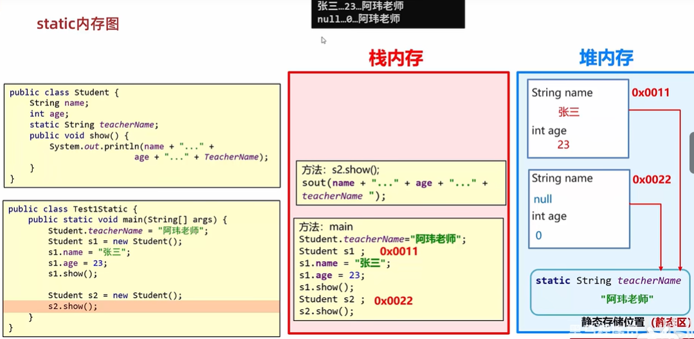

static随着类加载到方法区，就会相应的去运行，如果static修饰的是变量，那么此时系统会自动在**<u>*堆的静态区*</u>**创建一个相应的量，**在没有进行new对象时，如果想对这个变量进行改变，可以通过类去调用**

创建对象之后通过对象去堆访问相应的数据，如果访问static，它还要到静态存储区去访问

 


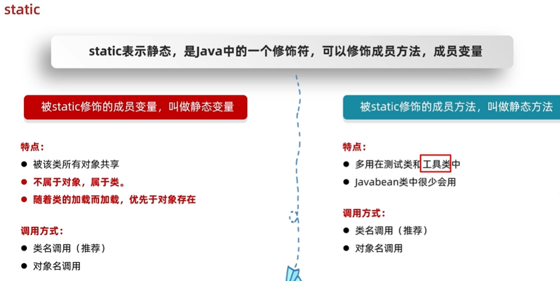


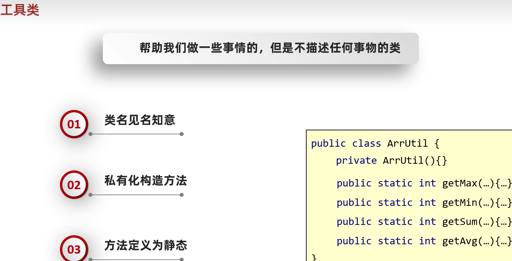

/1/**<u>*私有化构造方法：这样的话无法创建这个类的对象（创造了也没意义，不如不创造）*</u>**

/在Java中，如果一个类**<u>没有提供任何构造方法</u>**，那么Java会**<u>*自动为其创建一个默认的无参构造方法*</u>**（所以为了防止变成public,就用private），这个构造方法不会做任何初始化操作。然而，如果你的类需要进行一些特定的初始化工作，或者希望用户通过某种方式定制实例化过程，就需要显式地定义构造方法。/

/2/方法定义为静态：方便直接通过类名进行调用（你都没有对象了，肯定只能通过类名调用）

## 2.1 概述

以前我们定义过如下类：

```java
public class Student {
    // 成员变量
    public String name;
    public char sex; // '男'  '女'
    public int age;

    // 无参数构造方法
    public Student() {

    }
    
    // 有参数构造方法
    public Student(String  a) {

    }
}
```

我们已经知道面向对象中，存在类和对象的概念，我们在类中定义了一些成员变量，例如name,age,sex ,结果发现这些成员变量，每个对象都存在（因为每个对象都可以访问）。

而像name ,age , sex确实是每个学生**<u>对象都应该有的属性</u>**，应该**<u>*属于每个对象*</u>**。

所以Java中成员（**变量和方法**）等是存在所属性的，Java是通过static关键字来区分的。**static关键字在Java开发非常的重要，对于理解面向对象非常关键。**

关于 `static` 关键字的使用，它可以用来修饰的成员变量和成员方法，被static修饰的成员变量和方法是**属于类**的是放在静态区中，没有static修饰的成员变量和方法则是**属于对象**的。我们上面案例中的成员变量都是没有static修饰的，所以属于每个对象。

## 2.2 定义格式和使用 

static是静态的意思。 static可以修饰成员变量或者修饰方法。

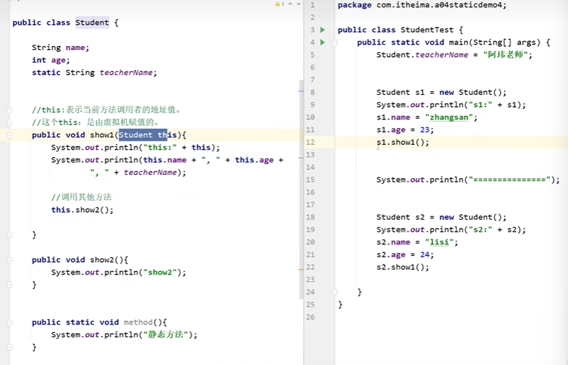

其实，类方法形参的前面都是会有 "类名 this"这样的数据出现，只不过是被隐藏了，this实际上指的是调用对象的地址值


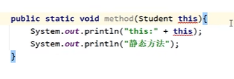

但是静态方法里面没有this关键字


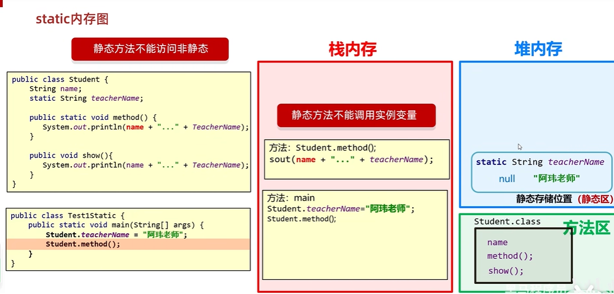


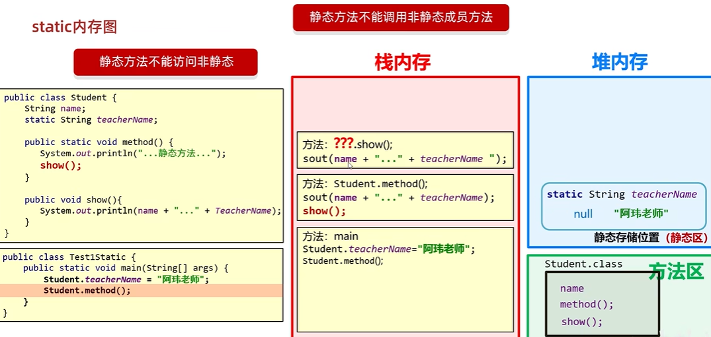


1/方法区内存了	成员变量（非静态）、静态方法

静态变量 存储在堆里

2/静态方法	只能	调用静态方法/静态变量

非静态方法	都可以调用


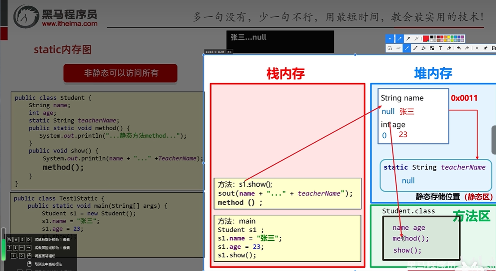

*<u>**//注意看这个图，只有类的静态变量是加载在堆里的静态区**</u>*

*<u>**静态方法	或者	非静态方法都在方法区**</u>*


### 2.2.1 静态变量及其访问

有static修饰成员变量，说明这个成员变量是属于类的，这个成员变量称为**类变量**或者**静态成员变量**。 直接用  类名访问即可。因为类只有一个，所以静态成员变量在内存区域中也只存在一份。所有的对象都可以共享这个变量。

**如何使用呢**

例如现在我们需要定义传智全部的学生类，那么这些学生类的对象的学校属性应该都是“传智”，这个时候我们可以把这个属性定义成static修饰的静态成员变量。

**定义格式**

```java
修饰符 static 数据类型 变量名 = 初始值；    
```

**举例**

```java
public class Student {
    public static String schoolName = "传智播客"； // 属于类，只有一份。
    // .....
}
```

**静态成员变量的访问:**

**格式：类名.静态变量**

```java
public static void  main(String[] args){
    System.out.println(Student.schoolName); // 传智播客
    Student.schoolName = "黑马程序员";
    System.out.println(Student.schoolName); // 黑马程序员
}
```

### 2.2.2 实例变量及其访问

无static修饰的成员变量属于每个对象的，  这个成员变量叫**实例变量**，之前我们写成员变量就是实例成员变量。

**需要注意的是**：实例成员变量属于每个对象，必须创建类的对象才可以访问。   

**格式：对象.实例成员变量**

### 2.2.3 静态方法及其访问

有static修饰成员方法，说明这个成员方法是属于类的，这个成员方法称为**类方法或者**静态方法**。 直接用  类名访问即可。因为类只有一个，所以静态方法在内存区域中也只存在一份。所有的对象都可以共享这个方法。

与静态成员变量一样，静态方法也是直接通过**类名.方法名称**即可访问。

**举例**

```java
public class Student{
    public static String schoolName = "传智播客"； // 属于类，只有一份。
    // .....
    public static void study(){
    	System.out.println("我们都在黑马程序员学习");   
    }
}
```

**静态成员变量的访问:**

**格式：类名.静态方法**

```java
public static void  main(String[] args){
    Student.study();
}
```

### 2.2.4 实例方法及其访问

无static修饰的成员方法属于每个对象的，这个成员方法也叫做**实例方法**。

**需要注意的是**：实例方法是属于每个对象，必须创建类的对象才可以访问。  

**格式：对象.实例方法**

**示例**：

```java
public class Student {
    // 实例变量
    private String name ;
    // 2.方法：行为
    // 无 static修饰，实例方法。属于每个对象，必须创建对象调用
    public void run(){
        System.out.println("学生可以跑步");
    }
	// 无 static修饰，实例方法
    public  void sleep(){
        System.out.println("学生睡觉");
    }
    public static void study(){
        
    }
}
```

```java
public static void main(String[] args){
    // 创建对象 
    Student stu = new Student ;
    stu.name = "徐干";
    // Student.sleep();// 报错，必须用对象访问。
    stu.sleep();
    stu.run();
}
```

## 2.3 小结

**<u>静态======共享</u>**


*<u>**静态方法中没有this**</u>*

*<u>**静态方法中，只能访问静态**</u>*

*<u>**非静态的方法可以访问所有**</u>*

1.当 `static` 修饰成员变量或者成员方法时，该变量称为**静态变量**，该方法称为**静态方法**。该类的每个对象都**共享**同一个类的静态变量和静态方法。任何对象都可以更改该静态变量的值或者访问静态方法。但是不推荐这种方式去访问。因为静态变量或者静态方法直接通过类名访问即可，完全没有必要用对象去访问。

2.无static修饰的成员变量或者成员方法，称为**实例变量，实例方法**，实例变量和实例方法必须创建类的对象，然后通过对象来访问。

3.static修饰的成员属于类，会存储在静态区，是随着类的加载而加载的，且只加载一次，所以只有一份，节省内存。存储于一块固定的内存区域（静态区），所以，可以直接被类名调用。它优先于对象存在，所以，可以被所有对象共享。

4.无static修饰的成员，是属于对象，对象有多少个，他们就会出现多少份。所以必须由对象调用。


**<u>*拓展：main方法前修饰符的理解：*</u>**

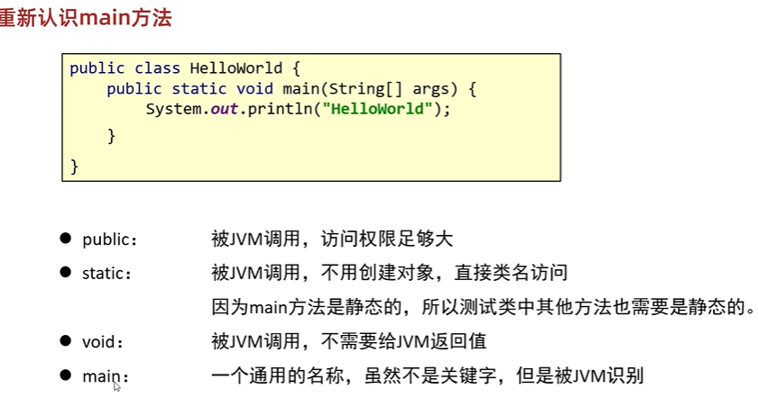


关于main方法前面修饰符的理解


1/public static void main(String[] args) {

}

首先都是public的、都是static的，返回值都是void，方法名都是main，输入参数都是一个字符串数组。

以上的方法声明中，**<u>*唯一可以改变的的部分就是方法的参数名*</u>**，你可以把args改成任意你想要使用的名字。

2/

**Java虚拟机如何启动？**

在《Java语言规范》中，对于Java虚拟机的启动给出了明确的定义：**Java虚拟机是通过加载指定的类，然后调用该类中的main方法而启动的。**

也就是说，通过**调用**某个指定类的***main方法，传递给他单个的字符串数组参数，就可以启动Java虚拟机。***

一个main方法想要被执行，需要经过几个步骤，首先对应的类需要**被虚拟机加载**，然后需要进行**链接**和**初始化**、之后才是**调用**main方法。
————————————————


**为什么 main 方法是公有的(public)？**

Java中，可以使用访问控制符来保护对类、变量、方法和构造方法的访问。Java 支持 4 种不同的访问权限。

default (即默认，什么也不写): 在同一包内可见，不使用任何修饰符。使用对象：类、接口、变量、方法。

private : 在同一类内可见。使用对象：变量、方法。注意：不能修饰类(外部类)

public : 对所有类可见。使用对象：类、接口、变量、方法

protected : 对同一包内的类和所有子类可见。使用对象：变量、方法。注意：不能修饰类(外部类)。

以上四种控制符都可以用来修饰方法，但是被修饰的方法的访问权限就不同了。

而对于main方法来说，我们需要通过JVM直接调用他，那么就需要他的限定符必须是public的，否则是无法访问的。
————————————————


3/**为什么 main 方法是静态的(static)**？

static是静态修饰符，被他修饰的方法我们称之为静态方法，静态方法有一个特点，那就是静态方法独立于该类的任何对象，它不依赖类特定的实例，被类的所有实例共享。**只要这个类被加载**，**Java虚拟机就能根据类名在运行时数据区的方法区内定找到他们。**

而对于main方法来说，他的**调用过程是经历**了**类加载、链接和初始化**的。但是并没有被实例化过，这时候如果想要调用一个类中的方法。那么这个方法必须是静态方法，否则是无法调用的。
————————————————

4/**为什么 main 方法没有返回值(void)**？

如果大家对于C语言和C++语言有一定的了解的话，就会知道，像 C、C++ 这种以 int 为 main 函数返回值的编程语言。

这个返回值在是程序退出时的 exit code，一般被命令解释器或其他外部程序调用已确定流程是否完成。一本正常情况下用 0 返回，非 0 为异常退出。

而在Java中，这个退出过程是由JVM进行控制的，在发生以下两种情况时，程序会终止其所有行为并退出：

1、所有不是后台守护线程的线程全部终止。

2、某个线程调用了Runtime类或者System类的exit方法，并且安全管理器并不禁止exit操作。

上面的两种情况中，第二种情况一旦发生，JVM是不会管main方法有没有执行完的，他都会终止所有行为并退出，这时候main方法的返回值是没有任何意义的。

所以，main方法的返回值就被固定要求为void。
————————————————


# 第三章 继承 （类与类之间的继承，父类里的代码可以被子类调用）//当类与类之间代码相同的时候，并且子类是父类的一种，可以考虑继承来优化

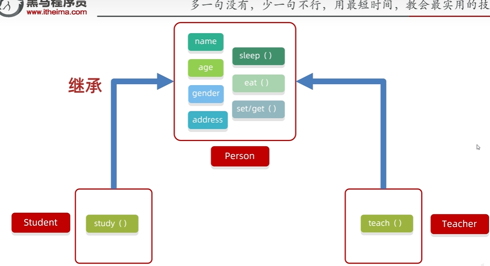


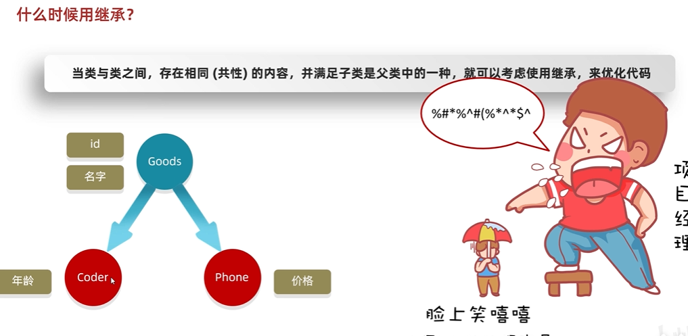

在考虑怎么写父类的时候，一般是根据类与类之间的共同特征去创造，但是也不能完全这样，要考虑实际意义，比如 人 和 水杯 就不是一个类


## 3.1 概述

### 3.1.1 引入
假如我们要定义如下类:
学生类,老师类和工人类，分析如下。

1. 学生类
   属性:姓名,年龄
   行为:吃饭,睡觉

2. 老师类
   属性:姓名,年龄，薪水
   行为:吃饭,睡觉，教书

3. 班主任
   属性:姓名,年龄，薪水
   行为:吃饭,睡觉，管理

如果我们定义了这三个类去开发一个系统，那么这三个类中就存在大量重复的信息（属性:姓名，年龄。行为：吃饭，睡觉）。这样就导致了相同代码大量重复，代码显得很臃肿和冗余，那么如何解决呢？

假如多个类中存在相同属性和行为时，我们可以将这些内容抽取到单独一个类中，那么多个类无需再定义这些属性和行为，只要**继承**那一个类即可。如图所示：


其中，多个类可以称为**子类**，单独被继承的那一个类称为**父类**、**超类（superclass）**或者**基类**。

### 3.1.2 继承的含义//☆☆☆☆☆☆☆☆☆☆☆☆☆☆☆☆☆☆☆☆☆☆☆☆☆☆☆☆☆☆☆☆☆☆☆☆核心：1.共性内容的抽取

### 2.子类是父类的一种☆☆☆☆☆☆☆☆☆☆☆☆☆☆☆☆☆☆☆☆☆☆☆☆☆☆☆☆☆☆☆☆☆☆☆☆☆☆☆☆☆☆☆☆☆☆☆☆☆☆☆☆☆☆☆☆☆☆☆☆☆☆☆☆☆

**<u>*只能有一个爸爸*</u>**

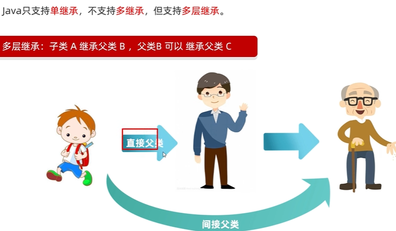

**<u>*爷爷，爷爷的爸爸，爷爷的爷爷...都是儿子的间接父类*</u>**

**<u>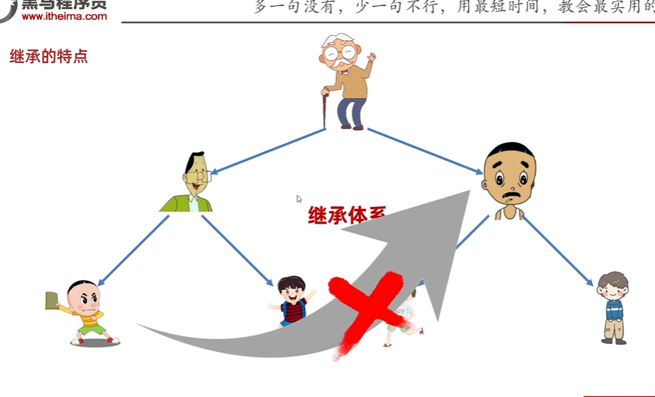</u>**


子类可以继承（直接/间接）父类里的代码，但是不能继承“叔叔类”里的代码


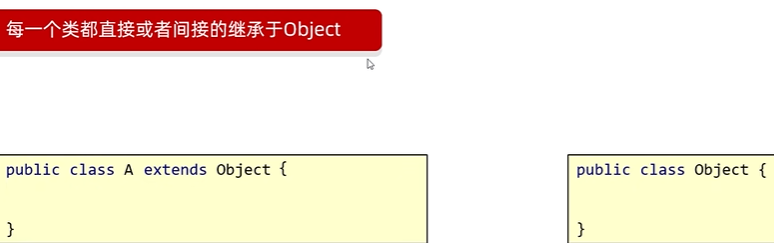

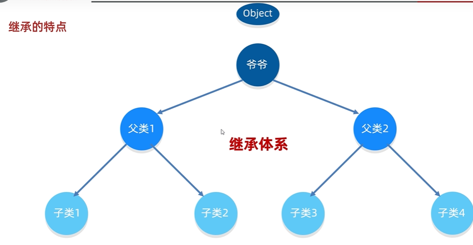<u>*如果说JVM没有发现你定义的父类，他会自动默认为是Object的子类*</u>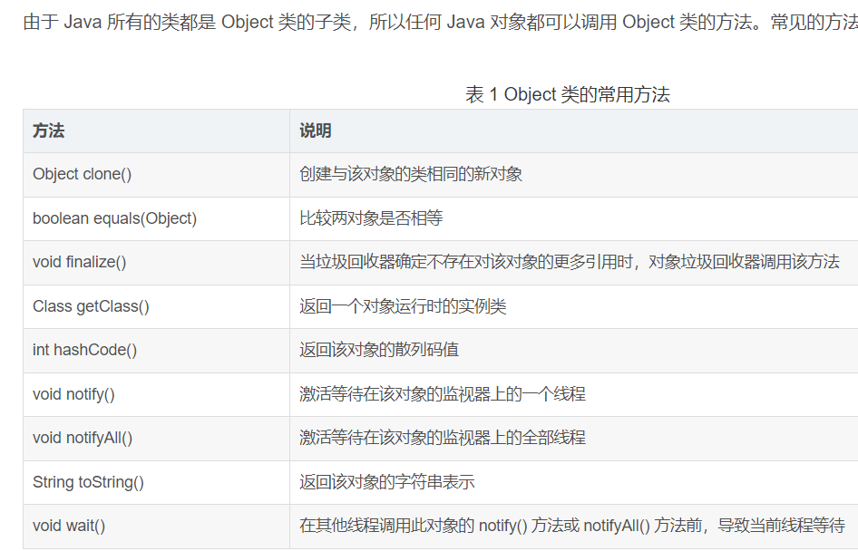

继承描述的是事物之间的所属关系，这种关系是：`is-a` 的关系。例如，兔子属于食草动物，食草动物属于动物。可见，父类更通用，子类更具体。我们**通过继承，可以使多种事物之间形成一种关系体系。**

**继承**：就是子类继承父类的**属性**和**行为**，使得子类对象可以直接具有与父类相同的属性、相同的行为。子类可以直接访问父类中的**非私有**的属性和行为。

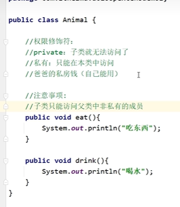

**<u>*继承的分析方法：画图法：*</u>**

**<u>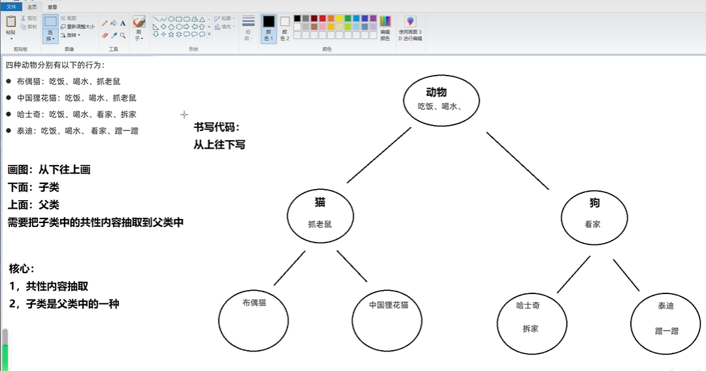</u>**

### 3.1.3 继承的好处
1. 提高**代码的复用性**（减少代码冗余，相同代码重复利用）。
2. 使类与类之间产生了关系。

## 3.2 继承的格式
通过 `extends` 关键字，可以声明一个子类继承另外一个父类，定义格式如下：
```java
class 父类 {
	...
}

class 子类 extends 父类 {
	...
}
```

**需要注意：Java是单继承的，一个类只能继承一个直接父类，跟现实世界很像，但是Java中的子类是更加强大的。**

## 3.3 继承案例
### 3.3.1 案例

请使用继承定义以下类:

1. 学生类
   属性:姓名,年龄
   行为:吃饭,睡觉
2. 老师类
   属性:姓名,年龄，薪水
   行为:吃饭,睡觉，教书
3. 班主任
   属性:姓名,年龄，薪水
   行为:吃饭,睡觉，管理

### 3.3.2 案例图解分析

老师类，学生类，还有班主任类，实际上都是属于人类的，我们可以定义一个人类，把他们相同的属性和行为都定义在人类中，然后继承人类即可，子类特有的属性和行为就定义在子类中了。

如下图所示。


### 3.3.3 案例代码实现

**1.父类Human类**

  ```java
 public class Human {
    // 合理隐藏
    private String name ;
    private int age ;
	
    // 合理暴露
    public String getName() {
        return name;
    }

    public void setName(String name) {
        this.name = name;
    }

    public int getAge() {
        return age;
    }

    public void setAge(int age) {
        this.age = age;
    }
 }
  ```

**2.子类Teacher类**

  ```java
public class Teacher extends Human {
    // 工资
    private double salary ;
    
    // 特有方法
    public void teach(){
        System.out.println("老师在认真教技术！")；
    }

    public double getSalary() {
        return salary;
    }

    public void setSalary(double salary) {
        this.salary = salary;
    }
}
  ```

**3.子类Student类**

  ```java
public class Student extends Human{
 
}
  ```

**4.子类BanZhuren类**

```java 
public class Teacher extends Human {
    // 工资
    private double salary ;
    
       // 特有方法
    public void admin(){
        System.out.println("班主任强调纪律问题！")；
    }
    
    public double getSalary() {
        return salary;
    }

    public void setSalary(double salary) {
        this.salary = salary;
    }
}
```


**5.测试类**

  ```java
  public class Test {
      public static void main(String[] args) {
          Teacher dlei = new Teacher();
          dlei.setName("播仔");
          dlei.setAge("31");
          dlei.setSalary(1000.99);
          System.out.println(dlei.getName());
          System.out.println(dlei.getAge());
          System.out.println(dlei.getSalary());
          dlei.teach();
          
          BanZhuRen linTao = new BanZhuRen();
          linTao.setName("灵涛");
          linTao.setAge("28");
          linTao.setSalary(1000.99);
          System.out.println(linTao.getName());
          System.out.println(linTao.getAge());
          System.out.println(linTao.getSalary());
          linTao.admin();

          Student xugan = new Student();
          xugan.setName("播仔");
          xugan.setAge("31");
          //xugan.setSalary(1000.99); // xugan没有薪水属性，报错！
          System.out.println(xugan.getName());
          System.out.println(xugan.getAge());


      }
  }
  ```

### 3.3.4 小结

1.继承实际上是子类相同的属性和行为可以定义在父类中，子类特有的属性和行为由自己定义，这样就实现了相同属性和行为的重复利用，从而提高了代码复用。

2.子类继承父类，就可以直接得到父类的成员变量和方法。是否可以继承所有成分呢？

## 3.4 子类不能继承的内容

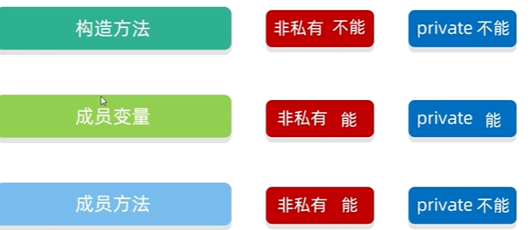


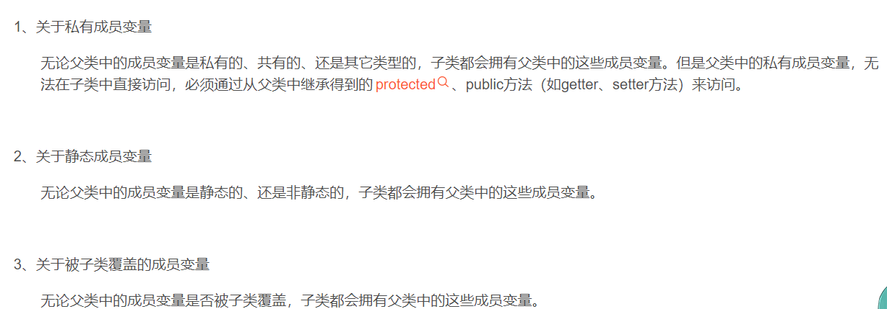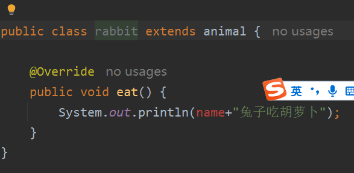成员变量   不管是什么修饰符修饰，（即使是private）,也还是能够被子类继承下来的，能不能用了另外说

1/

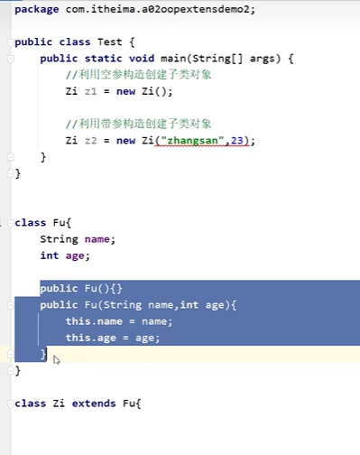

子类是不能继承父类的构造方法的，这样的话，就违背了构造方法与类名相同的规则，**即构造方法只能自己在每个类中书写**

//上面这个例子中，main里面的Zi空参构造方法能调用，是因为 如果你不写构造方法，JVM会自动帮你生成一个空参的构造方法

2/继承的内存图

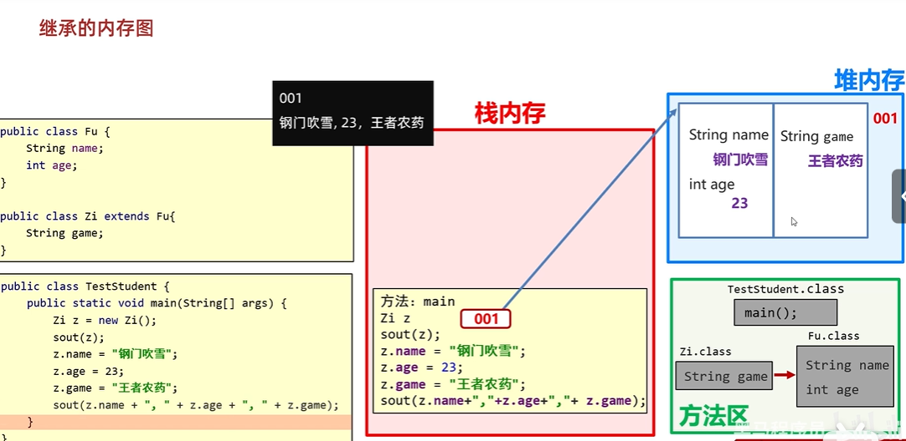

方法区在加载子类方法的时候，也会把父类的方法加载进去

堆中new创建新对象的时候，会为子类和父类的成员变量分区开辟存储空间

3/一旦方法执行结束之后，方法从栈里弹出（包括方法里声明的变量也会随之消失），此时没有指向new中的地址了，那些之前开辟的存储空间变成垃圾

4**<u>*/当父类的成员变量有private修饰时*</u>**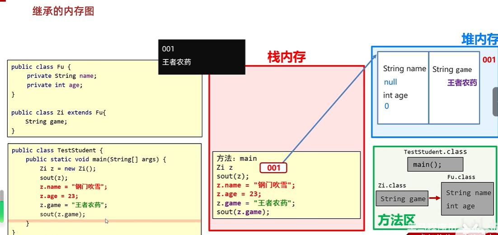

**<u>*存在但是无法调用*</u>**

5/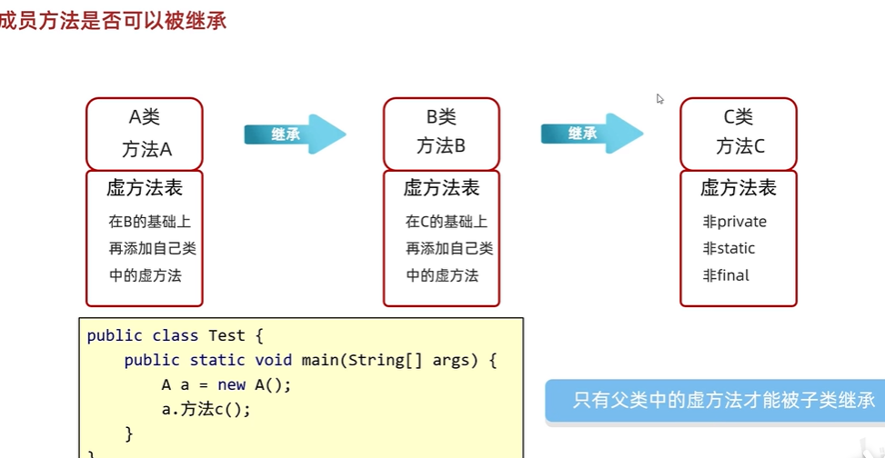

从最顶级的父类开始，会把他的虚方法逐层累积传递给子类，这样的话子类就可以直接找到

//如果不是虚方法，那就只能一层一层的向上去找，但实际上会报错，因为只有虚方法表里的方法才代表着子类能继承父类的那些方法

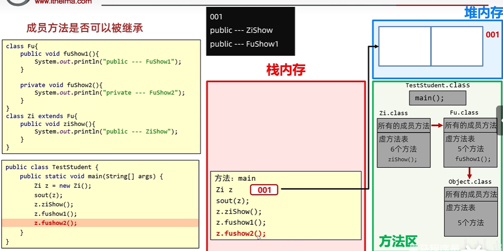


虚方法表的组成：直接父类继承下来的虚方法表+这个方法本身的虚方法  

当调用虚方法的时候直接去这个类里面的虚方法表里就行，如果找不到，就只能逐层向上去查找，然后报错！！！！！！

### 3.4.1 引入

并不是父类的所有内容都可以给子类继承的：

**子类不能继承父类的构造方法。**

**值得注意的是子类可以继承父类的私有成员（成员变量，方法），只是子类无法直接访问而已，可以通过getter/setter方法访问父类的private成员变量（其实说的是private变量在标准类里的特征，没啥特别的地方）。**

### 3.4.1 演示代码
```java
public class Demo03 {
    public static void main(String[] args) {
        Zi z = new Zi();
        System.out.println(z.num1);
//		System.out.println(z.num2); // 私有的子类无法使用
        // 通过getter/setter方法访问父类的private成员变量
        System.out.println(z.getNum2());

        z.show1();
        // z.show2(); // 私有的子类无法使用
    }
}

class Fu {
    public int num1 = 10;
    private int num2 = 20;

    public void show1() {
        System.out.println("show1");
    }

    private void show2() {
        System.out.println("show2");
    }

    public int getNum2() {
        return num2;
    }

    public void setNum2(int num2) {
        this.num2 = num2;
    }
}

class Zi extends Fu {
}
```

## 3.5 继承后的特点—成员变量

当类之间产生了继承关系后，其中各类中的成员变量，又产生了哪些影响呢？

### 3.5.1 成员变量不重名

如果子类父类中出现**不重名**的成员变量，这时的访问是**没有影响的**。代码如下：

```java
class Fu {
	// Fu中的成员变量
	int num = 5;
}
class Zi extends Fu {
	// Zi中的成员变量
	int num2 = 6;
  
	// Zi中的成员方法
	public void show() {
		// 访问父类中的num
		System.out.println("Fu num="+num); // 继承而来，所以直接访问。
		// 访问子类中的num2
		System.out.println("Zi num2="+num2);
	}
}
class Demo04 {
	public static void main(String[] args) {
        // 创建子类对象
		Zi z = new Zi(); 
      	// 调用子类中的show方法
		z.show();  
	}
}

演示结果：
Fu num = 5
Zi num2 = 6
```

### 3.5.2 成员变量重名

如果子类父类中出现**重名**的成员变量，这时的访问是**有影响的**。代码如下：

```java
class Fu1 {
	// Fu中的成员变量。
	int num = 5;
}
class Zi1 extends Fu1 {
	// Zi中的成员变量
	int num = 6;
  
	public void show() {
		// 访问父类中的num
		System.out.println("Fu num=" + num);
		// 访问子类中的num
		System.out.println("Zi num=" + num);
	}
}
class Demo04 {
	public static void main(String[] args) {
      	// 创建子类对象
		Zi1 z = new Zi1(); 
      	// 调用子类中的show方法
		z1.show(); 
	}
}
演示结果：
Fu num = 6
Zi num = 6
```

子父类中出现了同名的成员变量时，子类会优先访问自己对象中的成员变量。如果此时想访问父类成员变量如何解决呢？我们可以使用super关键字。

### 3.5.3  super访问父类成员变量（super最多只能用一次，不能连续使用super）

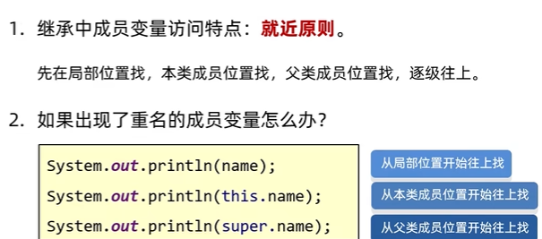


如果父类没有就报错

直接调用，谁离我近，我调用谁

 

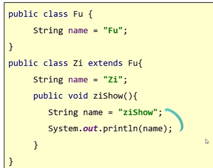

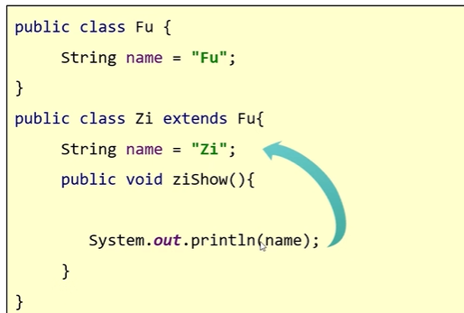

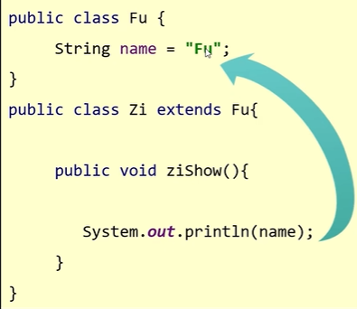


子父类中出现了同名的成员变量时，在子类中需要访问父类中非私有成员变量（私有变量不能直接访问）时，需要使用`super` 关键字，修饰父类成员变量，类似于之前学过的 `this` 。

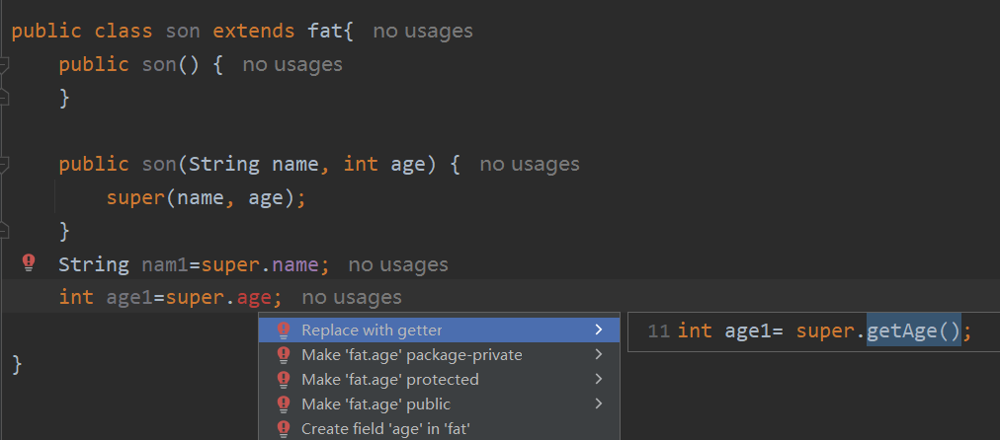（这个图要说明的是父类的私有成员变量不能直接super()访问）

需要注意的是：**super代表的是父类对象的引用，this代表的是当前对象的引用。**

**使用格式：**

```java
super.父类成员变量名
```

子类方法需要修改，代码如下：

```java
class Fu {
	// Fu中的成员变量。
	int num = 5;
}

class Zi extends Fu {
	// Zi中的成员变量
	int num = 6;
  
	public void show() {
        int num = 1;
      
        // 访问方法中的num
        System.out.println("method num=" + num);
        // 访问子类中的num
        System.out.println("Zi num=" + this.num);
        // 访问父类中的num
        System.out.println("Fu num=" + super.num);
	}
}

class Demo04 {
	public static void main(String[] args) {
      	// 创建子类对象
		Zi1 z = new Zi1(); 
      	// 调用子类中的show方法
		z1.show(); 
	}
}

演示结果：
method num=1
Zi num=6
Fu num=5
```

> 小贴士：Fu 类中的成员变量是非私有的，子类中可以直接访问。若Fu 类中的成员变量私有了，子类是不能直接访问的。通常编码时，我们遵循封装的原则，使用private修饰成员变量，那么如何访问父类的私有成员变量呢？对！可以在父类中提供公共的getXxx方法和setXxx方法。

## 3.6 继承后的特点—成员方法


方法调用：

方法的直接调用（直接写方法名，实际上方法的前面有一个隐藏“this.”，因为方法的调用必须要有一个调用者）

当类之间产生了关系，其中各类中的成员方法，又产生了哪些影响呢？

### 3.6.1 成员方法不重名

如果子类父类中出现**不重名**的成员方法，这时的调用是**没有影响的**。对象调用方法时，会先在子类中查找有没有对应的方法，若子类中存在就会执行子类中的方法，若子类中不存在就会执行父类中相应的方法。代码如下：

```java
class Fu {
	public void show() {
		System.out.println("Fu类中的show方法执行");
	}
}
class Zi extends Fu {
	public void show2() {
		System.out.println("Zi类中的show2方法执行");
	}
}
public  class Demo05 {
	public static void main(String[] args) {
		Zi z = new Zi();
     	//子类中没有show方法，但是可以找到父类方法去执行
		z.show(); 
		z.show2();
	}
}
```

### 3.6.2 成员方法重名

如果子类父类中出现**重名**的成员方法，则创建子类对象调用该方法的时候，子类对象会优先调用自己的方法。

代码如下：

```java
class Fu {
	public void show() {
		System.out.println("Fu show");
	}
}
class Zi extends Fu {
	//子类重写了父类的show方法
	public void show() {
		System.out.println("Zi show");
	}
}
public class ExtendsDemo05{
	public static void main(String[] args) {
		Zi z = new Zi();
     	// 子类中有show方法，只执行重写后的show方法
		z.show();  // Zi show
	}
}
```

## 当子类对象想要调用父类传递过来的重名方法时：这样写是错误的；

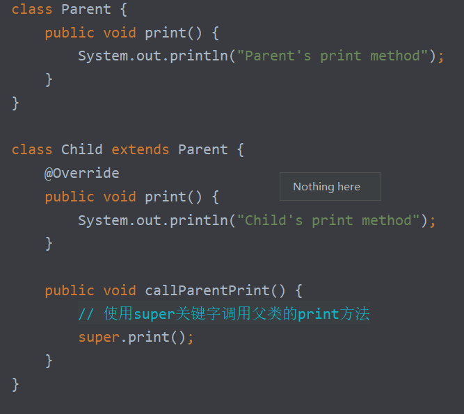

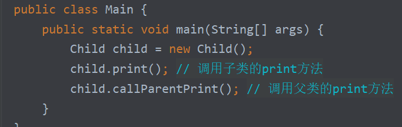
请注意，**super**关键字只能在**子类的方法内部**使用，并且**必须**出现在**方法的第一行**，否则会导致编译错误。此外，如果父类的方法是私有的（private），则无法在子类中通过super关键字调用。

## 3.7 方法重写

### 3.7.1 概念

**方法重写** ：子类中出现与父类一模一样的方法时（**<u>*返回值类型，方法名和参数列表都相同*</u>**），会出现覆盖效果，也称为重写或者复写。**声明不变，重新实现**。

### 3.7.2 使用场景与案例

发生在子父类之间的关系。
子类继承了父类的方法，但是子类觉得父类的这方法不足以满足自己的需求，子类重新写了一个与父类同名的方法，以便覆盖父类的该方 法。

例如：我们定义了一个动物类代码如下：

```java
public class Animal  {
    public void run(){
        System.out.println("动物跑的很快！");
    }
    public void cry(){
        System.out.println("动物都可以叫~~~");
    }
}
```

然后定义一个猫类，猫可能认为父类cry()方法不能满足自己的需求

代码如下：

```java
public class Cat extends Animal {
    public void cry(){
        System.out.println("我们一起学猫叫，喵喵喵！喵的非常好听！");
    }
}

public class Test {
	public static void main(String[] args) {
      	// 创建子类对象
      	Cat ddm = new Cat()；
        // 调用父类继承而来的方法
        ddm.run();
      	// 调用子类重写的方法
      	ddm.cry();
	}
}
```

### 3.7.2 @Override重写注解

* @Override:注解，重写注解校验！

* 这个注解标记的方法，就说明这个方法必须是重写父类的方法，否则编译阶段报错。

* 建议重写都加上这个注解，一方面可以提高代码的可读性，一方面可以防止重写出错！

  加上后的子类代码形式如下：

  ``` java
  public class Cat extends Animal {
       // 声明不变，重新实现
      // 方法名称与父类全部一样，只是方法体中的功能重写写了！
      @Override
      public void cry(){
          System.out.println("我们一起学猫叫，喵喵喵！喵的非常好听！");
      }
  }
  ```


### 3.7.3 注意事项

1. 方法重写是发生在子父类之间的关系。
2. 子类方法覆盖父类方法，必须要保证权限大于等于父类权限。
3. 子类方法覆盖父类方法，返回值类型、函数名和参数列表都要一模一样。

## 3.8 继承后的特点—构造方法！！！！！！！！
### 3.8.1 引入

当类之间产生了关系，其中各类中的构造方法，又产生了哪些影响呢？
首先我们要回忆两个事情，构造方法的定义格式和作用。

1. 构造方法的名字是与类名一致的。所以子类是无法继承父类构造方法的。
2. 构造方法的作用是初始化对象成员变量数据的。所以子类的初始化过程中，必须先执行父类的初始化动作。**<u>*子类的构造方法中默认有一个`super()`*</u>** ，表示调用父类的构造方法，父类成员变量初始化后，才可以给子类使用。（**先有爸爸，才能有儿子**）
3. 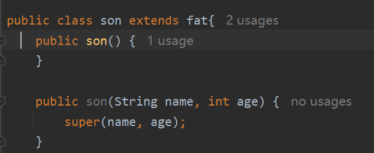

**继承后子造类构方法特点:子类所有构造方法的第一行都会默认先调用父类的无参构造方法**


### **<u>*代码示例：*</u>**


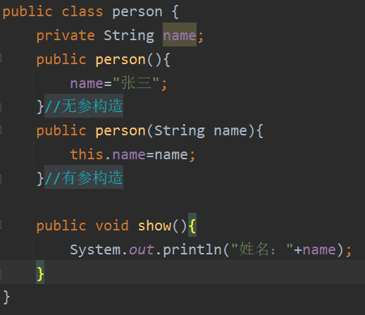

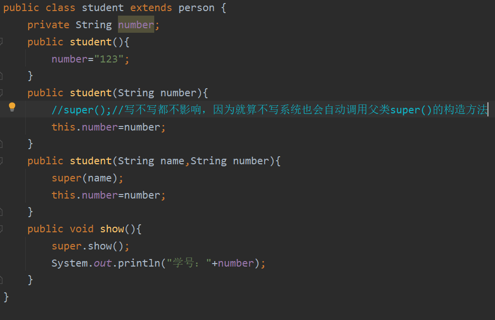

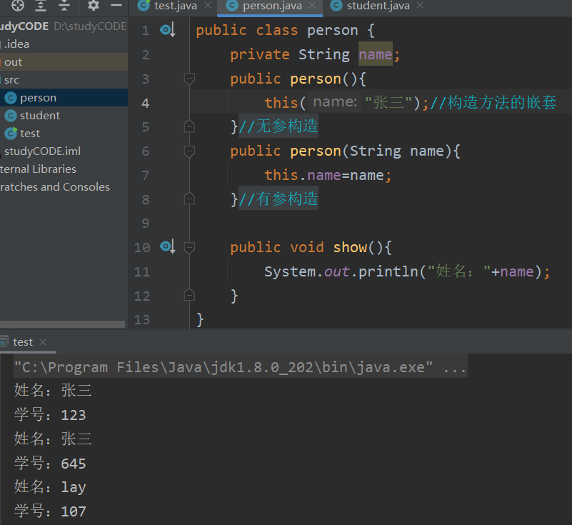

1/类似的

this([参数列表])；//可以调用该类的构造方法

### //**<u>*同一类构造方法的嵌套*</u>**

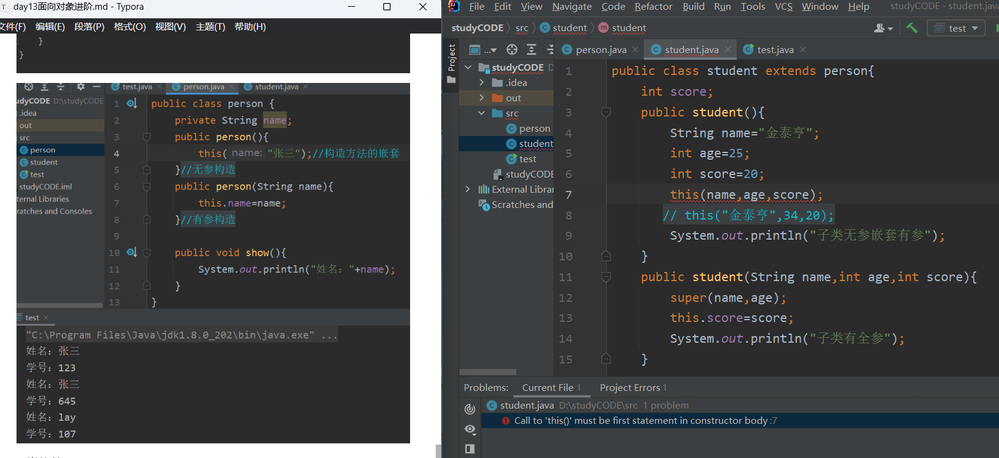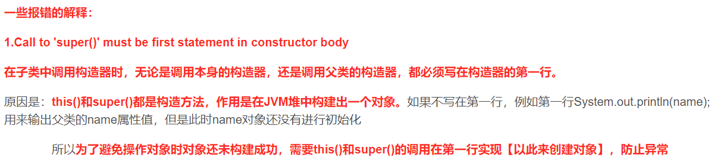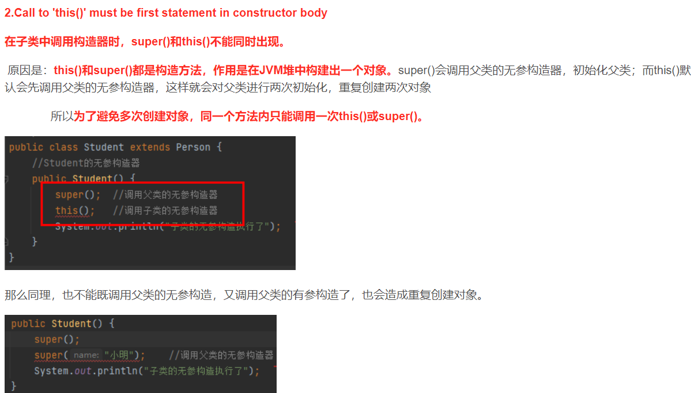

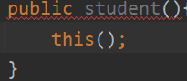

也不是这个图这种写法，不然会陷入死循环


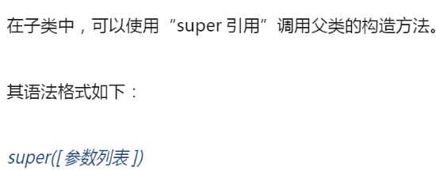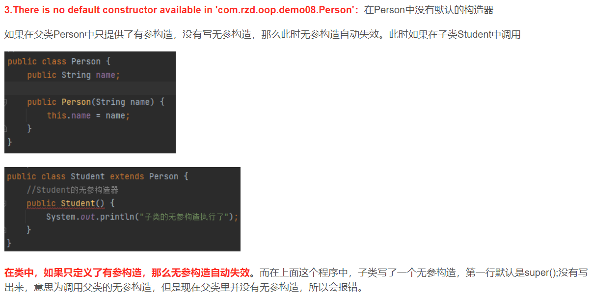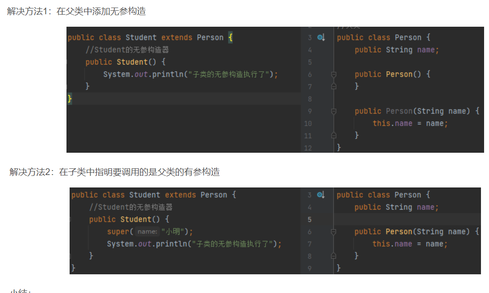


2/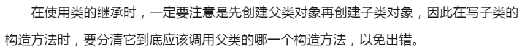

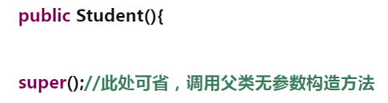

3/总之，构造方法一定是先	父类	再	子类

就算你不写出来，系统也会默认的在子类构造方法的第一行 调用父类的构造方法

至于因为参数列表导致形成许多不同的构造方法，根据传递的参数，他会自己匹配的

4/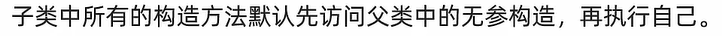

如果要在子类中调用父类的有参构造，要自己写（不写的话系统只会自动给你写空参构造）

### 3.8.2 案例演示

按如下需求定义类:

1. 人类
   成员变量: 姓名,年龄
   成员方法: 吃饭
2. 学生类
   成员变量: 姓名,年龄,成绩
   成员方法: 吃饭

代码如下：
```java
class Person {
    private String name;
    private int age;

    public Person() {
        System.out.println("父类无参");
    }

    // getter/setter省略
}

class Student extends Person {
    private double score;

    public Student() {
        //super(); // 调用父类无参,默认存在，可以不写，必须再第一行
        System.out.println("子类无参");
    }
    
     public Student(double score) {
        //super();  // 调用父类无参,默认存在，可以不写，必须再第一行
        this.score = score;    
        System.out.println("子类有参");
     }

}

public class Demo07 {
    public static void main(String[] args) {
        Student s1 = new Student();
        System.out.println("----------");
        Student s2 = new Student(99.9);
    }
}

输出结果：
父类无参
子类无参
----------
父类无参
子类有参
```

### 3.8.3 小结

* 子类构造方法执行的时候，都会在第一行默认先调用父类无参数构造方法一次。
* 子类构造方法的第一行都隐含了一个**super()**去调用父类无参数构造方法，**super()**可以省略不写。

## 3.9 super(...)和this(...)

### 3.9.1  引入

请看上节中的如下案例：

```java 
class Person {
    private String name;
    private int age;

    public Person() {
        System.out.println("父类无参");
    }

    // getter/setter省略
}

class Student extends Person {
    private double score;

    public Student() {
        //super(); // 调用父类无参构造方法,默认就存在，可以不写，必须再第一行
        System.out.println("子类无参");
    }
    
     public Student(double score) {
        //super();  // 调用父类无参构造方法,默认就存在，可以不写，必须再第一行
        this.score = score;    
        System.out.println("子类有参");
     }
      // getter/setter省略
}

public class Demo07 {
    public static void main(String[] args) {
        // 调用子类有参数构造方法
        Student s2 = new Student(99.9);
        System.out.println(s2.getScore()); // 99.9
        System.out.println(s2.getName()); // 输出 null
        System.out.println(s2.getAge()); // 输出 0
    }
}
```

我们发现，子类有参数构造方法只是初始化了自己对象中的成员变量score，而父类中的成员变量name和age依然是没有数据的，怎么解决这个问题呢，我们可以借助与super(...)去调用父类构造方法，以便初始化继承自父类对象的name和age.

### 3.9.2 super和this的用法格式

super和this完整的用法如下，其中this，super访问成员我们已经接触过了。

```java
this.成员变量    	--    本类的
super.成员变量    	--    父类的

this.成员方法名()  	--    本类的    
super.成员方法名()   --    父类的
```

接下来我们使用调用构造方法格式：

```java
super(...) -- 调用父类的构造方法，根据参数匹配确认
this(...) -- 调用本类的其他构造方法，根据参数匹配确认//本类的构造方法也可以进行嵌套
```

### 3.9.3 super(....)用法演示

代码如下：

```java
class Person {
    private String name ="凤姐";
    private int age = 20;

    public Person() {
        System.out.println("父类无参");
    }
    
    public Person(String name , int age){
        this.name = name ;
        this.age = age ;
    }

    // getter/setter省略
}

class Student extends Person {
    private double score = 100;

    public Student() {
        //super(); // 调用父类无参构造方法,默认就存在，可以不写，必须再第一行
        System.out.println("子类无参");
    }
    
     public Student(String name ， int age，double score) {
        super(name ,age);// 调用父类有参构造方法Person(String name , int age)初始化name和age
        this.score = score;    
        System.out.println("子类有参");
     }
      // getter/setter省略
}

public class Demo07 {
    public static void main(String[] args) {
        // 调用子类有参数构造方法
        Student s2 = new Student("张三"，20，99);
        System.out.println(s2.getScore()); // 99
        System.out.println(s2.getName()); // 输出 张三
        System.out.println(s2.getAge()); // 输出 20
    }
}
```

**注意：**

**子类的每个构造方法中均有默认的super()，调用父类的空参构造。手动调用父类构造会覆盖默认的super()。**

**super() 和 this() 都必须是在构造方法的第一行，所以不能同时出现。**

super(..)是根据参数去确定调用父类哪个构造方法的。

### 3.9.4 super(...)案例图解

**父类空间优先于子类对象产生**

在每次创建子类对象时，先初始化父类空间，再创建其子类对象本身。目的在于子类对象中包含了其对应的父类空间，便可以包含其父类的成员，如果父类成员非private修饰，则子类可以随意使用父类成员。代码体现在子类的构造调用时，一定先调用父类的构造方法。理解图解如下：

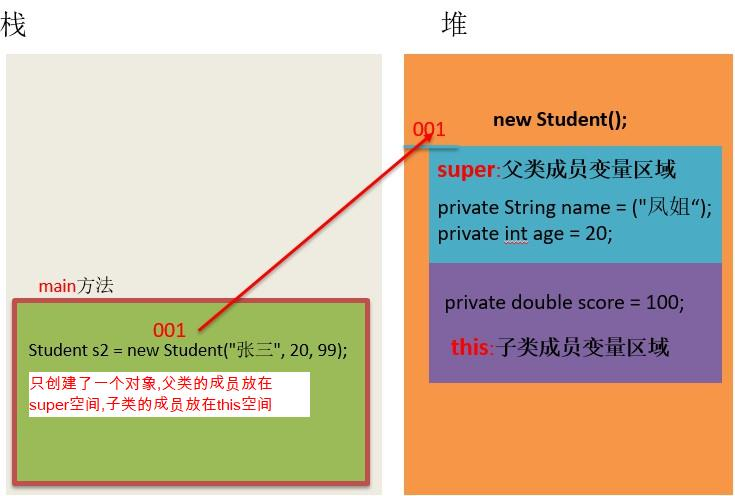


### 3.9.5 this(...)用法演示

this(...)
 *    默认是去找本类中的其他构造方法，根据参数来确定具体调用哪一个构造方法。
 *    为了借用其他构造方法的功能。

```java
package com.itheima._08this和super调用构造方法;
/**
 * this(...):
 *    默认是去找本类中的其他构造方法，根据参数来确定具体调用哪一个构造方法。
 *    为了借用其他构造方法的功能。
 *
 */
public class ThisDemo01 {
    public static void main(String[] args) {
        Student xuGan = new Student();
        System.out.println(xuGan.getName()); // 输出:徐干
        System.out.println(xuGan.getAge());// 输出:21
        System.out.println(xuGan.getSex());// 输出： 男
    }
}

class Student{
    private String name ;
    private int age ;
    private char sex ;

    public Student() {
  // 很弱，我的兄弟很牛逼啊，我可以调用其他构造方法：
        this("徐干",21,'男');
    }

    public Student(String name, int age, char sex) {
        this.name = name ;
        this.age = age   ;
        this.sex = sex   ;
    }

    public String getName() {
        return name;
    }

    public void setName(String name) {
        this.name = name;
    }

    public int getAge() {
        return age;
    }

    public void setAge(int age) {
        this.age = age;
    }

    public char getSex() {
        return sex;
    }

    public void setSex(char sex) {
        this.sex = sex;
    }
}
```

### 3.9.6 小结

* **子类的每个构造方法中均有默认的super()，调用父类的空参构造。手动调用父类构造会覆盖默认的super()。**

* **super() 和 this() 都必须是在构造方法的第一行，所以不能同时出现。**

* **super(..)和this(...)是根据参数去确定调用父类哪个构造方法的。**
* super(..)可以调用父类构造方法初始化继承自父类的成员变量的数据。
* this(..)可以调用本类中的其他构造方法。

## 3.10 继承的特点
1. Java只支持单继承，不支持多继承。
  ```java
// 一个类只能有一个父类，不可以有多个父类。
class A {}
class B {}
class C1 extends A {} // ok
// class C2 extends A, B {} // error
  ```

2. 一个类可以有多个子类。
  ```java
// A可以有多个子类
class A {}
class C1 extends A {}
class C2 extends  A {}
  ```

3. 可以多层继承。
  ```java
class A {}
class C1 extends A {}
class D extends C1 {}
  ```
  > 顶层父类是Object类。所有的类默认继承Object，作为父类。

## 4. 关于今天知识的小结：

会写一个继承结构下的标准Javabean即可

需求：

​	猫：属性：姓名，年龄，颜色

​	狗：属性：姓名，年龄，颜色，吼叫

 分享书写技巧：

​        1.在大脑中要区分谁是父，谁是子

​        2.把共性写到父类中，独有的东西写在子类中

​        3.开始编写标准Javabean（从上往下写）

​        4.在测试类中，创建对象并赋值调用


代码示例：

```java
package com.itheima.test4;

public class Animal {
    //姓名，年龄，颜色
    private String name;
    private int age;
    private String color;


    public Animal() {
    }

    public Animal(String name, int age, String color) {
        this.name = name;
        this.age = age;
        this.color = color;
    }

    public String getName() {
        return name;
    }

    public void setName(String name) {
        this.name = name;
    }

    public int getAge() {
        return age;
    }

    public void setAge(int age) {
        this.age = age;
    }

    public String getColor() {
        return color;
    }

    public void setColor(String color) {
        this.color = color;
    }
}


public class Cat extends Animal{
    //因为猫类中没有独有的属性。
    //所以此时不需要写私有的成员变量

    //空参
    public Cat() {
    }

    //需要带子类和父类中所有的属性
    public Cat(String name, int age, String color) {
        super(name,age,color);
    }
}


public class Dog extends Animal{
    //Dog ：吼叫
    private String wang;

    //构造
    public Dog() {
    }

    //带参构造：带子类加父类所有的属性
    public Dog(String name, int age, String color,String wang) {
        //共性的属性交给父类赋值
        super(name,age,color);
        //独有的属性自己赋值
        this.wang = wang;
    }

    public String getWang() {
        return wang;
    }

    public void setWang(String wang) {
        this.wang = wang;
    }
}

public class Demo {
    public static void main(String[] args) {
        //Animal ： 姓名，年龄，颜色
        //Cat :
        //Dog ：吼叫

        //创建狗的对象
        Dog d = new Dog("旺财",2,"黑色","嗷呜~~");
        System.out.println(d.getName()+", " + d.getAge() + ", " + d.getColor() + ", " + d.getWang());

        //创建猫的对象
        Cat c = new Cat("中华田园猫",3,"黄色");
        System.out.println(c.getName() + ", " + c.getAge() + ", " + c.getColor());
    }
}


```


